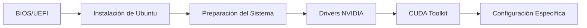

# Guía Mejorada de Configuración de Estaciones de Trabajo Ubuntu con GPU NVIDIA

> **Última actualización:** 4 de Agosto de 2026

---

## Índice

* [1. Requisitos Previos a la Instalación](#1-requisitos-previos-a-la-instalación)
* [2. Instalación del Sistema Ubuntu](#2-instalación-del-sistema-ubuntu)
* [3. Preparación Inicial del Sistema Ubuntu](#3-preparación-inicial-del-sistema-ubuntu)
* [4. Instalación de Drivers de NVIDIA en Ubuntu](#4-instalación-de-drivers-de-nvidia-en-ubuntu)
* [5. Instalación de CUDA Toolkit](#5-instalación-de-cuda-toolkit)
* [6. Configuración Específica para Estaciones de Compresión](#6-configuración-específica-para-estaciones-de-compresión)
* [7. Configuración Específica para Estaciones de Analítica](#7-configuración-específica-para-estaciones-de-analítica)
* [8. Gestión de la Interfaz Gráfica](#8-gestión-de-la-interfaz-gráfica)
* [9. Solución de Problemas Comunes con Redes en Placas Nuevas](#9-solución-de-problemas-comunes-con-redes-en-placas-nuevas)
* [10. Wake-on-LAN (WOL): Windows a Windows y Ubuntu a Windows](#10-wake-on-lan-wol-windows-a-windows-y-ubuntu-a-windows)
* [11. Script de Post-Instalación (Opcional)](#11-script-de-post-instalación-opcional)
* [12. Scripts Doctor de Verificación](#12-scripts-doctor-de-verificación)
* [13. Buenas Prácticas de Seguridad (Opcional)](#13-buenas-prácticas-de-seguridad-opcional)
* [14. Runbook: MongoDB 8 no arranca por kernel HWE 7.0](#14-runbook-mongodb-8-no-arranca-por-kernel-hwe-70)
* [FAQ: Preguntas Frecuentes](#faq-preguntas-frecuentes)
* [Anexo A: Identificación de GPUs NVIDIA](#anexo-a-identificación-de-gpus-nvidia)
* [Anexo B: Verificación de Compatibilidad](#anexo-b-verificación-de-compatibilidad)

---

> **¡Bienvenido!** Esta guía mejorada te ayudará a instalar y configurar Ubuntu con GPU NVIDIA, optimizando cada paso y explicando el porqué de cada acción. Los comandos y procedimientos originales se mantienen intactos, pero se agregan explicaciones, tips y advertencias para facilitar el proceso.

---

## Resumen Visual del Proceso



---

## 1. Requisitos Previos a la Instalación

### Antes de tocar el equipo

Confirma estos puntos antes de instalar Ubuntu:

| Necesitas | Para qué sirve |
|-----------|----------------|
| USB de 8 GB o más | Para arrancar el instalador de Ubuntu. |
| Imagen ISO de Ubuntu Desktop LTS | Es el archivo que se copia a la USB. Esta guía usa Ubuntu Desktop 24.04 LTS como referencia. |
| Respaldo de datos importantes | La instalación puede borrar el disco completo. |
| Acceso a internet | Ayuda a instalar actualizaciones y paquetes durante el proceso. |
| Tipo de estación definido | Decide si el equipo será de **compresión/data** o de **analítica**. |

> **Alerta importante:** Si el equipo tiene archivos que no puedes perder, respáldalos antes de seguir. El modo simple de instalación usa "Borrar disco e instalar Ubuntu".

### Decisión rápida

- Si el equipo será usado por una persona y tendrá pantalla, instala **Ubuntu Desktop**.
- Si el equipo será administrado remotamente, igual puedes partir con **Ubuntu Desktop** y luego desactivar la interfaz gráfica.
- Si necesitas dual boot con Windows, no uses el camino simple de esta sección; requiere particionado manual.

---

## 2. Instalación del Sistema Ubuntu

Esta sección deja Ubuntu instalado y listo para la preparación inicial. Sigue los pasos en orden.

### Paso 1: Descarga Ubuntu

1. Entra a [https://ubuntu.com/download/desktop](https://ubuntu.com/download/desktop).
2. Descarga la versión **Ubuntu Desktop LTS** indicada para tu instalación.
3. Guarda el archivo `.iso` en un lugar fácil de encontrar, por ejemplo `Downloads`.

> **Si el equipo va a correr MongoDB 8:** las ISO de Ubuntu Desktop 24.04.4 en adelante instalan
> el kernel **HWE 7.0**, que impide arrancar `mongod` (ver [Sección 14](#14-runbook-mongodb-8-no-arranca-por-kernel-hwe-70)).
> La ISO de Ubuntu **Server** instala el track GA por defecto y no tiene el problema. Si igual
> instalas desde Desktop, aplica el pinning preventivo del [Paso 7 de la Sección 3](#paso-7-aplica-ajustes-según-tu-versión-de-ubuntu)
> antes de instalar MongoDB.

### Paso 2: Crea la USB de instalación

La forma más simple es usar una herramienta gráfica:

1. Descarga BalenaEtcher desde [https://etcher.balena.io/](https://etcher.balena.io/) o Ventoy desde [https://www.ventoy.net/](https://www.ventoy.net/).
2. Conecta la USB.
3. Selecciona la ISO de Ubuntu.
4. Selecciona la USB correcta.
5. Inicia el proceso y espera a que termine.

> **Cuidado:** La herramienta borrará la USB. Revisa dos veces que elegiste la unidad correcta.

### Paso 3: Entra a la BIOS/UEFI

1. Apaga el equipo.
2. Conecta la USB.
3. Enciende el equipo y presiona varias veces la tecla de BIOS.

Teclas comunes: `DEL`, `F2`, `F8`, `F10`, `F11`, `F12` o `ESC`.

Ejemplos habituales:

- ASUS suele usar `DEL`.
- MSI suele usar `DEL` o `F2`.
- Gigabyte suele usar `DEL`.

Si no entra, reinicia e intenta con otra tecla.

### Paso 4: Ajusta la BIOS/UEFI

Dentro de la BIOS, cambia solo lo necesario:

| Opción | Valor recomendado | Motivo |
|--------|-------------------|--------|
| Secure Boot | Disabled | Evita conflictos con drivers NVIDIA propietarios. |
| Boot Priority | USB primero | Permite arrancar el instalador de Ubuntu. |
| AC Power Loss | Always On, si es estación remota | El equipo vuelve a encender tras un corte de energía. |

Guarda los cambios con `F10` o con la opción **Save and Exit**.

### Paso 5: Arranca desde la USB

1. Al reiniciar, elige la USB como dispositivo de arranque.
2. Selecciona **Try or Install Ubuntu**.
3. Espera a que cargue el instalador.

Si aparece una pantalla negra antes de entrar al instalador, usa el modo `nomodeset`:

1. En el menú de arranque, presiona `E`.
2. Busca la línea que empieza con `linux`.
3. Agrega `nomodeset` al final de esa línea.
4. Presiona `F10` para continuar.

**Ejemplo de línea editada:**
```
linux /boot/vmlinuz-... nomodeset ---
```

### Paso 6: Instala Ubuntu con opciones simples

En el instalador, usa esta selección:

| Pantalla | Selección recomendada |
|----------|-----------------------|
| Idioma | **English**, para mantener nombres de carpetas estándar como `Desktop` y `Downloads`. |
| Teclado | Español o el layout físico del teclado. |
| Red | Conectado a internet si es posible. |
| Tipo de instalación | Normal installation. |
| Software adicional | Instala actualizaciones si el instalador lo ofrece. Si "software de terceros" mezcla gráficos y Wi-Fi, déjalo desmarcado; los drivers de red se revisan en la sección 3 y NVIDIA se instala luego con `.run`. |
| Disco | **Erase disk and install Ubuntu**, solo si ya respaldaste todo. |
| Usuario | Crea un usuario normal con contraseña fuerte. |
| Zona horaria | Selecciona la zona correcta. |

> **Alerta importante:** `Erase disk and install Ubuntu` borra el disco seleccionado. No elijas esa opción si necesitas conservar Windows, particiones o archivos.

La instalación puede tardar entre 15 y 30 minutos. Cuando termine, el instalador pedirá reiniciar.

### Paso 7: Primer inicio

1. Cuando Ubuntu lo pida, quita la USB.
2. Presiona `Enter` si aparece el mensaje de reinicio.
3. Inicia sesión con el usuario creado.
4. Abre una terminal con `Ctrl+Alt+T`.
5. Ejecuta estas verificaciones básicas:

```bash
lsb_release -a
ping -c 4 google.com
df -h
```

Resultado esperado:

- `lsb_release -a` muestra Ubuntu.
- `ping` recibe respuestas.
- `df -h` muestra espacio disponible en disco.

### Si algo falla durante la instalación

| Problema | Qué probar primero |
|----------|--------------------|
| La USB no aparece en el arranque | Rehacer la USB, probar otro puerto USB o revisar el orden de boot. |
| Pantalla negra antes del instalador | Arrancar con `nomodeset`. |
| El instalador se congela | Reiniciar, desactivar overclock en BIOS y volver a intentar. |
| No puedes desactivar Secure Boot | Revisar el manual de la placa madre o buscar el modelo exacto de BIOS. |
| Error al borrar o preparar disco | Usar la opción simple si no necesitas dual boot; si necesitas dual boot, detenerse y preparar particiones manualmente. |
| No hay internet | Continuar la instalación y resolver red después en la sección de problemas de red. |

---

## 3. Preparación Inicial del Sistema Ubuntu

Esta sección deja Ubuntu listo para instalar el driver NVIDIA oficial con archivo `.run`, que será el camino principal de este manual. Todavía no instales el driver NVIDIA ni CUDA; eso viene en las secciones siguientes.

### Regla de esta sección

- Sí instalamos actualizaciones, herramientas de compilación, headers del kernel y utilidades base.
- Sí dejamos el entorno gráfico en Xorg para evitar conflictos con NVIDIA.
- Sí podemos instalar firmware o drivers de **Ethernet/Wi-Fi** si la red no funciona.
- No usamos `ubuntu-drivers`, "Additional Drivers" ni repositorios APT para instalar NVIDIA.
- No ejecutamos todavía ningún instalador `.run`.

### Paso 1: Abre una terminal

Presiona `Ctrl+Alt+T`.

Si el equipo pide contraseña al usar `sudo`, escribe la contraseña de tu usuario. La terminal no mostrará caracteres mientras la escribes; eso es normal.

### Paso 2: Verifica internet y drivers de red

Antes de actualizar Ubuntu, confirma que el equipo tiene red:

```bash
nmcli device status
ping -c 4 archive.ubuntu.com
```

Resultado esperado:

- `nmcli` muestra al menos una interfaz conectada.
- `ping` recibe respuestas.

Si **Ethernet o Wi-Fi no aparecen**, identifica el hardware:

```bash
lspci -nn | grep -Ei 'ethernet|network|wireless|wifi'
lsusb
```

Usa esta salida para decidir:

| Caso | Qué hacer |
|------|-----------|
| Ethernet funciona, Wi-Fi no | Conecta cable Ethernet y sigue con la guía. El Wi-Fi se puede resolver después. |
| Wi-Fi funciona, Ethernet no | Conéctate por Wi-Fi y sigue con la guía. Ethernet se puede resolver después. |
| No funciona ni Ethernet ni Wi-Fi | Usa internet temporal por USB tethering desde un teléfono o un adaptador USB Ethernet/Wi-Fi compatible con Linux. |
| Aparece Broadcom Wi-Fi | Con internet temporal, instala `bcmwl-kernel-source`. |
| Aparece Intel/Realtek Wi-Fi pero no conecta | Con internet temporal, instala o actualiza `linux-firmware`. |
| Aparece Realtek RTL8125 Ethernet | Si no levanta red, revisa la sección 9 después de conseguir internet temporal. |

Con internet temporal, instala firmware base de red:

```bash
sudo apt update
sudo apt install -y linux-firmware
sudo reboot
```

> **Importante:** Está permitido usar "Additional Drivers" para controladores de red como Broadcom Wi-Fi. No selecciones drivers NVIDIA ahí; NVIDIA se instalará en la sección 4 con `.run`.

### Paso 3: Actualiza Ubuntu y reinicia

Primero actualiza el sistema completo:

```bash
sudo apt update
sudo apt upgrade -y
```

Cuando termine, reinicia:

```bash
sudo reboot
```

Después del reinicio, vuelve a abrir la terminal.

### Paso 4: Instala herramientas necesarias para `.run`

El instalador `.run` de NVIDIA necesita compilar módulos para el kernel. Para eso se requieren headers, DKMS y herramientas de compilación.

```bash
sudo apt install -y build-essential dkms linux-headers-$(uname -r) linux-headers-generic pkg-config gcc g++ make
sudo apt install -y libglvnd-dev libgl1-mesa-dev libegl1-mesa-dev libgles2-mesa-dev libx11-dev libxmu-dev libxi-dev libglu1-mesa-dev libgstreamer1.0-dev libgstreamer-plugins-base1.0-dev
sudo apt install -y ca-certificates curl wget git vim nano mesa-utils inxi net-tools openssh-server ufw dnsutils htop ncdu tree traceroute nmap lm-sensors neofetch
```

### Paso 5: Desactiva Wayland y usa Xorg

Para este manual usaremos Xorg porque suele ser más predecible con drivers NVIDIA instalados por `.run`.

Edita la configuración de GDM3:

```bash
sudo nano /etc/gdm3/custom.conf
```

Busca esta línea:

```ini
#WaylandEnable=false
```

Déjala así, sin `#` al inicio:

```ini
WaylandEnable=false
```

Guarda con `Ctrl+O`, presiona `Enter` y sal con `Ctrl+X`.

Reinicia para aplicar el cambio:

```bash
sudo reboot
```

### Paso 6: Prepara acceso remoto si lo vas a usar

Si el equipo será administrado desde otra máquina, activa SSH y permite el acceso en el firewall:

```bash
sudo systemctl enable --now ssh
sudo ufw allow ssh
sudo ufw --force enable
```

Si no usarás acceso remoto, puedes saltar este paso.

### Paso 7: Aplica ajustes según tu versión de Ubuntu

Primero mira tu versión:

```bash
lsb_release -rs
```

Para **Ubuntu 22.04 LTS**, instala GCC/G++ 12 si vas a usar versiones de CUDA que lo requieran:

```bash
sudo apt install -y gcc-12 g++-12
sudo update-alternatives --install /usr/bin/gcc gcc /usr/bin/gcc-12 120
sudo update-alternatives --install /usr/bin/g++ g++ /usr/bin/g++-12 120
```

Para **Ubuntu 24.04 LTS**, instala `libtinfo5` solo si CUDA o una herramienta antigua lo solicita:

```bash
wget http://security.ubuntu.com/ubuntu/pool/universe/n/ncurses/libtinfo5_6.3-2ubuntu0.1_amd64.deb
sudo apt install ./libtinfo5_6.3-2ubuntu0.1_amd64.deb
rm libtinfo5_6.3-2ubuntu0.1_amd64.deb
```

Si no sabes si lo necesitas, puedes dejarlo para más adelante. No bloquea la instalación del driver NVIDIA.

Para **Ubuntu 24.04 LTS en equipos que van a correr MongoDB 8** (todas las estaciones de
compresión y de analítica), fija el kernel en el track **GA 6.8** antes de instalar cualquier
otro paquete. MongoDB 8 se niega a arrancar en kernels 6.19 – 7.0.13, que es lo que instala el
HWE de las ISO 24.04.4 en adelante:

```bash
sudo tee /etc/apt/preferences.d/99-no-hwe-kernel >/dev/null <<'EOF'
# MongoDB 8 vs kernel 6.19-7.0.13 (SERVER-121912): mantener track GA 6.8
Package: linux-*hwe-24.04* linux-*hwe-7.* linux-image-7.* linux-modules-7.* linux-headers-7.* linux-tools-7.*
Pin: release *
Pin-Priority: -1
EOF

sudo tee /etc/apt/apt.conf.d/51-block-hwe-kernel >/dev/null <<'EOF'
Unattended-Upgrade::Package-Blacklist {
  "linux-generic-hwe-24.04";
  "linux-image-generic-hwe-24.04";
  "linux-headers-generic-hwe-24.04";
};
EOF

sudo apt-mark hold linux-generic-hwe-24.04 linux-image-generic-hwe-24.04 \
                    linux-headers-generic-hwe-24.04
sudo apt update
sudo apt install --install-recommends linux-generic
```

Verifica que el pin apuntó al blanco correcto y **no** arrastró al track GA:

```bash
uname -r                                   # 6.8.0-1XX-generic si ya estás en GA
apt-cache policy linux-generic-hwe-24.04   # esperado: Candidate: (none), prioridad -1
apt-cache policy linux-image-generic       # esperado: 500 / 6.8.0-1XX.XXX  ← NO debe ser -1
```

> **Si `uname -r` ya muestra `7.0.0-XX`**, el equipo nació con el HWE instalado y este pinning
> solo evita que empeore: falta purgar el 7.0. No sigas con MongoDB; ve a la
> [Sección 14, Caso A](#caso-a--equipo-ya-desplegado-corriendo-kernel-70).

### Paso 8: Verifica que la preparación quedó lista

Ejecuta:

```bash
gcc --version
dkms status
ls /usr/src/linux-headers-$(uname -r)
echo $XDG_SESSION_TYPE
```

Resultado esperado:

- `gcc --version` muestra una versión instalada.
- `dkms status` no muestra error, aunque puede no listar nada todavía.
- `ls /usr/src/linux-headers-$(uname -r)` muestra archivos del kernel.
- `echo $XDG_SESSION_TYPE` debería mostrar `x11` si estás en sesión gráfica.

### Si algo falla en la preparación

| Problema | Qué probar primero |
|----------|--------------------|
| `apt update` falla | Verifica internet con `ping -c 4 archive.ubuntu.com`. |
| No aparece Wi-Fi | Usa Ethernet o USB tethering temporal e instala `linux-firmware`; si es Broadcom, instala `bcmwl-kernel-source`. |
| No aparece Ethernet | Usa Wi-Fi, USB tethering o adaptador USB temporal; luego revisa el chip con `lspci -nn`. |
| No instala paquetes | Ejecuta `sudo apt --fix-broken install` y repite el comando. |
| Faltan headers del kernel | Ejecuta `sudo apt install -y linux-headers-$(uname -r) linux-headers-generic`. |
| `echo $XDG_SESSION_TYPE` muestra `wayland` | Revisa `/etc/gdm3/custom.conf`, confirma `WaylandEnable=false` y reinicia. |
| SSH no conecta | Revisa IP del equipo con `ip a` y estado del firewall con `sudo ufw status`. |
| No sabes si ya hay driver NVIDIA instalado | No sigas instalando encima. En la sección 4 se hará limpieza antes del `.run`. |

---

## 4. Instalación de Drivers de NVIDIA en Ubuntu

Esta sección instala el driver NVIDIA oficial usando el archivo `.run`. Este es el método principal del manual.

### Antes de empezar

Confirma que ya hiciste la sección 3:

- Ubuntu está actualizado.
- Hay internet.
- `gcc`, `dkms` y los headers del kernel están instalados.
- Secure Boot está desactivado en BIOS/UEFI.
- No instalaste NVIDIA desde "Additional Drivers", `ubuntu-drivers` ni APT.

> **Importante:** No mezcles métodos. Si instalas NVIDIA con `.run`, no instales después `nvidia-driver-XXX`, `nvidia-open` ni `cuda-drivers` con APT sobre la misma instalación.

### Rama recomendada: 580.x.x

Para estas estaciones usamos la familia **R580 / 580.x.x** porque ha sido la más estable en nuestras pruebas. Cuando descargues el driver, busca la versión más reciente disponible dentro de la rama 580 para tu GPU.

No cambies a otra familia de drivers solo porque exista una versión más nueva. Cambia de rama únicamente si hay una razón concreta: soporte de una GPU nueva, bug crítico corregido o validación interna.

### Paso 1: Identifica la GPU NVIDIA

Ejecuta:

```bash
lspci -nn | grep -Ei 'nvidia|vga|3d|display'
```

Ejemplo:

```
01:00.0 VGA compatible controller: NVIDIA Corporation GA104 [GeForce RTX 3070] (rev a1)
```

Si no aparece una GPU NVIDIA:

- Revisa que la GPU esté bien instalada físicamente.
- Revisa BIOS/UEFI.
- No sigas con el `.run` hasta que el sistema detecte la GPU.

### Paso 2: Descarga el driver `.run`

1. Entra a [https://www.nvidia.com/drivers/](https://www.nvidia.com/drivers/).
2. Selecciona tu modelo exacto de GPU.
3. Selecciona **Linux 64-bit** como sistema operativo.
4. Busca una versión **580.x.x**.
5. Descarga el archivo `.run`.
6. Guárdalo en `Downloads`.

Si NVIDIA ofrece varias opciones, prefiere la más reciente de la familia 580 compatible con tu GPU. Si la web no ofrece 580 para ese modelo, detente y revisa compatibilidad antes de instalar otra familia.

En la terminal, confirma que el archivo existe:

```bash
cd ~/Downloads
ls NVIDIA-Linux-x86_64-*.run
mv NVIDIA-Linux-x86_64-*.run NVIDIA-driver.run
```

Si `mv` falla porque hay más de un `.run`, deja en `Downloads` solo el driver que vas a instalar y repite el comando.

Si NVIDIA publica checksum para tu descarga, compáralo:

```bash
sha256sum NVIDIA-driver.run
```

### Paso 3: Limpia instalaciones NVIDIA previas

En un equipo recién instalado no debería haber mucho que limpiar, pero este paso evita mezclar métodos:

```bash
dpkg -l | grep -Ei 'nvidia|cuda-drivers' || true
sudo apt purge -y '^nvidia-.*' '^libnvidia-.*' '^cuda-drivers.*' '^nvidia-open.*'
sudo apt autoremove -y
```

Si el comando elimina algo, reinicia antes de seguir:

```bash
sudo reboot
```

### Paso 4: Desactiva Nouveau y entra a modo texto

`nouveau` es el driver libre que Ubuntu puede cargar antes de instalar NVIDIA. El `.run` necesita que no esté activo.

```bash
printf 'blacklist nouveau\noptions nouveau modeset=0\n' | sudo tee /etc/modprobe.d/blacklist-nouveau.conf
sudo update-initramfs -u
sudo systemctl set-default multi-user.target
sudo reboot
```

Después del reinicio verás una consola de texto. Inicia sesión con tu usuario y verifica:

```bash
lsmod | grep nouveau
```

Resultado esperado: no muestra nada. Si aparece `nouveau`, no sigas; repite este paso y reinicia.

### Paso 5: Ejecuta el instalador `.run`

Desde la consola de texto:

```bash
cd ~/Downloads
chmod +x NVIDIA-driver.run
sudo ./NVIDIA-driver.run --dkms
```

Responde así si el instalador pregunta:

| Pregunta del instalador | Respuesta recomendada |
|-------------------------|-----------------------|
| `The distribution-provided pre-install script failed...` | `Yes`, continuar. En Ubuntu suele ser una advertencia. |
| Registrar módulos con DKMS | `Yes`. Esto ayuda cuando cambia el kernel. |
| Tipo de módulo: Open/MIT-GPL o Proprietary | Para RTX 20/30/40/50 o más nuevas, usa Open/MIT-GPL si aparece. Para GPUs antiguas pre-Turing, usa Proprietary. Si no sabes, deja la opción recomendada por el instalador. |
| Bibliotecas 32-bit | `No`, salvo que necesites aplicaciones antiguas de 32 bits. |
| Ejecutar `nvidia-xconfig` | `No`. |

Si falla, revisa:

```bash
less /var/log/nvidia-installer.log
```

### Paso 6: Vuelve al modo gráfico y reinicia

Cuando el instalador termine correctamente:

```bash
sudo systemctl set-default graphical.target
sudo reboot
```

### Paso 7: Verifica el driver NVIDIA

Después del reinicio, abre una terminal y ejecuta:

```bash
nvidia-smi
cat /proc/driver/nvidia/version
dkms status | grep -i nvidia
```

Resultado esperado:

- `nvidia-smi` muestra la GPU.
- `/proc/driver/nvidia/version` muestra la versión cargada.
- `dkms status` muestra el módulo NVIDIA instalado para el kernel actual.

También puedes guardar un resumen del equipo:

```bash
nvidia-smi --query-gpu=name,driver_version,memory.total --format=csv
```

### Si necesitas desinstalar el `.run`

Usa esto solo si el driver quedó mal instalado o necesitas empezar de cero:

```bash
sudo systemctl set-default multi-user.target
sudo reboot
```

Luego inicia sesión en consola y ejecuta:

```bash
sudo nvidia-uninstall
sudo rm -f /etc/modprobe.d/blacklist-nouveau.conf
sudo update-initramfs -u
sudo systemctl set-default graphical.target
sudo reboot
```

### Si algo falla con NVIDIA

| Problema | Qué revisar primero |
|----------|---------------------|
| `nvidia-smi` dice que falló | Revisa Secure Boot, reinicia y mira `/var/log/nvidia-installer.log`. |
| El instalador dice que `nouveau` está activo | Repite el paso 4, ejecuta `sudo update-initramfs -u` y reinicia. |
| Falla compilando el módulo | Verifica `gcc --version`, `dkms status` y `ls /usr/src/linux-headers-$(uname -r)`. |
| Pantalla negra después del reinicio | Entra por modo recovery o TTY, ejecuta `sudo nvidia-uninstall` y vuelve a intentar. |
| Se rompió después de actualizar kernel | Instala headers del kernel nuevo y ejecuta `sudo dkms autoinstall`. |
| Instalaste por APT por error | Purga paquetes NVIDIA con APT, reinicia y repite esta sección desde el paso 3. |

Referencias oficiales:

- [NVIDIA Driver Installation Guide](https://docs.nvidia.com/datacenter/tesla/driver-installation-guide/)
- [NVIDIA Driver Downloads](https://www.nvidia.com/drivers/)

---

## 5. Instalación de CUDA Toolkit

> **Nota:** Esta sección instala únicamente CUDA Toolkit usando el instalador `.deb (local)` de NVIDIA. Asume que el driver NVIDIA ya está instalado vía `.run` (sección 4). **No instales el meta-paquete `cuda` ni `cuda-drivers`**: ambos arrastran el driver de NVIDIA y pisarían tu instalación `.run`. Instala solo `cuda-toolkit-XX-Y`.

> **Versión fijada por este manual:** **CUDA 13.0** (compatible con la rama de drivers 580.x.x). Si cambias de versión, ajusta los comandos y rutas (`13-0` → `XX-Y`, `cuda-13.0` → `cuda-XX.Y`).

### Antes de empezar

Confirma:

- Driver NVIDIA `.run` 580.x.x ya instalado (sección 4) y `nvidia-smi` funciona.
- Tienes internet.
- No instalaste antes CUDA por APT, snap o `.run` con otra versión.

### Paso 1: Pin del repositorio CUDA

El pin asegura prioridad correcta cuando hay paquetes solapados con otros repos:

```bash
wget https://developer.download.nvidia.com/compute/cuda/repos/ubuntu2404/x86_64/cuda-ubuntu2404.pin
sudo mv cuda-ubuntu2404.pin /etc/apt/preferences.d/cuda-repository-pin-600
```

### Paso 2: Descarga e instala el repositorio local CUDA 13.0

```bash
wget https://developer.download.nvidia.com/compute/cuda/13.0.0/local_installers/cuda-repo-ubuntu2404-13-0-local_13.0.0-580.65.06-1_amd64.deb
sudo dpkg -i cuda-repo-ubuntu2404-13-0-local_13.0.0-580.65.06-1_amd64.deb
sudo cp /var/cuda-repo-ubuntu2404-13-0-local/cuda-*-keyring.gpg /usr/share/keyrings/
sudo apt-get update
```

> **Importante:** El nombre del `.deb` cambia con cada release (`13.0.0-580.65.06-1` aquí). Antes de instalar, ve a [https://developer.nvidia.com/cuda-downloads](https://developer.nvidia.com/cuda-downloads), selecciona Linux > x86_64 > Ubuntu > 24.04 > deb (local), y copia los comandos exactos que muestra NVIDIA.

### Paso 3: Instala solo el toolkit (sin driver)

```bash
sudo apt-get -y install cuda-toolkit-13-0
```

> **No ejecutes** `sudo apt-get install cuda` ni `sudo apt-get install cuda-drivers`. Esos paquetes instalan el driver de NVIDIA empaquetado y rompen el driver `.run` 580.x.x instalado en la sección 4.

**Verificación (opcional):**
```bash
dpkg -l | grep cuda-toolkit-13-0
ls /usr/local/cuda-13.0/bin/nvcc
```

### Paso 4: Configura PATH y LD_LIBRARY_PATH

Edita `~/.bashrc`:

```bash
nano ~/.bashrc
```

Agrega al final:

```bash
export PATH=/usr/local/cuda-13.0/bin${PATH:+:${PATH}}
export LD_LIBRARY_PATH=/usr/local/cuda-13.0/lib64${LD_LIBRARY_PATH:+:${LD_LIBRARY_PATH}}
```

Guarda y recarga:

```bash
source ~/.bashrc
```

**Verificación:**
```bash
which nvcc                # /usr/local/cuda-13.0/bin/nvcc
nvcc --version            # release 13.0
nvidia-smi                # driver 580.x.x sigue cargado
```

### Si necesitas desinstalar CUDA Toolkit

```bash
sudo apt-get -y remove --purge 'cuda-toolkit-13-0' 'cuda-*-13-0'
sudo apt-get -y autoremove
sudo rm -rf /usr/local/cuda-13.0
sudo rm -f /etc/apt/preferences.d/cuda-repository-pin-600
sudo rm -f /etc/apt/sources.list.d/cuda-ubuntu2404-13-0-local.list
sudo apt-get update
```

El driver NVIDIA `.run` no se toca con esto.

### Troubleshooting CUDA

- **`nvcc: command not found`:** revisa que `~/.bashrc` tenga la línea `export PATH=...` y que ejecutaste `source ~/.bashrc`.
- **`apt` quiere instalar `nvidia-driver-*` o `cuda-drivers-*`:** estás llamando al meta-paquete `cuda`. Usa solo `cuda-toolkit-13-0`.
- **El driver dejó de funcionar después de instalar CUDA:** instalaste `cuda` o `cuda-drivers`. Purga con la sección de desinstalación, reinstala el driver `.run` (sección 4) y vuelve a instalar solo `cuda-toolkit-13-0`.
- **`nvidia-smi` y `nvcc` reportan versiones distintas:** es normal. `nvidia-smi` muestra la versión del driver, `nvcc` la del toolkit.

---

## 6. Configuración Específica para Estaciones de Compresión

> **Nota:** Esta sección instala herramientas para estaciones de compresión/data, asumiendo Ubuntu 24.04.1 LTS con CUDA/drivers instalados. Las herramientas son opcionales; instala solo lo necesario. Verifica versiones en sitios oficiales.

### Instalación de MongoDB (Base de Datos NoSQL)

#### Paso 0: Verifica que el kernel sea compatible

MongoDB 8 **no arranca** en kernels Linux 6.19 – 7.0.13 (bug de TCMalloc/rseq,
[SERVER-121912](https://jira.mongodb.org/browse/SERVER-121912)). Antes de instalar:

```bash
uname -r                        # esperado: 6.8.0-1XX-generic
cat /proc/version_signature     # base upstream real, p.ej. "... 6.8.0-136.136"
```

- Si ves `6.8.0-1XX-generic`, sigue con el Paso 1. Si aún no aplicaste el pinning preventivo del
  [Paso 7 de la Sección 3](#paso-7-aplica-ajustes-según-tu-versión-de-ubuntu), hazlo ahora — sin
  él, un `apt upgrade` futuro reinstala el HWE y deja el equipo sin base de datos.
- Si ves `7.0.0-XX-generic`, **no instales MongoDB todavía**: ve a la
  [Sección 14](#14-runbook-mongodb-8-no-arranca-por-kernel-hwe-70) y vuelve acá al terminar.

#### Paso 1: Agrega el Repositorio
Importa la clave GPG:
```bash
curl -fsSL https://www.mongodb.org/static/pgp/server-8.0.asc | sudo gpg --dearmor -o /usr/share/keyrings/mongodb-server-8.0.gpg
```

Agrega el repositorio (ajusta `jammy` por `noble` si usas Ubuntu 24.04):
```bash
echo "deb [ arch=amd64,arm64 signed-by=/usr/share/keyrings/mongodb-server-8.0.gpg ] https://repo.mongodb.org/apt/ubuntu noble/mongodb-org/8.0 multiverse" | sudo tee /etc/apt/sources.list.d/mongodb-org-8.0.list
```

#### Paso 2: Instala MongoDB
```bash
sudo apt-get update
sudo apt-get install -y mongodb-org
```

#### Paso 3: Inicia y Habilita el Servicio
```bash
sudo systemctl start mongod
sudo systemctl enable mongod
```

**Verificación (opcional):**
```bash
sudo systemctl status mongod
mongosh --eval "db.runCommand('ping')"
# Debería mostrar "ok": 1
```

> **Nota sobre Transparent Huge Pages:** MongoDB 8.0 requiere THP **habilitado**, al revés que
> 7.0 y anteriores. Si algún script de provisión antiguo dejó `transparent_hugepage=never` en
> `GRUB_CMDLINE_LINUX` o una unit de systemd que lo desactiva, quítalo. Verifica con
> `cat /sys/kernel/mm/transparent_hugepage/enabled` (debería mostrar `[always]` o `[madvise]`).

### Instalación de MongoDB Compass (GUI para MongoDB)

#### Paso 1: Descarga e Instala
Descarga desde [https://www.mongodb.com/try/download/compass](https://www.mongodb.com/try/download/compass):
```bash
wget https://downloads.mongodb.com/compass/mongodb-compass_1.43.4_amd64.deb
sudo apt install -y ./mongodb-compass_1.43.4_amd64.deb
```

Si dependencias faltan:
```bash
sudo apt --fix-broken install
```

#### Paso 2: Ejecuta Compass
```bash
mongodb-compass &
```

**Verificación (opcional):** Abre la app y conecta a `mongodb://localhost:27017`.

**Desinstalación (opcional):**
```bash
sudo apt remove -y mongodb-compass
```

### Instalación de EMQX (Broker MQTT)

#### Paso 1: Instala desde Repositorio
> **Advertencia de seguridad:** Revisa el contenido del script antes de ejecutarlo con `sudo`. Puedes descargarlo primero con `wget` e inspeccionarlo.

```bash
curl -sL https://assets.emqx.com/scripts/install-emqx-deb.sh | sudo bash
sudo apt-get install -y emqx
```

#### Paso 2: Inicia y Habilita
```bash
sudo systemctl start emqx
sudo systemctl enable emqx
```

**Verificación (opcional):**
```bash
sudo systemctl status emqx
# Dashboard en http://localhost:18083 (usuario: admin, pass: public)
```

### Instalación de Golang

#### Paso 1: Instala con Snap
```bash
sudo snap install go --classic
```

**Verificación (opcional):**
```bash
go version
# Debería mostrar versión instalada
```

### Instalación de Visual Studio Code

#### Paso 1: Instala con Snap
```bash
sudo snap install code --classic
```

**Verificación (opcional):**
```bash
code --version
# Debería mostrar versión
```

### Instalación de GStreamer y Plugins

#### Paso 1: Instala Plugins
```bash
sudo apt-get install -y gstreamer1.0-plugins-base gstreamer1.0-plugins-good gstreamer1.0-plugins-bad gstreamer1.0-plugins-ugly gstreamer1.0-libav gstreamer1.0-tools gstreamer1.0-x gstreamer1.0-alsa gstreamer1.0-gl gstreamer1.0-gtk3 gstreamer1.0-qt5 gstreamer1.0-pulseaudio gstreamer1.0-rtsp
```

**Verificación (opcional):**
```bash
gst-inspect-1.0 rtspclientsink
gst-inspect-1.0 nvh264enc
# Debería mostrar info del plugin
```

### Instalación de Angry IP Scanner

#### Paso 1: Descarga e Instala
Descarga desde [https://github.com/angryip/ipscan/releases](https://github.com/angryip/ipscan/releases):
```bash
wget https://github.com/angryip/ipscan/releases/download/3.9.1/ipscan_3.9.1_amd64.deb
sudo apt install -y ./ipscan_3.9.1_amd64.deb
```

**Verificación (opcional):** Ejecuta `ipscan` desde terminal o menú.

### Instalación de AnyDesk (Soporte Remoto)

#### Paso 1: Agrega Repositorio e Instala
```bash
sudo apt update
sudo apt install -y ca-certificates curl apt-transport-https
sudo install -m 0755 -d /etc/apt/keyrings
sudo curl -fsSL https://keys.anydesk.com/repos/DEB-GPG-KEY -o /etc/apt/keyrings/keys.anydesk.com.asc
sudo chmod a+r /etc/apt/keyrings/keys.anydesk.com.asc
echo "deb [signed-by=/etc/apt/keyrings/keys.anydesk.com.asc] https://deb.anydesk.com all main" | sudo tee /etc/apt/sources.list.d/anydesk-stable.list > /dev/null
sudo apt update
sudo apt install -y anydesk
```

#### Paso 2: Configura el servicio para compatibilidad con NVIDIA y X11

> **Importante:** En equipos con driver NVIDIA instalado por `.run` y Xorg forzado, el servicio de AnyDesk arranca como `root` sin acceso al display X11 del usuario. Sin este fix, AnyDesk crashea al inicio y genera un loop de CPU que congela el escritorio GNOME. Este paso es obligatorio en estaciones de compresión.

Crea el override del servicio:

```bash
sudo mkdir -p /etc/systemd/system/anydesk.service.d
sudo tee /etc/systemd/system/anydesk.service.d/override.conf > /dev/null << 'EOF'
[Service]
Environment=DISPLAY=:0
Environment=XAUTHORITY=/run/user/1000/gdm/Xauthority
Environment=LIBGL_ALWAYS_SOFTWARE=1
ExecStartPre=/bin/sleep 5
EOF
```

Aplica los cambios:

```bash
sudo systemctl daemon-reload
sudo systemctl enable anydesk
sudo systemctl start anydesk
```

**Verificación (opcional):**
```bash
sudo systemctl status anydesk
# Debería mostrar "active (running)" sin errores
sudo systemctl cat anydesk | grep -A6 "override.conf"
# Debería mostrar las 4 líneas del override
```

#### Paso 3: Configura Firewall
```bash
sudo ufw allow 80/tcp
sudo ufw allow 443/tcp
sudo ufw allow 6568/tcp
sudo ufw allow 50001:50003/udp
```

**Verificación (opcional):** Ejecuta `anydesk` desde el escritorio y anota el ID.

### Instalación de RustDesk (Soporte Remoto Alternativo)

#### Paso 1: Descarga e Instala
Descarga desde [https://github.com/rustdesk/rustdesk/releases](https://github.com/rustdesk/rustdesk/releases):
```bash
wget https://github.com/rustdesk/rustdesk/releases/download/1.2.3/rustdesk-1.2.3-x86_64.deb
sudo apt install -y ./rustdesk-1.2.3-x86_64.deb
```

**Verificación (opcional):** Ejecuta `rustdesk` y configura ID/contraseña.

### Configuración de Puertos para Estaciones de Compresión (Opcional)
Si habilitaste UFW en la sección 3, abre los puertos necesarios para que las aplicaciones funcionen correctamente. Si no usas firewall, omite esta sección.

| Aplicación | Puertos | Protocolo | Comando para Abrir (Opcional) |
|------------|---------|-----------|-------------------------------|
| MongoDB | 27017 | TCP | `sudo ufw allow 27017/tcp` |
| EMQX MQTT | 1883 | TCP | `sudo ufw allow 1883/tcp` |
| EMQX Dashboard | 18083 | TCP | `sudo ufw allow 18083/tcp` |
| GStreamer RTSP | 554 | TCP/UDP | `sudo ufw allow 554/tcp && sudo ufw allow 554/udp` |
| AnyDesk | 80, 443, 6568 | TCP | `sudo ufw allow 80/tcp && sudo ufw allow 443/tcp && sudo ufw allow 6568/tcp` |
| AnyDesk (UDP) | 50001-50003 | UDP | `sudo ufw allow 50001:50003/udp` |
| RustDesk | Dinámicos (ver logs) | TCP/UDP | Configura según necesidad |
| SSH (si usas) | 22 (o custom) | TCP | `sudo ufw allow ssh` |

**Verificación general (opcional):**
```bash
sudo ufw status
netstat -tlnp | grep LISTEN  # Lista puertos abiertos
```

**Tips (opcional):**
- Para acceso remoto, abre solo puertos necesarios y desde IPs específicas: `sudo ufw allow from <IP> to any port 27017`.
- Si usas VPN, ajusta reglas.
- Revisa logs de apps para puertos adicionales (ej. `sudo journalctl -u emqx`).

### Tips Generales
- Verifica servicios: `sudo systemctl status <servicio>`.
- Configura contraseñas únicas para acceso remoto.
- Revisa plugins: Usa `gst-inspect-1.0` para GStreamer.

### Troubleshooting
- **MongoDB no inicia:** Revisa logs: `sudo journalctl -u mongod`.
- **MongoDB no inicia y el journal dice `MongoDB cannot start: Linux kernel versions 6.19 and newer has a known incompatibility`:** El equipo está corriendo el kernel HWE 7.0. Confirma con `uname -r` y aplica la [Sección 14](#14-runbook-mongodb-8-no-arranca-por-kernel-hwe-70). No sirve reinstalar `mongodb-org` ni tocar `/etc/mongod.conf`.
- **EMQX falla:** Verifica puertos: `netstat -tlnp | grep 1883`.
- **GStreamer plugins faltan:** `sudo apt install gstreamer1.0-plugins-*`.
- **AnyDesk/RustDesk no conecta:** Desactiva firewall temporalmente para test.
- **AnyDesk congela el escritorio al iniciar (gnome-shell al 70–100% CPU):** El servicio de AnyDesk no tiene acceso al display X11. Verifica que el override del Paso 2 esté aplicado con `sudo systemctl cat anydesk`. Si no aparece el bloque `override.conf`, repite el Paso 2 y ejecuta `sudo systemctl daemon-reload && sudo systemctl restart anydesk`. Síntoma adicional: aparece `_usr_bin_anydesk.1000.crash` en `/var/crash/`.
- **AnyDesk muestra "Authorization required, but no authorization protocol specified":** El servicio arranca antes de que X11 esté listo o sin las variables `DISPLAY`/`XAUTHORITY`. El `ExecStartPre=/bin/sleep 5` del override corrige el timing; verifica que esté presente.

> **Recursos Adicionales:**
> * [MongoDB Docs](https://www.mongodb.com/docs/)
> * [EMQX Docs](https://www.emqx.io/docs/)
> * [GStreamer Docs](https://gstreamer.freedesktop.org/documentation/)

---

## 7. Configuración Específica para Estaciones de Analítica

> **Nota:** Esta sección instala herramientas para analítica/machine learning, asumiendo Ubuntu 24.04.1 LTS con CUDA instalado. Instala solo lo necesario.

### Configuración de MongoDB (Base de Datos y Usuario)

#### Paso 1: Accede a la Consola
```bash
mongosh
```

#### Paso 2: Crea Base de Datos y Usuario
Reemplaza placeholders:
```javascript
use NOMBRE_BD
db.createUser({
  user: "USUARIO",
  pwd: "PASSWORD",
  roles: [
    {
      role: "readWrite",
      db: "NOMBRE_BD"
    }
  ]
})
```

Sal con `exit`.

#### Paso 3: Habilita Autorización
Edita config:
```bash
sudo nano /etc/mongod.conf
```

Agrega bajo `security:`:
```yaml
security:
  authorization: enabled
```

Guarda y reinicia:
```bash
sudo systemctl restart mongod
```

**Verificación (opcional):**
```bash
mongosh -u USUARIO -p PASSWORD --authenticationDatabase NOMBRE_BD
# Debería conectar
```

### Instalación de Node-RED

#### Paso 1: Ejecuta el Script de Instalación
> **Advertencia de seguridad:** Revisa el contenido del script antes de ejecutarlo. Puedes descargarlo primero con `wget` e inspeccionarlo.

```bash
bash <(curl -sL https://raw.githubusercontent.com/node-red/linux-installers/master/deb/update-nodejs-and-nodered)
```

#### Paso 2: Habilita y Inicia el Servicio
```bash
sudo systemctl enable nodered
sudo systemctl start nodered
```

**Verificación (opcional):**
```bash
sudo systemctl status nodered
# Dashboard en http://localhost:1880
```

### Instalación de Python y Bibliotecas para Machine Learning

#### Paso 1: Instala Python y Pip
```bash
sudo apt install -y python3 python3-pip
```

#### Paso 2: Actualiza Pip
```bash
pip3 install --upgrade pip --break-system-packages
```

#### Paso 3: Instala Bibliotecas
> **Nota:** Se usa `--break-system-packages` para instalar a nivel de sistema, permitiendo acceso directo desde cualquier script Python sin necesidad de entornos virtuales.

```bash
pip3 install --break-system-packages pandas numpy scikit-learn paho-mqtt ultralytics
```

**Verificación (opcional):**
```bash
python3 -c "import pandas, numpy, sklearn; print('Bibliotecas OK')"
# Debería imprimir sin errores
```

### Configuración de Puertos para Estaciones de Analítica (Opcional)
Si usas firewall, abre puertos:

| Aplicación | Puertos | Protocolo | Comando |
|------------|---------|-----------|---------|
| MongoDB | 27017 | TCP | `sudo ufw allow 27017/tcp` |
| Node-RED | 1880 | TCP | `sudo ufw allow 1880/tcp` |

**Verificación (opcional):**
```bash
sudo ufw status
```

### Tips Generales
- Usa entornos virtuales: `python3 -m venv ml_env && source ml_env/bin/activate`.
- Actualiza bibliotecas: `pip3 install --break-system-packages --upgrade <lib>`.

### Troubleshooting
- **MongoDB auth falla:** Verifica config en `/etc/mongod.conf`.
- **`mongosh` no conecta porque `mongod` no arranca:** Si el journal muestra `MongoDB cannot start: Linux kernel versions 6.19 and newer...`, es el kernel HWE 7.0, no la config de auth. Aplica la [Sección 14](#14-runbook-mongodb-8-no-arranca-por-kernel-hwe-70).
- **Node-RED no inicia:** Revisa logs: `sudo journalctl -u nodered`.
- **Pip instala lento:** Usa mirror: `pip3 install --break-system-packages --index-url https://pypi.org/simple <lib>`.

> **Recursos Adicionales:**
> * [Node-RED Docs](https://nodered.org/docs/)
> * [MongoDB Docs](https://www.mongodb.com/docs/)
> * [Pandas Docs](https://pandas.pydata.org/docs/)

---

## 8. Gestión de la Interfaz Gráfica

> **Nota:** Ubuntu usa GDM3 como display manager. Gestiona el entorno gráfico para liberar recursos en servidores o solucionar issues con GPUs.

### Verificar Estado Actual
Antes de cambiar, checkea el target actual:
```bash
systemctl get-default  # Debería mostrar graphical.target o multi-user.target
who  # Muestra sesiones activas
```

### Desactivar Entorno Gráfico (Modo Texto/Servidor)
Útil para servidores headless o troubleshooting.

#### Paso 1: Deshabilita GDM3
```bash
sudo systemctl disable gdm3
sudo systemctl set-default multi-user.target
```

#### Paso 2: Reinicia
```bash
sudo reboot
```

**Verificación (opcional):**
```bash
systemctl get-default  # multi-user.target
# No verás entorno gráfico al bootear
```

### Reactivar Entorno Gráfico
Para uso desktop normal.

#### Paso 1: Habilita GDM3
```bash
sudo systemctl enable gdm3
sudo systemctl set-default graphical.target
```

#### Paso 2: Reinicia
```bash
sudo reboot
```

**Verificación (opcional):**
```bash
systemctl get-default  # graphical.target
# Deberías ver login gráfico
```

### Alternativas y Tips
- **Cambiar sin reinicio:** Usa `sudo systemctl isolate multi-user.target` (temporal).
- **Otro DM:** Si prefieres LightDM: `sudo apt install lightdm && sudo dpkg-reconfigure lightdm`.
- **Issues con GPUs:** Si pantalla negra, fuerza Xorg en `/etc/gdm3/custom.conf` (ver sección 3).

### Troubleshooting
- **GDM3 no inicia:** Logs: `sudo journalctl -u gdm`.
- **Pantalla negra:** Agrega `nomodeset` en GRUB (ver sección 2).
- **No cambia target:** `sudo systemctl daemon-reload` y reintenta.

> **Explicación:** Desactivar libera RAM/CPU; reactivar para apps GUI. Usa según necesidad.

---

## 9. Solución de Problemas Comunes con Redes en Placas Nuevas

> **Nota:** Problemas de red en placas nuevas suelen ser por drivers incompatibles. Usa `lspci | grep Network` para identificar el chip. Reinicia después de cambios.

> **⚠️ Antes de instalar el kernel HWE para resolver una NIC:** en cualquier estación que corra
> MongoDB 8 —o sea, todas las de compresión y analítica— ese camino está **cerrado**. El kernel HWE
> de 24.04 arrastra la serie 7.0, que impide arrancar `mongod`
> ([SERVER-121912](https://jira.mongodb.org/browse/SERVER-121912)), y el pin de la
> [Sección 3 Paso 7](#paso-7-aplica-ajustes-según-tu-versión-de-ubuntu) lo deja sin candidato: el
> `apt install` va a fallar con `has no installation candidate`.
>
> Lo que hace falta es un **driver** más nuevo, no un kernel más nuevo. El procedimiento completo,
> con el orden correcto para no quedarte sin red a mitad de camino, está en el
> [Caso C de la Sección 14](#caso-c--placas-cuya-nic-no-funciona-en-el-kernel-ga).

### Problemas con Realtek RTL8125 (Ethernet)

#### Diagnóstico
```bash
ip link show  # Busca ethX/enpXsY DOWN
lspci | grep RTL8125  # Confirma chip
```

#### Solución

Ubuntu 24.04 trae `r8125-dkms` **en sus propios repositorios**; no hace falta PPA de terceros:

```bash
sudo apt update
sudo apt install -y dkms build-essential linux-headers-generic
sudo apt install -y r8125-dkms        # para RTL8168/8111 usa r8168-dkms
```

Solo si el chip sigue sin levantar, bloqueá el driver in-tree y regenerá el initramfs:

```bash
echo 'blacklist r8169' | sudo tee /etc/modprobe.d/blacklist-r8169.conf
sudo update-initramfs -u
sudo reboot
```

> **Probá primero sin blacklistear.** El `r8169` del kernel absorbió el soporte de RTL8125 hace
> varias versiones y en muchas placas funciona solo. Verificá con
> `basename $(readlink -f /sys/class/net/<iface>/device/driver)`: si dice `r8169` y la interfaz está
> UP, no toques nada.

Al ser DKMS, el módulo se recompila en cada cambio de kernel, así que este camino es compatible con
el pin del track GA que exige MongoDB 8.

**Verificación (opcional):** `ip link show` (debería estar UP), `lspci | grep -i ethernet`

### Problemas con Intel Ethernet (ej. I219, I225, I226)

#### Diagnóstico
```bash
lspci | grep -i ethernet              # Busca controlador Intel
dmesg | grep -Ei 'e1000e|igc|igb'     # Errores del driver
ip link show                          # Estado UP/DOWN de la interfaz
```

Los chips Intel I219 usan el driver `e1000e`, mientras que I225/I226 usan `igc`. Ambos vienen incluidos en el kernel de Ubuntu; el problema casi siempre es un kernel demasiado antiguo o firmware faltante.

#### Solución

1. Actualiza el sistema y firmware:
   ```bash
   sudo apt update && sudo apt full-upgrade -y
   sudo apt install -y linux-firmware
   ```
2. Confirmá si el driver del kernel que vas a usar conoce tu placa. Sacá el PCI ID de
   `lspci -nn` —por ejemplo `8086:125c`— y preguntale al módulo:
   ```bash
   lspci -nn | grep -Ei 'ethernet'
   modinfo igc | grep -i 'pci:v00008086d0000125C'   # ajusta el ID al de tu placa
   ```
   Si el alias aparece, el driver soporta el chip y el problema es otro: firmware, BIOS o el punto 4.
3. Si el alias **no** aparece, el driver de ese kernel es demasiado viejo para la placa.

   > **No instales `linux-generic-hwe-24.04` si la estación corre MongoDB 8.** Ese es el kernel de la
   > serie 7.0 que impide arrancar `mongod`. Seguí el
   > [Caso C de la Sección 14](#caso-c--placas-cuya-nic-no-funciona-en-el-kernel-ga), que resuelve la
   > NIC sin cambiar de track de kernel.

   En un equipo que **no** vaya a correr MongoDB, el HWE sigue siendo válido:
   ```bash
   sudo apt install -y --install-recommends linux-generic-hwe-24.04
   ```
   Para Ubuntu 22.04 usa `linux-generic-hwe-22.04`.
4. Si el chip levanta pero la conexión es inestable y `dmesg` muestra errores de `igc`, probá
   desactivar TSO/GSO temporalmente:
   ```bash
   sudo ethtool -K enpXsY tso off gso off gro off
   ```

**Verificación (opcional):** `ip a` (IP asignada), `ping 8.8.8.8`

> **Nota:** El paquete `backport-iwlwifi-dkms` es para tarjetas **Wi-Fi** Intel (chipset `iwlwifi`), no para Ethernet. No lo instales para resolver problemas de I219/I225/I226.

### Problemas con Wi-Fi (Broadcom, etc.)

#### Diagnóstico
```bash
iwconfig  # Lista interfaces Wi-Fi
lspci | grep Network  # Identifica chip
```

#### Solución para Broadcom
1. Instala bcmwl: `sudo apt install bcmwl-kernel-source`
2. Reinicia: `sudo reboot`

**Verificación (opcional):** `iwconfig` (debería mostrar wlan0 UP)

### DNS No Resuelve Nombres

#### Diagnóstico
```bash
nslookup google.com  # Falla?
cat /etc/resolv.conf  # Nameservers
```

#### Solución
1. Edita resolv.conf: `sudo nano /etc/resolv.conf`
2. Agrega: `nameserver 8.8.8.8` y `nameserver 1.1.1.1`
3. O usa systemd: `sudo systemctl restart systemd-resolved`

**Verificación (opcional):** `nslookup google.com` (debería resolver)

### Conexión Lenta o Intermitente

#### Diagnóstico
```bash
speedtest-cli  # Velocidad
dmesg | grep -i network  # Errores
```

#### Solución
1. Desactiva IPv6: `sudo nano /etc/sysctl.conf` agrega `net.ipv6.conf.all.disable_ipv6=1`
2. Aplica: `sudo sysctl -p`
3. Cambia MTU: `sudo ip link set dev enpXsY mtu 1450`

**Verificación (opcional):** `speedtest-cli`, reinicia y testea.

### Configurar IP Estática

#### Solución
1. Edita Netplan: `sudo nano /etc/netplan/01-netcfg.yaml`
2. Ejemplo:
   ```yaml
   network:
     version: 2
     ethernets:
       enp0s3:
         dhcp4: no
         addresses: [192.168.1.100/24]
         routes:
           - to: default
             via: 192.168.1.1
         nameservers:
           addresses: [8.8.8.8, 1.1.1.1]
   ```
   > **Nota:** `gateway4` está deprecado desde Netplan 0.105+. Usa `routes` como se muestra arriba.
3. Aplica: `sudo netplan apply`

**Verificación (opcional):** `ip a` (IP estática), `ping google.com`

### Problemas con VPN

#### Diagnóstico
```bash
sudo systemctl status openvpn  # Si usas OpenVPN
journalctl -u openvpn  # Logs
```

#### Solución
1. Instala OpenVPN: `sudo apt install openvpn`
2. Conecta: `sudo openvpn config.ovpn`
3. Para WireGuard: `sudo apt install wireguard` y configura.

**Verificación (opcional):** `ip a` (tun interface), `curl ifconfig.me` (IP externa cambia)

### Troubleshooting General
- **No conecta:** `sudo systemctl restart NetworkManager`
- **Drivers faltan:** Busca en repos: `sudo apt search <chip>`
- **Logs:** `sudo journalctl -u NetworkManager`
- **Reset:** `sudo nmcli networking off && sudo nmcli networking on`

> **Tip:** Si nada funciona, instala drivers desde sitio del fabricante o usa USB Ethernet.

---

## 10. Wake-on-LAN (WOL): Windows a Windows y Ubuntu a Windows

> **Nota:** WOL despierta PCs por red enviando un "paquete mágico". Requiere Ethernet (no Wi-Fi). Configura BIOS y OS primero.

### Configurar WOL en el Equipo Destino (Windows/Ubuntu)

#### En BIOS/UEFI
1. Entra a BIOS (F2/DEL).
2. Busca "Power Management" > "Wake on LAN" > "Enabled".
3. "AC Power Loss" > "Power On" (opcional).
4. Guarda y sal.

#### En Windows
1. Ejecuta `powercfg /devicequery wake_armed` (lista dispositivos que pueden despertar).
2. En Device Manager > Network Adapter > Properties > Power Management > Marca "Allow this device to wake the computer".
3. En Power Options > "Allow wake timers".

#### En Ubuntu
1. Instala ethtool: `sudo apt install ethtool`
2. Habilita WOL: `sudo ethtool -s enpXsY wol g` (reemplaza enpXsY por interfaz, ej. `ip link show`)
3. Verifica: `sudo ethtool enpXsY | grep Wake-on`
4. Para persistencia: Crea `/etc/systemd/system/wol.service` con:
   ```
   [Unit]
   Description=Enable WOL
   After=network.target

   [Service]
   Type=oneshot
   ExecStart=/usr/sbin/ethtool -s enpXsY wol g

   [Install]
   WantedBy=multi-user.target
   ```
   Habilita: `sudo systemctl enable wol`

**Verificación (opcional):** Apaga el PC, espera 1 min, envía paquete desde otro dispositivo.

### Enviar Paquete WOL desde Windows (a Windows o Ubuntu)

#### Script PowerShell
Guarda como `Send-WOL.ps1` y ejecuta: `.\Send-WOL.ps1 -Mac AA:BB:CC:DD:EE:FF`

Funciona para despertar PCs Windows o Ubuntu configurados para WOL.

```powershell
[CmdletBinding()]
param(
  [Parameter(Mandatory=$true)] [string]$Mac,
  [string]$Broadcast = "255.255.255.255",
  [int]$Port = 9
)

$macClean = ($Mac -replace '[:-]','')
if ($macClean.Length -ne 12) { throw "MAC inválida: $Mac" }

$macBytes = 0..5 | ForEach-Object { [Convert]::ToByte($macClean.Substring($_*2,2),16) }

$packet = New-Object byte[] (6 + 16*6)
for ($i=0; $i -lt 6; $i++) { $packet[$i] = 0xFF }
for ($i=0; $i -lt 16; $i++) { [Array]::Copy($macBytes, 0, $packet, 6 + $i*6, 6) }

$udp = New-Object System.Net.Sockets.UdpClient
$udp.EnableBroadcast = $true
[void]$udp.Send($packet, $packet.Length, $Broadcast, $Port)
$udp.Close()
Write-Host "WOL enviado a $Mac via $Broadcast:$Port"
```

### Enviar Paquete WOL desde Ubuntu

#### Instala herramientas
```bash
sudo apt install wakeonlan etherwake
```

#### Envía paquete
```bash
wakeonlan -i 192.168.1.255 AA:BB:CC:DD:EE:FF  # Broadcast IP de tu red
# o
sudo etherwake -i enpXsY AA:BB:CC:DD:EE:FF
```

**Verificación (opcional):** Usa Wireshark/tcpdump para ver paquete: `sudo tcpdump -i enpXsY port 9`

### Troubleshooting
- **No despierta:** Verifica BIOS, cable Ethernet, firewall bloquea puerto 9.
- **MAC incorrecta:** `ip link show` o `arp -a` para obtener.
- **Broadcast IP:** Usa `ip route | grep default` para subnet.
- **Persistencia:** En Ubuntu, agrega a cron: `@reboot sudo ethtool -s enpXsY wol g`

> **Nota:** WOL por Wi-Fi no funciona. Usa Ethernet. Prueba con PCs en misma red local.

---

## 11. Script de Post-Instalación (Opcional)

> **Nota:** Este script automatiza la preparación inicial (sección 3). Actualízalo según tus necesidades. Ejecuta como root o con sudo.

### Script Mejorado `setup.sh`
Incluye dependencias adicionales y opciones.

```bash
#!/bin/bash
# Script para la preparación inicial del sistema Ubuntu
# Versión mejorada con más herramientas

set -euo pipefail  # Salir en error, variables no definidas, y fallos en pipes

echo "--- Actualizando el sistema ---"
sudo apt update && sudo apt upgrade -y

echo "--- Instalando dependencias comunes ---"
sudo apt install -y build-essential dkms pkg-config libglvnd-dev libgl1-mesa-dev libegl1-mesa-dev libgles2-mesa-dev libx11-dev libxmu-dev libxi-dev libglu1-mesa-dev libgstreamer1.0-dev libgstreamer-plugins-base1.0-dev mesa-utils inxi net-tools openssh-server curl git wget htop ncdu tree traceroute nmap vim lm-sensors neofetch

echo "--- Configurando GDM3 (desactivar Wayland) ---"
if [ -f /etc/gdm3/custom.conf ]; then
  sudo sed -i 's/#WaylandEnable=false/WaylandEnable=false/' /etc/gdm3/custom.conf
else
  echo "Archivo /etc/gdm3/custom.conf no encontrado. Omitiendo configuración de Wayland."
fi

echo "--- Configurando firewall (opcional) ---"
read -r -p "¿Habilitar UFW con SSH? (s/n): " ufw_choice
if [[ $ufw_choice =~ ^[sS]$ ]]; then
  sudo ufw allow ssh
  sudo ufw --force enable
fi

echo "--- Verificaciones ---"
echo "GCC versión: $(gcc --version | head -1)"
echo "Git versión: $(git --version)"
echo "Firewall status: $(sudo ufw status | head -1)"

echo "--- Preparación completada. Reinicio recomendado. ---"
read -r -p "¿Reiniciar ahora? (s/n): " choice
case "$choice" in
  s|S ) sudo reboot;;
  * ) echo "Ejecuta 'sudo reboot' manualmente.";;
esac
```

### Cómo Usarlo
1. Crea el archivo: `nano setup.sh`
2. Pega el contenido y guarda.
3. Permisos: `chmod +x setup.sh`
4. Ejecuta: `./setup.sh` (o `sudo ./setup.sh` si necesita root)

### Personalización
- Agrega más installs: `sudo apt install -y <paquete>`
- Quita opciones: Comenta líneas con `#`
- Logging: Agrega `>> setup.log` a comandos.

### Troubleshooting
- Si falla: Revisa logs en terminal.
- Permisos: Asegura que el script tenga ejecución.
- Dependencias: Verifica internet para apt.

---

## 12. Scripts Doctor de Verificación

> **Nota:** Los scripts doctor permiten verificar que todos los componentes de una estación estén instalados correctamente y, opcionalmente, instalar los faltantes de forma automática. Existen dos variantes según el tipo de estación.

### Archivos

| Archivo | Descripción |
|---------|-------------|
| `doctor_lib.sh` | Librería compartida con funciones de verificación, instalación y resumen. No se ejecuta directamente. |
| `doctor_compresion.sh` | Verifica e instala componentes para estaciones de **compresión** (secciones 3-6). |
| `doctor_analitica.sh` | Verifica e instala componentes para estaciones de **analítica** (secciones 3-5 y 7). |

### Uso Básico

#### Solo verificar (sin instalar nada)
```bash
chmod +x doctor_compresion.sh doctor_analitica.sh doctor_lib.sh
./doctor_compresion.sh      # Para estaciones de compresión
./doctor_analitica.sh       # Para estaciones de analítica
```

#### Verificar e instalar faltantes automáticamente
```bash
./doctor_compresion.sh --fix
./doctor_analitica.sh --fix
```

Con `--fix` el script:
1. Solicita `sudo` una sola vez al inicio.
2. Ejecuta `apt update` una sola vez.
3. Para cada check que falla, intenta instalar el componente y re-verifica.
4. Genera un log completo en `/tmp/doctor_fix_YYYYMMDD_HHMMSS.log`.

### Flujo Recomendado

```
1. Ejecutar el script sin --fix para diagnosticar
             │
             ▼
2. ¿Hay fallos en NVIDIA Driver o CUDA?
   ├─ SÍ → Instalar manualmente (secciones 4 y 5 de esta guía)
   └─ NO → Continuar
             │
             ▼
3. Ejecutar con --fix para instalar el resto automáticamente
             │
             ▼
4. Verificar resumen final
   ├─ Todo OK → Listo
   └─ Aún hay fallos → Revisar /tmp/doctor_fix_*.log
```

> **Importante:** Los drivers NVIDIA y CUDA Toolkit requieren instalación manual (reboot, modo texto, configuración de PATH). El script los detecta pero no los instala automáticamente; en su lugar muestra instrucciones para seguir las secciones correspondientes de esta guía.

### Niveles de Severidad

Los scripts clasifican los resultados en distintos niveles para facilitar la priorización:

| Tag | Nivel | Descripción | Ejemplo |
|-----|-------|-------------|---------|
| `[OK]` | Correcto | Componente instalado y funcionando | build-essential, nvidia-smi, MongoDB |
| `[FALLO]` | Crítico | Componente esencial faltante | Paquetes del sistema, drivers, CUDA |
| `[AVISO]` | Aviso crítico | Componente opcional importante ausente | Servicios no iniciados, herramientas remotas |
| `[NOTA]` | Menor | Configuración opcional no aplicada | Puertos de firewall no configurados |
| `[INFO]` | Informativo | Datos del sistema detectados | Versión de GPU, kernel, IP |

En el resumen:
- **SALUDABLE:** 0 fallos y 0 avisos. Las notas menores no afectan el estado.
- **SALUDABLE CON AVISOS:** 0 fallos, pero hay avisos críticos pendientes.
- **ATENCIÓN REQUERIDA:** 1-3 fallos.
- **REQUIERE INTERVENCIÓN:** Más de 3 fallos.

### Qué Verifica Cada Script

#### Componentes comunes (ambos scripts)
- Sistema operativo (Ubuntu, kernel, arquitectura)
- Dependencias de desarrollo (build-essential, dkms, GCC, librerías OpenGL/Mesa/GStreamer)
- Herramientas de calidad de vida (git, curl, wget, vim, htop, ncdu, nmap, etc.)
- Entorno gráfico (Xorg vs Wayland)
- SSH y firewall
- Dependencias de desarrollo: headers del kernel en ejecución, necesarios para que DKMS recompile el módulo NVIDIA
- Drivers NVIDIA (nvidia-smi, módulos kernel, detección GPU)
- Driver en la rama fijada por el manual (580.x.x) e instalado por `.run` y **no** por APT. Un equipo con `nvidia-driver-*` de APT pasaba todos los checks NVIDIA aunque la Sección 4 lo trate como error a purgar
- Módulo open/MIT-GPL, recomendado por la Sección 4 Paso 5 para RTX 20/30/40/50
- CUDA Toolkit (nvcc, PATH, LD_LIBRARY_PATH, configuración en sistema)
- CUDA en la versión fijada por la Sección 5 (13.0)
- Pin del kernel GA persistente. Verificar solo `uname -r` no alcanza: un equipo hoy en 6.8 pero sin pin vuelve al HWE en el próximo `apt upgrade` y se queda sin base de datos
- Transparent Huge Pages habilitado, que MongoDB 8.0 requiere

#### Solo compresión (`doctor_compresion.sh`)
- MongoDB y MongoDB Compass, incluyendo kernel compatible con MongoDB 8 (falla si está en el rango 6.19 – 7.0.13, ver [Sección 14](#14-runbook-mongodb-8-no-arranca-por-kernel-hwe-70))
- EMQX (broker MQTT)
- Golang y Visual Studio Code
- GStreamer y todos sus plugins (base, good, bad, ugly, libav, RTSP, NVIDIA, etc.)
- Herramientas remotas (Angry IP Scanner, AnyDesk, RustDesk)
- Override de systemd de AnyDesk, que el Paso 2 de la Sección 6 declara obligatorio. Sin él AnyDesk crashea y congela GNOME, y el paquete instalado a secas no lo delata
- Puertos: 27017 (MongoDB), 1883 (MQTT), 18083 (EMQX Dashboard)

#### Solo analítica (`doctor_analitica.sh`)
- MongoDB con verificación de autorización y de kernel compatible con MongoDB 8 (falla si está en el rango 6.19 – 7.0.13, ver [Sección 14](#14-runbook-mongodb-8-no-arranca-por-kernel-hwe-70))
- Node-RED, Node.js y npm
- Python 3, pip3 y bibliotecas ML (pandas, numpy, scikit-learn, paho-mqtt, ultralytics)
- Puertos: 27017 (MongoDB), 1880 (Node-RED)

### Troubleshooting
- **El script falla al iniciar:** Verifica que `doctor_lib.sh` esté en el mismo directorio.
- **`--fix` no instala algo:** Revisa el log en `/tmp/doctor_fix_*.log` para ver el error exacto.
- **Paquete Python no detectado:** El script usa `pip3 show` para verificar, que es más robusto que `import`. Si falla, verifica con `pip3 list | grep <paquete>`.
- **NVIDIA módulo no detectado:** El script verifica vía `lsmod`, `/proc/driver/nvidia/version` y `nvidia-smi` como fallback. Si todo falla, revisa que el driver esté instalado correctamente.
- **CUDA no detectado:** El script busca `nvcc` en `/usr/local/cuda*/bin/` y también verifica configuración en `~/.bashrc`, `/etc/profile.d/` y `/etc/environment`.
- **"Kernel compatible con MongoDB 8" falla:** No tiene autofix; `--fix` no puede cambiar el kernel en ejecución. Aplica la [Sección 14](#14-runbook-mongodb-8-no-arranca-por-kernel-hwe-70) a mano y vuelve a correr el script.
- **"Driver instalado por .run y no por APT" falla:** Hay paquetes `nvidia-*` de APT. No tiene autofix a propósito: purgar el driver activo requiere modo texto. Aplica los pasos 3 a 6 de la [Sección 4](#4-instalación-de-drivers-de-nvidia-en-ubuntu).
- **"Pin del kernel GA persistente" falla:** Falta `/etc/apt/preferences.d/99-no-hwe-kernel` o `/etc/apt/apt.conf.d/51-block-hwe-kernel`, o el pin no dejó `Candidate: (none)`. Aplica el [Paso 7 de la Sección 3](#paso-7-aplica-ajustes-según-tu-versión-de-ubuntu). Este check puede dar verde en `uname -r` y rojo acá: significa que el equipo está bien hoy y roto en el próximo `apt upgrade`.
- **"Driver en la rama 580.x.x" falla:** El manual fija esa familia. Cambiar de rama solo con razón concreta: GPU nueva, bug crítico corregido o validación interna. Ver [Anexo B](#anexo-b-verificación-de-compatibilidad).
- **"AnyDesk con override X11" falla:** `--fix` lo aplica escribiendo el override y reiniciando el servicio. También lo hace al instalar AnyDesk desde cero.
- **Un paquete instalado aparece como ausente:** Si está en `hold`, `dpkg -l` lo muestra como `hi` y no `ii`. Los scripts usan `pkg_installed`, que consulta `dpkg-query` y no se confunde; si escribís un check propio, no uses `grep '^ii'`.

---

## 13. Buenas Prácticas de Seguridad (Opcional)

> **Nota:** Estas medidas fortalecen Ubuntu, especialmente para acceso remoto. Aplica solo lo necesario; más seguridad puede complicar uso.

### SSH Seguro

#### Cambiar Puerto SSH
Reduce escaneo de bots.

1. Edita config: `sudo nano /etc/ssh/sshd_config`
2. Cambia: `Port 22` a `Port 2222`
3. Reinicia SSH: `sudo systemctl restart ssh`
4. Firewall: `sudo ufw allow 2222/tcp && sudo ufw delete allow 22/tcp`

**Verificación (opcional):** `ss -tlnp | grep 2222`

#### Autenticación por Clave SSH
Deshabilita passwords.

1. Genera clave local: `ssh-keygen -t ed25519 -C "tu_email"`
2. Copia a servidor: `ssh-copy-id -p 2222 usuario@ip_servidor`
3. Deshabilita password: `sudo nano /etc/ssh/sshd_config` > `PasswordAuthentication no`
4. Reinicia: `sudo systemctl restart ssh`

**Verificación (opcional):** Intenta login con password (debe fallar).

#### Deshabilitar Root Login
Previene acceso directo como root.

1. Edita: `sudo nano /etc/ssh/sshd_config` > `PermitRootLogin no`
2. Reinicia: `sudo systemctl restart ssh`

### Firewall y Monitoreo

#### Instalar Fail2Ban
Bloquea IPs con intentos fallidos.

1. Instala: `sudo apt install fail2ban`
2. Habilita: `sudo systemctl enable fail2ban`
3. Config: `sudo nano /etc/fail2ban/jail.local` (ej. `[sshd]` con `port = 2222`)

**Verificación (opcional):** `sudo fail2ban-client status sshd`

#### Actualizaciones Automáticas
Mantén sistema seguro.

1. Instala unattended-upgrades: `sudo apt install unattended-upgrades`
2. Config: `sudo dpkg-reconfigure unattended-upgrades`
3. O cron (solo para actualizaciones de seguridad): `sudo crontab -e` > `0 2 * * * apt update && apt upgrade -y`
   > **Advertencia:** No usar `apt upgrade -y` automático en producción con drivers NVIDIA. Una actualización de kernel puede romper los módulos NVIDIA. Prefiere `unattended-upgrades` que maneja esto mejor.

**Verificación (opcional):** `sudo unattended-upgrades --dry-run`

### Otras Prácticas

- **Backups:** Usa `rsync` o `borgbackup` para backups.
- **Antivirus:** Instala `clamav` para scans: `sudo apt install clamav`
- **Logs:** Monitorea con `journalctl` o `logwatch`.
- **VPN:** Usa WireGuard para acceso remoto seguro.

### Troubleshooting
- **SSH no conecta:** Verifica puerto y firewall.
- **Fail2Ban bloquea:** `sudo fail2ban-client unban <IP>`
- **Updates fallan:** `sudo apt --fix-broken install`

> **Tip:** Usa herramientas como `lynis` para auditoría: `sudo apt install lynis && sudo lynis audit system`

---

## 14. Runbook: MongoDB 8 no arranca por kernel HWE 7.0

> **Aplica a:** Ubuntu 24.04 LTS (noble) con `mongodb-org` 8.0.x.
> **Ticket upstream:** [SERVER-121912](https://jira.mongodb.org/browse/SERVER-121912).
> **Estado:** mitigación vigente hasta que MongoDB libere el TCMalloc parcheado (ver *Criterio de salida*).
> **Validado en:** `omnifish-SCMP`, 3 de Agosto de 2026.

Esta sección es un runbook: se aplica solo cuando el síntoma aparece (Caso A) o cuando se está
provisionando un equipo nuevo (Caso B). No es parte del flujo normal de instalación.

### Causa raíz

MongoDB 8.0+ empaqueta (vendoriza) una versión de TCMalloc que viola el ABI de **rseq**
(*restartable sequences*) del kernel. A partir de Linux 6.19 esto provoca crashes.

MongoDB agregó un guard explícito: **detecta kernels en el rango 6.19 – 7.0.13 y se niega a
arrancar**. Kernel 7.0.14 o superior resuelve la incompatibilidad.

El problema aparece en Ubuntu 24.04 porque Canonical rodó el stack **HWE de 26.04 (kernel 7.0)**
hacia noble. Las ISO 24.04.4 en adelante lo instalan por defecto en escritorio.

#### Detalle crítico para Ubuntu

Ubuntu mantiene fijo el `X.Y.0-ABI` en `uname -r` y solo incrementa el número de ABI, aunque
internamente suba el sublevel upstream. Es decir: **cuando Canonical rebase a 7.0.14+, `uname -r`
seguirá reportando `7.0.0-XX`** y el guard de MongoDB seguirá bloqueando, incluso sobre un kernel
ya corregido.

**Conclusión operativa:** no esperes a que la próxima actualización HWE lo arregle. La salida es
quedarse en el track **GA 6.8**, que recibe parches de seguridad de Canonical hasta el fin de vida
de 24.04 y nunca salta de rama.

### Diagnóstico

```bash
uname -r                        # p.ej. 7.0.0-28-generic
cat /proc/version_signature     # base upstream REAL, p.ej. "... 7.0.12"
systemctl status mongod
journalctl -u mongod -b --no-pager | tail -30
```

Firma inequívoca del problema en el journal:

```
"s":"F","c":"CONTROL","id":12257600,"ctx":"main",
"msg":"MongoDB cannot start: Linux kernel versions 6.19 and newer has a known incompatibility..."
```

`/proc/version_signature` distingue dos casos:

| Base upstream | Situación |
|---|---|
| 6.19 – 7.0.13 | Incompatibilidad real. Aplica este runbook. |
| ≥ 7.0.14 | Kernel ya corregido, pero el guard bloquea por el string de `uname`. Igual aplica este runbook. |

### Caso A — Equipo ya desplegado corriendo kernel 7.0

> **Orden obligatorio:** pinning → purge → verificar GRUB → reboot.
> Invertirlo deja ventanas donde apt reinstala el HWE, o donde el equipo arranca en 7.0 sin supervisión.

#### Paso 1: Pinning y bloqueo (primero, siempre)

```bash
sudo tee /etc/apt/preferences.d/99-no-hwe-kernel >/dev/null <<'EOF'
# MongoDB 8 vs kernel 6.19-7.0.13 (SERVER-121912): mantener track GA 6.8
Package: linux-*hwe-24.04* linux-*hwe-7.* linux-image-7.* linux-modules-7.* linux-headers-7.* linux-tools-7.*
Pin: release *
Pin-Priority: -1
EOF

sudo tee /etc/apt/apt.conf.d/51-block-hwe-kernel >/dev/null <<'EOF'
Unattended-Upgrade::Package-Blacklist {
  "linux-generic-hwe-24.04";
  "linux-image-generic-hwe-24.04";
  "linux-headers-generic-hwe-24.04";
};
EOF

sudo apt update
```

Valida que el pinning apuntó al blanco correcto y **no** arrastró al track GA:

```bash
apt-cache policy linux-generic-hwe-24.04   # esperado: Candidate: (none), prioridad -1
apt-cache policy linux-image-generic       # esperado: 500 / 6.8.0-1XX.XXX  ← NO debe ser -1
```

#### Paso 2: Asegura el track GA y quita los metapaquetes HWE

```bash
sudo apt install --install-recommends linux-generic
sudo apt purge linux-generic-hwe-24.04 linux-image-generic-hwe-24.04 \
                linux-headers-generic-hwe-24.04
```

`apt install linux-generic` va **antes** del purge: así el metapaquete GA queda dueño de la
imagen 6.8 y ningún `autoremove` posterior puede dejarla huérfana.

> **No intentes `apt-mark hold` sobre estos tres después del purge.** Falla:
>
> ```
> E: Can't select installed nor candidate version from package 'linux-generic-hwe-24.04' as it has neither of them
> ```
>
> No es un detalle de implementación, es estructural: la selección de dpkg es un **campo único**
> con valores `install` / `hold` / `deinstall` / `purge`. Un paquete purgado no puede estar además
> en `hold`, porque es el mismo slot. Y con el pin ya aplicado tampoco hay versión candidata que
> `apt-mark` pueda seleccionar.
>
> La protección real es el pin del Paso 1, que es **más fuerte** que un hold: deja
> `Candidate: (none)`, o sea que apt no puede instalarlos ni queriendo. Verificalo con
> `apt-cache policy linux-generic-hwe-24.04`.
>
> El `hold` sí sirve para paquetes que siguen instalados y querés congelar en su versión actual —
> por ejemplo `dkms`, ver *Cabos sueltos*.

#### Paso 3: Arranca una vez en 6.8

```bash
sudo grub-reboot "Advanced options for Ubuntu>Ubuntu, with Linux 6.8.0-136-generic"
sudo reboot
```

> **Cuidado:** `grub-reboot` es **de un solo uso** (escribe `next_entry` en grubenv). No es la
> solución; es solo el puente para poder purgar el 7.0 sin tocar el kernel en ejecución. Ajusta
> `6.8.0-136-generic` a la versión que tengas: mírala con `ls /boot/vmlinuz-6.8.0-*`.

Tras el reboot:

```bash
uname -r                 # 6.8.0-1XX-generic
systemctl status mongod  # active (running)
dkms status              # módulos compilados para 6.8.0-1XX-generic
```

#### Paso 4: Purga el kernel 7.0

**No uses globs a ciegas.** Un glob que no matchea nada hace que apt aborte la transacción
completa sin remover nada, y el mensaje de error pasa fácilmente por alto:

```
E: Couldn't find any package by glob 'linux-modules-extra-7.0.0-28*'
```

Enumera primero lo que realmente está instalado:

```bash
dpkg -l | awk '/^ii/ && /7\.0\.0/ {print $2}'
```

Salida típica (6 paquetes):

```
linux-headers-7.0.0-28-generic
linux-hwe-7.0-headers-7.0.0-28
linux-hwe-7.0-tools-7.0.0-28
linux-image-7.0.0-28-generic
linux-modules-7.0.0-28-generic
linux-tools-7.0.0-28-generic
```

Purga esa lista y **revisa el resumen de apt antes de confirmar**: debe contener solo esos
paquetes. Si aparece algo con `6.8.0-1XX` o `nvidia-dkms-*`, cancela.

```bash
sudo apt purge $(dpkg -l | awk '/^ii/ && /7\.0\.0/ {print $2}')
sudo apt autoremove --purge
sudo update-grub
```

DKMS desmontará el módulo NVIDIA del 7.0 en el proceso. Es esperado.

#### Paso 5: Verificación previa al reboot (gate)

```bash
sudo update-grub                                       # debe listar solo el 6.8
ls /boot/vmlinuz-*                                     # una sola imagen
sudo grub-editenv list                                 # next_entry= vacío
dkms status                                            # solo 6.8.0-1XX-generic
dpkg -l | awk '/^(i|h)i/ && /7\.0\.0/ {print $2}'      # sin salida
sudo apt full-upgrade -s \
  | grep -E '^Inst (linux-image|linux-modules|linux-headers|linux-generic|linux-hwe)' \
  || echo "sin cambios de kernel"
```

`update-grub` no debe imprimir ninguna línea `Found linux image: /boot/vmlinuz-7.0.0-*`.

> **Dos detalles de los patrones, ambos vistos en terreno:**
>
> El último check **no** puede usar `grep -iE 'linux-|7\.0\.0'`: ese patrón engancha `linux-base`,
> `linux-firmware` y `linux-libc-dev`, que son paquetes normales y no kernels. Da falso positivo y
> te frena un equipo que está bien. El patrón de arriba solo mira líneas `Inst` de paquetes de
> kernel.
>
> El penúltimo usa `^(i|h)i` y no `^ii` porque **`apt-mark hold` cambia el estado en `dpkg -l` de
> `ii` a `hi`** (el primer carácter es la acción deseada, el segundo el estado real). Con `^ii` un
> paquete instalado pero en hold sale como ausente.

> **Nota:** `grep 'vmlinuz-7.0.0' /boot/grub/grub.cfg` da *Permission denied* porque `grub.cfg` es
> 0600 y el `sudo` no se propaga por el pipe. Usa la salida de `update-grub` o
> `sudo grep ... /boot/grub/grub.cfg`.

**Recién con todos estos checks en verde el equipo es seguro para reiniciar sin supervisión.**

#### Paso 6: Limpia los overrides temporales de mongod

Si durante la mitigación se agregó un drop-in con `GLIBC_TUNABLES`, revísalo:

```bash
sudo systemctl cat mongod
```

- Un override con `glibc.pthread.rseq=0` es **redundante**: el unit de origen ya lo trae. Peor aún,
  cuando MongoDB cambie ese default al liberar el fix, el override lo pisará silenciosamente.
  Elimínalo.
- Un override con `glibc.pthread.rseq=1` era la mitigación de emergencia (hace que glibc gane el
  registro de rseq y TCMalloc caiga a cachés per-thread). En kernel 6.8 **sobra** y degrada el
  rendimiento al del allocator de MongoDB 7. Elimínalo.

```bash
sudo rm /etc/systemd/system/mongod.service.d/override.conf
sudo rmdir /etc/systemd/system/mongod.service.d
sudo systemctl daemon-reload && sudo systemctl restart mongod
systemctl cat mongod | grep -c override.conf   # esperado: 0
```

**Regla general:** nunca edites `/usr/lib/systemd/system/mongod.service` directamente — cualquier
upgrade de `mongodb-org-server` lo sobrescribe. Usa siempre `sudo systemctl edit mongod`.

### Caso B — Provisión de equipos nuevos

Mucho más corto, porque el 7.0 nunca llega a instalarse. Es el mismo pinning del
[Paso 7 de la Sección 3](#paso-7-aplica-ajustes-según-tu-versión-de-ubuntu). En `late-commands` del
autoinstall (o antes de sellar el golden image), **en este orden**:

1. Escribe `/etc/apt/preferences.d/99-no-hwe-kernel` y `/etc/apt/apt.conf.d/51-block-hwe-kernel`
   (contenido idéntico al Paso 1 del Caso A) — **antes de cualquier `apt install`**.
2. `apt-mark hold linux-generic-hwe-24.04 linux-image-generic-hwe-24.04 linux-headers-generic-hwe-24.04`
3. `apt install --install-recommends linux-generic`
4. Instala `mongodb-org` (Sección 6).

Sin paso de GRUB, sin purge, sin reboot intermedio.

> El ISO de Ubuntu **Server** instala GA por defecto; el de **Desktop** instala HWE. Si despliegas
> desde Desktop, cada equipo nace con el problema.

### Caso C — Placas cuya NIC no funciona en el kernel GA

Aparece con placas madre nuevas: el puerto Ethernet levanta en el kernel HWE y muere al bajar al
GA 6.8. La salida obvia —instalar `linux-generic-hwe-24.04`, como sugiere la
[Sección 9](#9-solución-de-problemas-comunes-con-redes-en-placas-nuevas)— **está cerrada en toda
estación que corra MongoDB 8**, o sea en todas las de compresión y analítica.

Lo que hace falta no es un kernel más nuevo: es un **driver** más nuevo. El HWE es un atajo para
conseguirlo, no el único camino.

> **Regla de oro: necesitás red para arreglar la red.** Si pineás a GA, reiniciás y la NIC no
> levanta, quedás en un equipo sin red que no puede descargar el driver que lo arreglaría. El orden
> de esta sección existe para que eso no pase.

#### Paso 1: Identificá el chip y su PCI ID, todavía con red

```bash
lspci -nn | grep -Ei 'ethernet|network'
```

Anotá el ID entre corchetes, formato `vendor:device` — por ejemplo `10ec:8125` (Realtek RTL8125) o
`8086:125c` (Intel I226-V). También el driver en uso:

```bash
for i in /sys/class/net/e*; do
  n=$(basename "$i")
  echo "$n -> $(basename "$(readlink -f "$i/device/driver")" 2>/dev/null)"
done
```

#### Paso 2: Instalá el kernel GA sin reiniciar

Aplicá el pin del Caso A Paso 1, y después:

```bash
sudo apt install --install-recommends linux-generic
```

Esto trae `linux-modules-6.8.0-1XX-generic`, que es donde viven `igc`, `e1000e`, `igb` y `r8169`.
No están en `linux-modules-extra`: cualquier kernel normalmente instalado los tiene.

#### Paso 3: Preguntale al driver del GA si conoce tu placa

Todavía sin reiniciar. Este es el chequeo que decide el camino:

```bash
GA=$(ls /lib/modules | grep '^6\.8\.' | sort -V | tail -1)
DRV=igc                  # o e1000e, igb, r8169 segun el Paso 1
ID=8086:125c             # el PCI ID del Paso 1

ALIAS="pci:v0000$(echo "${ID%:*}" | tr 'a-f' 'A-F')d0000$(echo "${ID#*:}" | tr 'a-f' 'A-F')"
modinfo -k "$GA" "$DRV" | grep -qi "$ALIAS" \
  && echo "OK: el driver del GA $GA conoce $ID" \
  || echo "FALTA: el driver del GA $GA no declara $ID"
```

`modinfo -k` consulta el módulo de **otro** kernel, así que funciona antes de arrancarlo. Requiere
que `linux-modules-*` de ese kernel esté instalado, que es lo que hizo el Paso 2.

| Resultado | Camino |
|---|---|
| **OK** | El GA soporta la placa. Seguí el Caso A normal desde el Paso 3 (arrancar en 6.8) |
| **FALTA** | Seguí al Paso 4 de esta sección **antes** de reiniciar |

> Un `FALTA` no siempre significa que no funcione: algunos drivers matchean por clase o por
> wildcard. Pero si la NIC ya murió una vez en GA, el `FALTA` lo confirma.

#### Paso 4: Traé el driver por DKMS, con la red todavía viva

DKMS es la respuesta correcta porque **recompila el módulo en cada cambio de kernel**, así que
sobrevive los updates de la serie GA. Confirmado: `/etc/kernel/postinst.d/dkms` lo dispara al
instalar un kernel, y un mismo módulo queda construido para todos los kernels presentes.

Para Realtek 2.5GbE, noble lo trae en sus propios repos — **no hace falta el PPA de terceros que
menciona la Sección 9**:

```bash
sudo apt install -y dkms build-essential linux-headers-generic
sudo apt install -y r8125-dkms      # RTL8125. Para RTL8168/8111: r8168-dkms
```

Para Intel `igc` (I225/I226) no hay paquete DKMS en los repos: hay que compilar del source que
publica Intel en su Download Center, y envolverlo en DKMS para que sobreviva los cambios de kernel.
Más trabajo, y por eso las dos alternativas de hardware suelen ganar en tiempo:

- **NIC PCIe Intel I210 o I350.** Sólida en GA 6.8, cero DKMS que mantener. Es la opción más barata
  medida en horas de operación.
- **Adaptador USB Ethernet.** Inmediato. Verificá que soporte Wake-on-LAN si esa estación lo
  necesita, porque muchos no lo hacen.

Si no hay red en absoluto para descargar el DKMS, usá tethering USB desde un teléfono o llevá el
`.deb` y sus dependencias en un pendrive.

#### Paso 5: Verificá que el módulo quedó construido para el GA

Antes de reiniciar:

```bash
dkms status
```

Tiene que listar el driver para el kernel GA, no solo para el que estás corriendo. Si falta:

```bash
sudo dkms autoinstall
```

#### Paso 6: Recién ahora, arrancá en el GA

Seguí el Caso A desde el Paso 3. Y agregá la red al gate del Paso 5, antes de purgar el kernel
viejo:

```bash
ip -br link show                 # la interfaz Ethernet en estado UP
ping -c 3 archive.ubuntu.com
```

**No purgues el kernel HWE hasta que la red funcione en el GA.** Mientras siga instalado tenés un
arranque de rescate; el pin impide que se reinstale, pero no borra lo que ya está.

### Preflight de Ansible para la flota

Agrega esto como primera tarea de los plays de la flota, para que un equipo mal aprovisionado falle
ruidosamente en consola en vez de romperse en silencio en terreno:

```yaml
- name: Kernel incompatible con MongoDB 8 (SERVER-121912)
  ansible.builtin.assert:
    that:
      - ansible_kernel is version('6.19', '<')
    fail_msg: >-
      {{ inventory_hostname }} corre {{ ansible_kernel }}: el rango 6.19-7.0.13
      bloquea el arranque de mongod. Aplicar el runbook (Caso A) antes de continuar.
    success_msg: "Kernel {{ ansible_kernel }} OK para MongoDB 8"
```

En equipos sueltos, el mismo control lo hacen los scripts doctor de la
[Sección 12](#12-scripts-doctor-de-verificación) con el check *Kernel compatible con MongoDB 8*.

### Cabos sueltos

- **THP:** MongoDB 8.0 requiere Transparent Huge Pages **habilitado** — al revés que 7.0 y
  anteriores. Si algún script de provisión antiguo arrastra `transparent_hugepage=never` en
  `GRUB_CMDLINE_LINUX` o una unit de systemd que lo desactiva, quítalo.
- **`GRUB_DEFAULT` numérico:** no uses índices (`"1>2"`). Se desplazan con cada kernel instalado y
  el equipo termina arrancando otra cosa semanas después. Con el 7.0 purgado, GRUB elige el 6.8 solo
  y no hace falta fijar nada.
- **dkms de terceros:** en `omnifish-SCMP` el paquete `dkms` viene del repo local de CUDA
  (`dkms/unknown 1:3.2.1-1ubuntu2`) en vez del de noble. Mezclar versiones puede complicar la
  recompilación de módulos NVIDIA en el próximo cambio de kernel. Si los módulos no recompilan, es
  el primer sospechoso. Evalúa `apt install dkms=3.0.11-1ubuntu13` + hold, salvo que CUDA 13 lo
  exija.

### Criterio de salida (cuándo revertir esto)

Este runbook es una mitigación, no un estado final. Revisa periódicamente
[SERVER-121912](https://jira.mongodb.org/browse/SERVER-121912).

Condiciones para volver a abrir el carril HWE:

1. MongoDB publica una release con TCMalloc parcheado y lo confirma en las release notes /
   production notes (hoy solo dicen que se resolverá "as soon as a patched version of TCMalloc is
   available").
2. Validar en **un** equipo de laboratorio: instalar el HWE, verificar `/proc/version_signature`,
   confirmar que `mongod` arranca **y sigue vivo pasados varios minutos** (hubo un modo de falla con
   SIGSEGV a los 30-60 s por Shadow Stacks / CET en CPUs Zen 5, distinto del bug de rseq).
3. Recién entonces: quitar el pinning, los holds y la blacklist de unattended-upgrades, el check de
   los scripts doctor, y actualizar esta sección.

### Troubleshooting

- **`apt purge` aborta con `Couldn't find any package by glob ...`:** No removió nada. Enumera con
  el `dpkg -l | awk ...` del Paso 4 y purga la lista real.
- **`apt-cache policy linux-image-generic` muestra `-1`:** El pin se pasó de ancho y bloqueó el
  track GA. Revisa la línea `Package:` de `/etc/apt/preferences.d/99-no-hwe-kernel`.
- **Tras el reboot el equipo volvió al 7.0:** `grub-reboot` es de un solo uso. Repite el Paso 3 y
  no reinicies de nuevo hasta terminar los Pasos 4 y 5.
- **Los módulos NVIDIA no recompilan en el 6.8:** `sudo dkms autoinstall && dkms status`. Si sigue
  fallando, revisa la versión de `dkms` (ver *Cabos sueltos*) y reinstala el driver `.run` de la
  [Sección 4](#4-instalación-de-drivers-de-nvidia-en-ubuntu).
- **`mongod` arranca y muere a los 30-60 s con SIGSEGV:** No es este bug. Es Shadow Stacks / CET en
  CPUs Zen 5, un modo de falla distinto.

---

## FAQ: Preguntas Frecuentes

* **¿Qué hago si el driver NVIDIA no se instala correctamente?**
  * Revisa la compatibilidad en el Anexo B y asegúrate de haber eliminado drivers antiguos. Ejecuta `sudo apt purge nvidia*` y reinicia antes de reinstalar.

* **¿Cómo sé qué versión de CUDA instalar?**
  * Consulta la web oficial y verifica compatibilidad con tu GPU. Para este manual, mantén el driver en la rama 580.x.x y elige CUDA compatible con esa rama.

* **¿Por qué no funciona Wake-on-LAN?**
  * Verifica configuración de BIOS, opciones de energía y que el equipo esté conectado por cable. Ejecuta `sudo ethtool enpXsY` para checkear soporte WOL.

* **¿Puedo usar esta guía en variantes de Ubuntu?**
  * Sí, pero puede haber diferencias menores. Se recomienda Ubuntu Desktop. Para Server, omite secciones GUI.

* **¿Cómo verifico si mi GPU es compatible?**
  * Usa `lspci -nn | grep VGA` para el Device ID, luego busca en Anexo A. Confirma con `nvidia-smi` después de instalar drivers.

* **¿Qué pasa si CUDA no reconoce la GPU?**
  * Asegúrate de que drivers estén instalados correctamente (`nvidia-smi`). Reinicia si es necesario. Verifica compatibilidad en Anexo B.

* **¿Por qué la pantalla queda negra después de instalar drivers?**
  * Agrega `nomodeset` en GRUB (sección 2). Si usas GDM3, fuerza Xorg en `/etc/gdm3/custom.conf`.

* **¿Cómo configuro red en placas nuevas?**
  * Identifica el chip con `lspci | grep Network`, instala drivers apropiados (ej. `sudo apt install r8168-dkms` para Realtek).

* **¿Puedo usar Docker con NVIDIA GPUs?**
  * Sí, instala `nvidia-container-toolkit` (reemplaza al deprecado `nvidia-docker2`). Sigue la [guía oficial](https://docs.nvidia.com/datacenter/cloud-native/container-toolkit/install-guide.html), reinicia Docker con `sudo nvidia-ctk runtime configure --runtime=docker && sudo systemctl restart docker`, y ejecuta contenedores con `docker run --gpus all`.

* **¿Cómo libero memoria GPU para otras apps?**
  * Desactiva entorno gráfico: `sudo systemctl set-default multi-user.target && sudo reboot`. Reactiva con `graphical.target`.

* **¿Qué hago si MongoDB o Node-RED no inician?**
  * Revisa logs: `sudo journalctl -u mongod` o `sudo journalctl -u nodered`. Verifica puertos con `sudo netstat -tlnp`.

* **`mongod` no arranca y el log habla de "Linux kernel versions 6.19 and newer". ¿Qué pasa?**
  * El equipo está en el kernel HWE 7.0 y MongoDB 8 se niega a arrancar en el rango 6.19 – 7.0.13 ([SERVER-121912](https://jira.mongodb.org/browse/SERVER-121912)). No es config de MongoDB: hay que volver al track GA 6.8. Sigue la [Sección 14](#14-runbook-mongodb-8-no-arranca-por-kernel-hwe-70).

* **¿Cómo actualizo el kernel sin romper drivers?**
  * Actualiza normalmente: `sudo apt update && sudo apt upgrade`. Si hay issues, reinstala drivers después. **Excepción:** en equipos con MongoDB 8 no instales el kernel HWE (`linux-generic-hwe-24.04`); quédate en el track GA 6.8 con el pinning de la [Sección 14](#14-runbook-mongodb-8-no-arranca-por-kernel-hwe-70). El track GA sigue recibiendo parches de seguridad hasta el fin de vida de 24.04.

* **¿Por qué `uname -r` muestra `7.0.0-XX` si Canonical ya publicó el kernel corregido?**
  * Ubuntu mantiene fijo el `X.Y.0-ABI` en `uname -r` y solo sube el número de ABI, aunque internamente rebase el sublevel upstream. El guard de MongoDB lee ese string, así que seguirá bloqueando incluso sobre un kernel ya parcheado. Revisa la base real con `cat /proc/version_signature`.

* **¿Es seguro usar el script post-install?**
  * Revisa el código antes de ejecutar. Hace backups y configura según la guía, pero úsalo con precaución en producción.

* **¿Dónde encuentro logs de errores?**
  * Drivers: `/var/log/nvidia-installer.log`. Sistema: `sudo journalctl -xe`. CUDA: logs en `/var/log/cuda-installer.log`.

* **¿Cómo desinstalo todo NVIDIA para reinstalar?**
  * Ejecuta `sudo apt purge nvidia* cuda*`, elimina `/usr/local/cuda*`, reinicia y sigue la guía desde cero.

---

## Anexo A: Identificación de GPUs NVIDIA

> **Nota:** Para identificar tu GPU, ejecuta `lspci -nn | grep VGA` (muestra Device ID en [xxxx:yyyy]). Busca el ID en las tablas abajo. Si no encuentras, usa `nvidia-smi` si drivers están instalados.

### Cómo Identificar
1. Ejecuta: `lspci -nn | grep VGA`
   - Ejemplo salida: `01:00.0 VGA compatible controller [0300]: NVIDIA Corporation GA104 [GeForce RTX 3070] [10de:2484]`
   - Device ID: `2484` (últimos 4 dígitos).
2. Busca el ID en las tablas.
3. Si es NVIDIA, confirma con `nvidia-smi` (versión driver).

### Script Simple para Identificación
Crea `identify_gpu.sh`:
```bash
#!/bin/bash
echo "Buscando GPUs NVIDIA..."
lspci -nn | grep -i nvidia | while read line; do
  device_id=$(echo $line | grep -oP '\[10de:\K[0-9a-f]{4}')
  model=$(echo $line | sed -n 's/.*NVIDIA Corporation \([^[]*\).*/\1/p')
  echo "Modelo: $model | Device ID: $device_id"
done
```
Ejecuta: `chmod +x identify_gpu.sh && ./identify_gpu.sh`

# NVIDIA GeForce RTX Serie 3000 - Identificación PCI (Ampere)

| Serie | Modelo      | Device ID (hex) |
| ----- | ----------- | --------------- |
| 3000  | RTX 3090    | 2204            |
| 3000  | RTX 3090 Ti | 22C6            |
| 3000  | RTX 3080    | 2206            |
| 3000  | RTX 3080 Ti | 2382            |
| 3000  | RTX 3070 Ti | 24C0            |
| 3000  | RTX 3070    | 2484            |
| 3000  | RTX 3060 Ti | 2489            |
| 3000  | RTX 3060    | 2503            |
| 3000  | RTX 3050 Ti | 2191            |
| 3000  | RTX 3050    | 25A0            |

# NVIDIA GeForce RTX Serie 4000 - Identificación PCI (Ada Lovelace)

| Serie | Modelo            | Device ID (hex) |
| ----- | ----------------- | --------------- |
| 4000  | RTX 4090          | 2684            |
| 4000  | RTX 4080 Super    | 2702            |
| 4000  | RTX 4080          | 2704            |
| 4000  | RTX 4070 Ti Super | 26B0            |
| 4000  | RTX 4070 Ti       | 2782            |
| 4000  | RTX 4070 Super    | 2788            |
| 4000  | RTX 4070          | 2786            |
| 4000  | RTX 4060 Ti       | 28A3            |
| 4000  | RTX 4060          | 2882            |

> **Nota:** No existe RTX 4050 de escritorio; "RTX 4050" solo se comercializa en variantes laptop/mobile. Verifica siempre tu Device ID con `lspci -nn | grep VGA` antes de asumir el modelo.

# NVIDIA GeForce RTX Serie 5000 - Identificación PCI (Blackwell)

> **Nota:** Estos Device IDs son preliminares y pueden variar según la revisión del hardware. Verifica con `lspci -nn | grep VGA` en tu equipo.

| Serie | Modelo      | Device ID (hex) |
| ----- | ----------- | --------------- |
| 5000  | RTX 5090    | 2B80            |
| 5000  | RTX 5080    | 2B81            |
| 5000  | RTX 5070 Ti | 2B82            |
| 5000  | RTX 5070    | 2B83            |
| 5000  | RTX 5060 Ti | 2B84            |
| 5000  | RTX 5060    | 2B85            |

---

## Anexo B: Verificación de Compatibilidad

> **Nota:** Antes de instalar drivers o CUDA, verifica compatibilidad para evitar errores. Usa comandos para checkear versiones instaladas. Si hay incompatibilidades, actualiza o downgradéa según necesidad.

### Verificar Versiones Instaladas
Ejecuta estos comandos para confirmar tu setup actual:

#### Driver NVIDIA
```bash
nvidia-smi  # Muestra versión driver, CUDA runtime, GPU
# Ejemplo salida: Driver Version: 580.159.03
```

#### CUDA Toolkit
```bash
nvcc --version  # Versión del compilador CUDA
# Si no está instalado: "Command 'nvcc' not found"
```

#### Ubuntu Kernel y GCC
```bash
uname -r  # Versión kernel (ej. 6.8.0-40-generic)
gcc --version | head -1  # Versión GCC (ej. gcc 11.4.0)
```

### Compatibilidad Recomendada (Mayo 2026)
Basado en NVIDIA docs y validación interna. Para este manual, la combinación estándar es **driver 580.x.x (`.run`) + CUDA Toolkit 13.0 (`.deb local`)**.

#### Drivers NVIDIA y GPUs
| Serie GPU | Arquitectura | Mínimo técnico aproximado | Rama recomendada del manual |
|-----------|--------------|---------------------------|----------------------------|
| RTX 3000 (Ampere) | GA10x | 470.x | 580.x.x |
| RTX 4000 (Ada Lovelace) | AD10x | 525.x | 580.x.x |
| RTX 5000 (Blackwell) | GB20x | 570.x/580.x según modelo | 580.x.x |

**Nota:** Instala la versión más reciente disponible dentro de la familia 580 para tu GPU. No cambies de rama sin validar primero.

#### CUDA Toolkit y Drivers
| CUDA Toolkit | Driver mínimo recomendado | Soporte Ubuntu | Estado en este manual |
|--------------|---------------------------|----------------|-----------------------|
| 13.0 | 580.65.06 | 22.04, 24.04 | **Versión fijada** |
| 12.8 | 570.x | 22.04, 24.04 | Compatible, no recomendada en este manual |
| 12.6 | 560.x | 20.04, 22.04, 24.04 | Legacy |

**Nota:** El manual fija CUDA 13.0 con driver `.run` 580.x.x. Usa otras versiones solo si tu hardware o software lo exige.

### Cómo Verificar Compatibilidad Online
1. **Para Drivers:** Ve a [NVIDIA Drivers](https://www.nvidia.com/drivers/), selecciona tu GPU y OS.
2. **Para CUDA:** Ve a [CUDA Downloads](https://developer.nvidia.com/cuda-downloads), elige tu OS y GPU. Selecciona siempre el instalador `deb (local)`.

### Troubleshooting de Compatibilidades
- **Driver demasiado viejo para CUDA:** Instala un driver NVIDIA más reciente siguiendo la sección 4 con archivo `.run`.
- **CUDA no reconoce GPU:** Verifica con `nvidia-smi`. Si falla, reinstala drivers.
- **`apt` quiere instalar `nvidia-driver-*` al instalar CUDA:** estás llamando a un meta-paquete (`cuda` o `cuda-drivers`). Usa solo `cuda-toolkit-XX-Y`.
- **Kernel mismatch:** Actualiza kernel: `sudo apt update && sudo apt upgrade`.
- **GCC incompatible:** Instala versión correcta: `sudo apt install gcc-12 g++-12` y reconfigura con `update-alternatives` si es necesario.

### Tips Generales
- **Instala en orden:** Driver `.run` (sección 4) → CUDA Toolkit `.deb local` (sección 5).
- **Prueba con samples:** clona [https://github.com/NVIDIA/cuda-samples](https://github.com/NVIDIA/cuda-samples) y compila `deviceQuery` para validar GPU + toolkit.
- **Si usas Docker:** instala `nvidia-container-toolkit` (no `nvidia-docker2`, deprecado) y ejecuta con `docker run --gpus all`.
- **Backup antes de cambios:** Crea snapshot o backup de drivers.

> **Recursos Adicionales:**
> * [NVIDIA CUDA Toolkit Release Notes](https://docs.nvidia.com/cuda/cuda-toolkit-release-notes/index.html)
> * [NVIDIA Container Toolkit Install Guide](https://docs.nvidia.com/datacenter/cloud-native/container-toolkit/install-guide.html)
> * [Ubuntu NVIDIA Drivers PPA](https://launchpad.net/~graphics-drivers/+archive/ubuntu/ppa)
