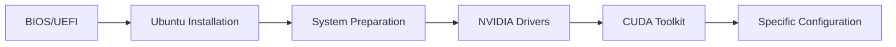

# Improved Guide for Setting Up Ubuntu Workstations with NVIDIA GPU

> **Last updated:** August 4, 2026

---

## Index

* [1. Pre-Installation Requirements](#1-pre-installation-requirements)
* [2. Ubuntu System Installation](#2-ubuntu-system-installation)
* [3. Initial Ubuntu System Preparation](#3-initial-ubuntu-system-preparation)
* [4. Installing NVIDIA Drivers on Ubuntu](#4-installing-nvidia-drivers-on-ubuntu)
* [5. Installing CUDA Toolkit](#5-installing-cuda-toolkit)
* [6. Specific Setup for Compression Workstations](#6-specific-setup-for-compression-workstations)
* [7. Specific Setup for Analytics Workstations](#7-specific-setup-for-analytics-workstations)
* [8. Managing the Graphical Interface](#8-managing-the-graphical-interface)
* [9. Common Network Issues with New Motherboards](#9-common-network-issues-with-new-motherboards)
* [10. Wake-on-LAN (WOL): Windows to Windows and Ubuntu to Windows](#10-wake-on-lan-wol-windows-to-windows-and-ubuntu-to-windows)
* [11. Post-Installation Script (Optional)](#11-post-installation-script-optional)
* [12. Doctor Verification Scripts](#12-doctor-verification-scripts)
* [13. Security Best Practices (Optional)](#13-security-best-practices-optional)
* [14. Runbook: MongoDB 8 Fails to Start on HWE Kernel 7.0](#14-runbook-mongodb-8-fails-to-start-on-hwe-kernel-70)
* [FAQ: Frequently Asked Questions](#faq-frequently-asked-questions)
* [Annex A: Identifying NVIDIA GPUs](#annex-a-identifying-nvidia-gpus)
* [Annex B: Compatibility Verification](#annex-b-compatibility-verification)
* [Annex C: Kernel Compatibility Matrix](#annex-c-kernel-compatibility-matrix-ubuntu-2404-lts)

---

> **Welcome!** This improved guide will help you install and configure Ubuntu with an NVIDIA GPU, optimizing each step and explaining the reasoning behind every action. All original commands and procedures are preserved, with added explanations, tips, and warnings for clarity.

---

## Visual Process Overview



---

## 1. Pre-Installation Requirements

### Before touching the machine

Confirm these points before installing Ubuntu:

| You need | Why |
|----------|-----|
| USB drive of 8 GB or more | To boot the Ubuntu installer. |
| Ubuntu Desktop LTS ISO image | This is the file copied to the USB drive. This guide uses Ubuntu Desktop 24.04 LTS as reference. |
| Backup of important data | The installation can erase the entire disk. |
| Internet access | Helps install updates and packages during the process. |
| Workstation type defined | Decide if the machine will be used for **compression/data** or **analytics**. |

> **Important alert:** If the machine has files you cannot lose, back them up before continuing. The simple installation path uses "Erase disk and install Ubuntu".

### Quick decision

- If the machine will be used by a person and has a screen, install **Ubuntu Desktop**.
- If the machine will be managed remotely, you can still start with **Ubuntu Desktop** and disable the graphical interface later.
- If you need dual boot with Windows, do not use the simple path in this section; it requires manual partitioning.

---

## 2. Ubuntu System Installation

This section leaves Ubuntu installed and ready for initial preparation. Follow the steps in order.

### Step 1: Download Ubuntu

1. Go to [https://ubuntu.com/download/desktop](https://ubuntu.com/download/desktop).
2. Download the **Ubuntu Desktop LTS** version indicated for your installation.
3. Save the `.iso` file somewhere easy to find, for example `Downloads`.

> **If the machine will run MongoDB 8:** Ubuntu Desktop 24.04.4 and later ISOs install the
> **HWE 7.0** kernel, which prevents `mongod` from starting (see
> [Section 14](#14-runbook-mongodb-8-fails-to-start-on-hwe-kernel-70)). The Ubuntu **Server** ISO
> installs the GA track by default and does not have this problem. If you install from Desktop
> anyway, apply the preventive pinning in
> [Section 3, Step 7](#step-7-apply-adjustments-for-your-ubuntu-version) before installing MongoDB.

### Step 2: Create the installation USB

The simplest option is to use a graphical tool:

1. Download BalenaEtcher from [https://etcher.balena.io/](https://etcher.balena.io/) or Ventoy from [https://www.ventoy.net/](https://www.ventoy.net/).
2. Connect the USB drive.
3. Select the Ubuntu ISO.
4. Select the correct USB drive.
5. Start the process and wait until it finishes.

> **Careful:** The tool will erase the USB drive. Check twice that you selected the correct drive.

### Step 3: Enter BIOS/UEFI

1. Shut down the machine.
2. Connect the USB drive.
3. Turn on the machine and press the BIOS key several times.

Common keys: `DEL`, `F2`, `F8`, `F10`, `F11`, `F12`, or `ESC`.

Common examples:

- ASUS usually uses `DEL`.
- MSI usually uses `DEL` or `F2`.
- Gigabyte usually uses `DEL`.

If it does not enter BIOS, restart and try another key.

### Step 4: Adjust BIOS/UEFI

Inside BIOS, change only what is needed:

| Option | Recommended value | Reason |
|--------|-------------------|--------|
| Secure Boot | Disabled | Prevents conflicts with proprietary NVIDIA drivers. |
| Boot Priority | USB first | Allows the Ubuntu installer to boot. |
| AC Power Loss | Always On, if it is a remote workstation | The machine powers back on after a power outage. |

Save changes with `F10` or with the **Save and Exit** option.

### Step 5: Boot from the USB

1. After restarting, choose the USB drive as the boot device.
2. Select **Try or Install Ubuntu**.
3. Wait for the installer to load.

If a black screen appears before entering the installer, use `nomodeset`:

1. In the boot menu, press `E`.
2. Find the line that starts with `linux`.
3. Add `nomodeset` at the end of that line.
4. Press `F10` to continue.

**Example edited line:**
```
linux /boot/vmlinuz-... nomodeset ---
```

### Step 6: Install Ubuntu with simple options

In the installer, use this selection:

| Screen | Recommended selection |
|--------|-----------------------|
| Language | **English**, to keep standard folder names like `Desktop` and `Downloads`. |
| Keyboard | Spanish or the physical keyboard layout. |
| Network | Connected to the internet if possible. |
| Installation type | Normal installation. |
| Additional software | Install updates if the installer offers them. If "third-party software" mixes graphics and Wi-Fi, leave it unchecked; network drivers are reviewed in section 3 and NVIDIA is installed later with `.run`. |
| Disk | **Erase disk and install Ubuntu**, only if you already backed everything up. |
| User | Create a normal user with a strong password. |
| Time zone | Select the correct time zone. |

> **Important alert:** `Erase disk and install Ubuntu` erases the selected disk. Do not choose this option if you need to keep Windows, partitions, or files.

The installation can take between 15 and 30 minutes. When it finishes, the installer will ask you to restart.

### Step 7: First boot

1. When Ubuntu asks, remove the USB drive.
2. Press `Enter` if the restart message appears.
3. Log in with the user you created.
4. Open a terminal with `Ctrl+Alt+T`.
5. Run these basic checks:

```bash
lsb_release -a
ping -c 4 google.com
df -h
```

Expected result:

- `lsb_release -a` shows Ubuntu.
- `ping` receives replies.
- `df -h` shows available disk space.

### If something fails during installation

| Problem | What to try first |
|---------|-------------------|
| The USB does not appear at boot | Recreate the USB, try another USB port, or check boot order. |
| Black screen before the installer | Boot with `nomodeset`. |
| The installer freezes | Restart, disable overclock in BIOS, and try again. |
| You cannot disable Secure Boot | Check the motherboard manual or search the exact BIOS model. |
| Error erasing or preparing the disk | Use the simple option if you do not need dual boot; if you need dual boot, stop and prepare partitions manually. |
| No internet | Continue the installation and solve networking later in the network issues section. |

---

## 3. Initial Ubuntu System Preparation

This section prepares Ubuntu to install the official NVIDIA driver with a `.run` file, which is the main path in this manual. Do not install the NVIDIA driver or CUDA yet; that comes in the next sections.

### Rule for this section

- We install updates, build tools, kernel headers, and base utilities.
- We set the graphical environment to Xorg to avoid NVIDIA conflicts.
- We can install **Ethernet/Wi-Fi** firmware or drivers if networking does not work.
- We do not use `ubuntu-drivers`, "Additional Drivers", or APT repositories to install NVIDIA.
- We do not run any `.run` installer yet.

### Step 1: Open a terminal

Press `Ctrl+Alt+T`.

If the machine asks for a password when using `sudo`, type your user password. The terminal will not show characters while you type; that is normal.

### Step 2: Check internet and network drivers

Before updating Ubuntu, confirm the machine has networking:

```bash
nmcli device status
ping -c 4 archive.ubuntu.com
```

Expected result:

- `nmcli` shows at least one connected interface.
- `ping` receives replies.

If **Ethernet or Wi-Fi does not appear**, identify the hardware:

```bash
lspci -nn | grep -Ei 'ethernet|network|wireless|wifi'
lsusb
```

Use that output to decide:

| Case | What to do |
|------|------------|
| Ethernet works, Wi-Fi does not | Connect an Ethernet cable and continue with the guide. Wi-Fi can be fixed later. |
| Wi-Fi works, Ethernet does not | Connect through Wi-Fi and continue with the guide. Ethernet can be fixed later. |
| Neither Ethernet nor Wi-Fi works | Use temporary internet through USB tethering from a phone or a Linux-compatible USB Ethernet/Wi-Fi adapter. |
| Broadcom Wi-Fi appears | With temporary internet, install `bcmwl-kernel-source`. |
| Intel/Realtek Wi-Fi appears but does not connect | With temporary internet, install or update `linux-firmware`. |
| Realtek RTL8125 Ethernet appears | If networking does not come up, review section 9 after getting temporary internet. |

With temporary internet, install base network firmware:

```bash
sudo apt update
sudo apt install -y linux-firmware
sudo reboot
```

> **Important:** It is allowed to use "Additional Drivers" for network drivers such as Broadcom Wi-Fi. Do not select NVIDIA drivers there; NVIDIA will be installed in section 4 with `.run`.

### Step 3: Update Ubuntu and reboot

First update the full system:

```bash
sudo apt update
sudo apt upgrade -y
```

When it finishes, reboot:

```bash
sudo reboot
```

After the reboot, open the terminal again.

### Step 4: Install tools required for `.run`

The NVIDIA `.run` installer needs to compile kernel modules. For that, it requires headers, DKMS, and build tools.

```bash
sudo apt install -y build-essential dkms linux-headers-$(uname -r) linux-headers-generic pkg-config gcc g++ make
sudo apt install -y libglvnd-dev libgl1-mesa-dev libegl1-mesa-dev libgles2-mesa-dev libx11-dev libxmu-dev libxi-dev libglu1-mesa-dev libgstreamer1.0-dev libgstreamer-plugins-base1.0-dev
sudo apt install -y ca-certificates curl wget git vim nano mesa-utils inxi net-tools openssh-server ufw dnsutils htop ncdu tree traceroute nmap lm-sensors neofetch
```

### Step 5: Disable Wayland and use Xorg

For this manual, we use Xorg because it is usually more predictable with NVIDIA drivers installed through `.run`.

Edit the GDM3 configuration:

```bash
sudo nano /etc/gdm3/custom.conf
```

Find this line:

```ini
#WaylandEnable=false
```

Leave it like this, without `#` at the beginning:

```ini
WaylandEnable=false
```

Save with `Ctrl+O`, press `Enter`, and exit with `Ctrl+X`.

Reboot to apply the change:

```bash
sudo reboot
```

### Step 6: Prepare remote access if you will use it

If the machine will be managed from another computer, enable SSH and allow it through the firewall:

```bash
sudo systemctl enable --now ssh
sudo ufw allow ssh
sudo ufw --force enable
```

If you will not use remote access, you can skip this step.

> **An active firewall with half the rules in place breaks services.** Here UFW comes up
> with SSH only, which is correct at this point because nothing else is installed yet.
> The stack ports (MongoDB, MQTT, EMQX dashboard, RTSP, Node-RED, AnyDesk) are added in
> Sections 6 and 7. If this machine will run those services, **do not leave it like
> this**: with UFW active and a port not allowed, the service starts fine and is still
> unreachable from the network, and troubleshooting goes to the service instead of the
> firewall. Check what is allowed with `sudo ufw show added` (it works even with the
> firewall off; `sudo ufw status` lists nothing while inactive).

### Step 7: Apply adjustments for your Ubuntu version

First check your version:

```bash
lsb_release -rs
```

For **Ubuntu 22.04 LTS**, install GCC/G++ 12 if you will use CUDA versions that require it:

```bash
sudo apt install -y gcc-12 g++-12
sudo update-alternatives --install /usr/bin/gcc gcc /usr/bin/gcc-12 120
sudo update-alternatives --install /usr/bin/g++ g++ /usr/bin/g++-12 120
```

For **Ubuntu 24.04 LTS**, install `libtinfo5` only if CUDA or an older tool requests it:

```bash
wget http://security.ubuntu.com/ubuntu/pool/universe/n/ncurses/libtinfo5_6.3-2ubuntu0.1_amd64.deb
sudo apt install ./libtinfo5_6.3-2ubuntu0.1_amd64.deb
rm libtinfo5_6.3-2ubuntu0.1_amd64.deb
```

If you do not know whether you need it, you can leave it for later. It does not block NVIDIA driver installation.

For **Ubuntu 24.04 LTS on machines that will run MongoDB 8** (every compression and analytics
workstation), pin the kernel to the **GA 6.8** track before installing any other package. MongoDB 8
refuses to start on kernels 6.19 – 7.0.13, which is what the HWE stack on 24.04.4+ ISOs installs:

```bash
sudo tee /etc/apt/preferences.d/99-no-hwe-kernel >/dev/null <<'EOF'
# MongoDB 8 vs kernel 6.19-7.0.13 (SERVER-121912): stay on the GA 6.8 track
Package: linux-*hwe-24.04* linux-*hwe-7.* linux-image-7.* linux-modules-7.* linux-headers-7.* linux-tools-7.*
Pin: release *
Pin-Priority: -1
EOF

sudo tee /etc/apt/apt.conf.d/51-block-hwe-kernel >/dev/null <<'EOF'
Unattended-Upgrade::Package-Blacklist {
  "linux-generic-hwe-24.04";
  "linux-image-generic-hwe-24.04";
  "linux-headers-generic-hwe-24.04";
};
EOF

sudo apt-mark hold linux-generic-hwe-24.04 linux-image-generic-hwe-24.04 \
                    linux-headers-generic-hwe-24.04
sudo apt update
sudo apt install --install-recommends linux-generic
```

Verify the pin hit the right target and did **not** drag the GA track down with it:

```bash
uname -r                                   # 6.8.0-1XX-generic if you are already on GA
apt-cache policy linux-generic-hwe-24.04   # expected: Candidate: (none), priority -1
apt-cache policy linux-image-generic       # expected: 500 / 6.8.0-1XX.XXX  <- must NOT be -1
```

> **If `uname -r` already shows `7.0.0-XX`**, the machine was born with HWE installed and this
> pinning only stops it from getting worse: the 7.0 still has to be purged. Do not continue with
> MongoDB; go to [Section 14, Case A](#case-a--machine-already-deployed-running-kernel-70).

### Step 8: Verify the preparation is ready

Run:

```bash
gcc --version
dkms status
ls /usr/src/linux-headers-$(uname -r)
echo $XDG_SESSION_TYPE
```

Expected result:

- `gcc --version` shows an installed version.
- `dkms status` does not show an error, although it may not list anything yet.
- `ls /usr/src/linux-headers-$(uname -r)` shows kernel files.
- `echo $XDG_SESSION_TYPE` should show `x11` if you are in a graphical session.

### If something fails during preparation

| Problem | What to try first |
|---------|-------------------|
| `apt update` fails | Check internet with `ping -c 4 archive.ubuntu.com`. |
| Wi-Fi does not appear | Use Ethernet or temporary USB tethering and install `linux-firmware`; if it is Broadcom, install `bcmwl-kernel-source`. |
| Ethernet does not appear | Use Wi-Fi, USB tethering, or a temporary USB adapter; then check the chip with `lspci -nn`. |
| Packages do not install | Run `sudo apt --fix-broken install` and repeat the command. |
| Kernel headers are missing | Run `sudo apt install -y linux-headers-$(uname -r) linux-headers-generic`. |
| `echo $XDG_SESSION_TYPE` shows `wayland` | Check `/etc/gdm3/custom.conf`, confirm `WaylandEnable=false`, and reboot. |
| SSH does not connect | Check the machine IP with `ip a` and firewall status with `sudo ufw status`. |
| You do not know whether an NVIDIA driver is already installed | Do not install over it. Section 4 will clean up before the `.run`. |

---

## 4. Installing NVIDIA Drivers on Ubuntu

This section installs the official NVIDIA driver using the `.run` file. This is the main method in this manual.

### Before starting

Confirm that you already completed section 3:

- Ubuntu is updated.
- Networking works.
- `gcc`, `dkms`, and kernel headers are installed.
- Secure Boot is disabled in BIOS/UEFI.
- You did not install NVIDIA through "Additional Drivers", `ubuntu-drivers`, or APT.

> **Important:** Do not mix methods. If you install NVIDIA with `.run`, do not later install `nvidia-driver-XXX`, `nvidia-open`, or `cuda-drivers` with APT on top of the same installation.

### Recommended branch: 580.x.x

For these workstations, we use the **R580 / 580.x.x** family because it has been the most stable in our testing. When downloading the driver, look for the newest available 580 version for your GPU.

Do not switch to another driver family only because a newer version exists. Change branches only for a concrete reason: support for a new GPU, a critical bug fix, or internal validation.

### Step 1: Identify the NVIDIA GPU

Run:

```bash
lspci -nn | grep -Ei 'nvidia|vga|3d|display'
```

Example:

```
01:00.0 VGA compatible controller: NVIDIA Corporation GA104 [GeForce RTX 3070] (rev a1)
```

If no NVIDIA GPU appears:

- Check that the GPU is physically installed correctly.
- Check BIOS/UEFI.
- Do not continue with the `.run` until the system detects the GPU.

### Step 2: Download the `.run` driver

1. Go to [https://www.nvidia.com/drivers/](https://www.nvidia.com/drivers/).
2. Select your exact GPU model.
3. Select **Linux 64-bit** as the operating system.
4. Look for a **580.x.x** version.
5. Download the `.run` file.
6. Save it in `Downloads`.

If NVIDIA offers several options, prefer the newest 580 family version compatible with your GPU. If the website does not offer 580 for that model, stop and review compatibility before installing another family.

In the terminal, confirm the file exists:

```bash
cd ~/Downloads
ls NVIDIA-Linux-x86_64-*.run
mv NVIDIA-Linux-x86_64-*.run NVIDIA-driver.run
```

If `mv` fails because there is more than one `.run`, leave only the driver you will install in `Downloads` and repeat the command.

If NVIDIA publishes a checksum for your download, compare it:

```bash
sha256sum NVIDIA-driver.run
```

### Step 3: Clean previous NVIDIA installations

On a freshly installed machine there should not be much to clean, but this avoids mixing methods:

```bash
dpkg -l | grep -Ei 'nvidia|cuda-drivers' || true
sudo apt purge -y '^nvidia-.*' '^libnvidia-.*' '^cuda-drivers.*' '^nvidia-open.*'
sudo apt autoremove -y
```

If the command removes anything, reboot before continuing:

```bash
sudo reboot
```

### Step 4: Disable Nouveau and enter text mode

`nouveau` is the open driver that Ubuntu may load before NVIDIA is installed. The `.run` installer needs it inactive.

```bash
printf 'blacklist nouveau\noptions nouveau modeset=0\n' | sudo tee /etc/modprobe.d/blacklist-nouveau.conf
sudo update-initramfs -u
sudo systemctl set-default multi-user.target
sudo reboot
```

After reboot you will see a text console. Log in with your user and verify:

```bash
lsmod | grep nouveau
```

Expected result: no output. If `nouveau` appears, do not continue; repeat this step and reboot.

### Step 5: Run the `.run` installer

From the text console:

```bash
cd ~/Downloads
chmod +x NVIDIA-driver.run
sudo ./NVIDIA-driver.run --dkms
```

Answer like this if the installer asks:

| Installer question | Recommended answer |
|--------------------|--------------------|
| `The distribution-provided pre-install script failed...` | `Yes`, continue. On Ubuntu this is often a warning. |
| Register modules with DKMS | `Yes`. This helps when the kernel changes. |
| Module type: Open/MIT-GPL or Proprietary | For RTX 20/30/40/50 or newer, use Open/MIT-GPL if shown. For older pre-Turing GPUs, use Proprietary. If unsure, leave the option recommended by the installer. |
| 32-bit libraries | `No`, unless you need old 32-bit applications. |
| Run `nvidia-xconfig` | `No`. |

If it fails, review:

```bash
less /var/log/nvidia-installer.log
```

### Step 6: Return to graphical mode and reboot

When the installer finishes successfully:

```bash
sudo systemctl set-default graphical.target
sudo reboot
```

### Step 7: Verify the NVIDIA driver

After reboot, open a terminal and run:

```bash
nvidia-smi
cat /proc/driver/nvidia/version
dkms status | grep -i nvidia
```

Expected result:

- `nvidia-smi` shows the GPU.
- `/proc/driver/nvidia/version` shows the loaded version.
- `dkms status` shows the NVIDIA module installed for the current kernel.

You can also save a machine summary:

```bash
nvidia-smi --query-gpu=name,driver_version,memory.total --format=csv
```

### If you need to uninstall the `.run`

Use this only if the driver was installed incorrectly or you need to start over:

```bash
sudo systemctl set-default multi-user.target
sudo reboot
```

Then log in through the console and run:

```bash
sudo nvidia-uninstall
sudo rm -f /etc/modprobe.d/blacklist-nouveau.conf
sudo update-initramfs -u
sudo systemctl set-default graphical.target
sudo reboot
```

### If something fails with NVIDIA

| Problem | What to check first |
|---------|---------------------|
| `nvidia-smi` says it failed | Check Secure Boot, reboot, and inspect `/var/log/nvidia-installer.log`. |
| The installer says `nouveau` is active | Repeat step 4, run `sudo update-initramfs -u`, and reboot. |
| Module compilation fails | Check `gcc --version`, `dkms status`, and `ls /usr/src/linux-headers-$(uname -r)`. |
| Black screen after reboot | Enter recovery mode or TTY, run `sudo nvidia-uninstall`, and retry. |
| It broke after a kernel update | Install headers for the new kernel and run `sudo dkms autoinstall`. |
| You installed through APT by mistake | Purge NVIDIA packages with APT, reboot, and repeat this section from step 3. |

Official references:

- [NVIDIA Driver Installation Guide](https://docs.nvidia.com/datacenter/tesla/driver-installation-guide/)
- [NVIDIA Driver Downloads](https://www.nvidia.com/drivers/)

---

## 5. Installing CUDA Toolkit

> **Note:** This section installs CUDA Toolkit only, using NVIDIA's `.deb (local)` installer. It assumes the NVIDIA driver is already installed via `.run` (section 4). **Do not install the `cuda` or `cuda-drivers` meta-packages**: both pull in NVIDIA's packaged driver and would override your `.run` install. Install only `cuda-toolkit-XX-Y`.

> **Version pinned by this manual:** **CUDA 13.0** (compatible with the 580.x.x driver branch). If you switch versions, adjust the commands and paths (`13-0` → `XX-Y`, `cuda-13.0` → `cuda-XX.Y`).

### Before starting

Confirm:

- NVIDIA `.run` driver 580.x.x already installed (section 4) and `nvidia-smi` works.
- Internet available.
- No previous CUDA install via APT, snap, or `.run` from another version.

### Step 1: CUDA repository pin

The pin ensures correct priority when packages overlap with other repos:

```bash
wget https://developer.download.nvidia.com/compute/cuda/repos/ubuntu2404/x86_64/cuda-ubuntu2404.pin
sudo mv cuda-ubuntu2404.pin /etc/apt/preferences.d/cuda-repository-pin-600
```

> **Side effect of the pin:** its last rule is `Package: *` with `Pin-Priority: 600`, so
> **everything** NVIDIA publishes outranks `noble`, including the `dkms` they repackage (it shows
> up as `dkms/unknown 1:3.2.1-1ubuntu2` in `apt list --upgradable`). The driver module is built by
> that `dkms`, so swapping it for an out-of-distro build is not worth it. A pin by package name
> beats the wildcard and hands `dkms` back to Ubuntu, which keeps getting its security updates:
>
> ```bash
> sudo tee /etc/apt/preferences.d/99-dkms-desde-ubuntu >/dev/null <<'EOF'
> Package: dkms
> Pin: release l=NVIDIA CUDA
> Pin-Priority: -1
> EOF
> apt-cache policy dkms    # Candidate must be noble's, not 1:3.2.1
> ```
>
> Installers 2.3.1+ write this pin themselves when they apply the CUDA one.

### Step 2: Download and install the local CUDA 13.0 repository

```bash
wget https://developer.download.nvidia.com/compute/cuda/13.0.0/local_installers/cuda-repo-ubuntu2404-13-0-local_13.0.0-580.65.06-1_amd64.deb
sudo dpkg -i cuda-repo-ubuntu2404-13-0-local_13.0.0-580.65.06-1_amd64.deb
sudo cp /var/cuda-repo-ubuntu2404-13-0-local/cuda-*-keyring.gpg /usr/share/keyrings/
sudo apt-get update
```

> **Important:** The `.deb` filename changes with each release (`13.0.0-580.65.06-1` here). Before installing, go to [https://developer.nvidia.com/cuda-downloads](https://developer.nvidia.com/cuda-downloads), choose Linux > x86_64 > Ubuntu > 24.04 > deb (local), and copy the exact commands NVIDIA shows.

### Step 3: Install the toolkit only (no driver)

```bash
sudo apt-get -y install cuda-toolkit-13-0
```

> **Do not run** `sudo apt-get install cuda` or `sudo apt-get install cuda-drivers`. Those packages install NVIDIA's packaged driver and break the `.run` 580.x.x driver from section 4.

**Verification (optional):**
```bash
dpkg -l | grep cuda-toolkit-13-0
ls /usr/local/cuda-13.0/bin/nvcc
```

### Step 4: Configure PATH and LD_LIBRARY_PATH

Edit `~/.bashrc`:

```bash
nano ~/.bashrc
```

Add at the end:

```bash
export PATH=/usr/local/cuda-13.0/bin${PATH:+:${PATH}}
export LD_LIBRARY_PATH=/usr/local/cuda-13.0/lib64${LD_LIBRARY_PATH:+:${LD_LIBRARY_PATH}}
```

Save and reload:

```bash
source ~/.bashrc
```

**Verification:**
```bash
which nvcc                # /usr/local/cuda-13.0/bin/nvcc
nvcc --version            # release 13.0
nvidia-smi                # 580.x.x driver still loaded
```

### If you need to uninstall CUDA Toolkit

```bash
sudo apt-get -y remove --purge 'cuda-toolkit-13-0' 'cuda-*-13-0'
sudo apt-get -y autoremove
sudo rm -rf /usr/local/cuda-13.0
sudo rm -f /etc/apt/preferences.d/cuda-repository-pin-600
sudo rm -f /etc/apt/sources.list.d/cuda-ubuntu2404-13-0-local.list
sudo apt-get update
```

This does not touch the NVIDIA `.run` driver.

### CUDA Troubleshooting

- **`nvcc: command not found`:** check `~/.bashrc` has the `export PATH=...` line and that you ran `source ~/.bashrc`.
- **`apt` wants to install `nvidia-driver-*` or `cuda-drivers-*`:** you are calling the `cuda` meta-package. Use only `cuda-toolkit-13-0`.
- **Driver stopped working after installing CUDA:** you installed `cuda` or `cuda-drivers`. Purge with the uninstall section, reinstall the `.run` driver (section 4), and reinstall only `cuda-toolkit-13-0`.
- **`nvidia-smi` and `nvcc` report different versions:** this is normal. `nvidia-smi` shows the driver version, `nvcc` shows the toolkit version.

---

## 6. Specific Setup for Compression Workstations

> **Note:** This section installs tools for compression/data workstations, assuming Ubuntu 24.04.1 LTS with CUDA/drivers installed. Tools are optional; install only what's necessary. Check versions on official sites.

### Installing MongoDB (NoSQL Database)

#### Step 0: Verify the kernel is compatible

MongoDB 8 **will not start** on Linux kernels 6.19 – 7.0.13 (TCMalloc/rseq bug,
[SERVER-121912](https://jira.mongodb.org/browse/SERVER-121912)). Before installing:

```bash
uname -r                        # expected: 6.8.0-1XX-generic
cat /proc/version_signature     # real upstream base, e.g. "... 6.8.0-136.136"
```

- If you see `6.8.0-1XX-generic`, continue with Step 1. If you have not applied the preventive
  pinning from [Section 3, Step 7](#step-7-apply-adjustments-for-your-ubuntu-version), do it now —
  without it, a future `apt upgrade` reinstalls HWE and leaves the machine without a database.
- If you see `7.0.0-XX-generic`, **do not install MongoDB yet**: go to
  [Section 14](#14-runbook-mongodb-8-fails-to-start-on-hwe-kernel-70) and come back here when done.

#### Step 1: Add Repository
Import GPG key:
```bash
curl -fsSL https://www.mongodb.org/static/pgp/server-8.0.asc | sudo gpg --dearmor -o /usr/share/keyrings/mongodb-server-8.0.gpg
```

Add repository (adjust `jammy` to `noble` if using Ubuntu 24.04):
```bash
echo "deb [ arch=amd64,arm64 signed-by=/usr/share/keyrings/mongodb-server-8.0.gpg ] https://repo.mongodb.org/apt/ubuntu noble/mongodb-org/8.0 multiverse" | sudo tee /etc/apt/sources.list.d/mongodb-org-8.0.list
```

#### Step 2: Install MongoDB
```bash
sudo apt-get update
sudo apt-get install -y mongodb-org
```

#### Step 3: Start and Enable Service
```bash
sudo systemctl start mongod
sudo systemctl enable mongod
```

**Verification:**
```bash
sudo systemctl status mongod
mongosh --eval "db.runCommand('ping')"
# Should show "ok": 1
```

> **Note on Transparent Huge Pages:** MongoDB 8.0 requires THP **enabled**, the opposite of 7.0 and
> earlier. If an old provisioning script left `transparent_hugepage=never` in `GRUB_CMDLINE_LINUX`
> or a systemd unit that disables it, remove it. Check with
> `cat /sys/kernel/mm/transparent_hugepage/enabled` (should show `[always]` or `[madvise]`).

### Installing MongoDB Compass (GUI for MongoDB)

#### Step 1: Download and Install
Download from [https://www.mongodb.com/try/download/compass](https://www.mongodb.com/try/download/compass):
```bash
wget https://downloads.mongodb.com/compass/mongodb-compass_1.43.4_amd64.deb
sudo apt install -y ./mongodb-compass_1.43.4_amd64.deb
```

If dependencies missing:
```bash
sudo apt --fix-broken install
```

#### Step 2: Run Compass
```bash
mongodb-compass &
```

**Verification:** Open the app and connect to `mongodb://localhost:27017`.

**Uninstallation (optional):**
```bash
sudo apt remove -y mongodb-compass
```

### Installing EMQX (MQTT Broker)

#### Step 1: Install from Repository
```bash
curl -sL https://assets.emqx.com/scripts/install-emqx-deb.sh | sudo bash
sudo apt-get install -y emqx
```

#### Step 2: Start and Enable
```bash
sudo systemctl start emqx
sudo systemctl enable emqx
```

**Verification:**
```bash
sudo systemctl status emqx
# Dashboard at http://localhost:18083 (user: admin, pass: public)
```

> **If `emqx` installs but the service never starts:** EMQX 5 will not start without
> `/etc/emqx/acl.conf`. That file is a dpkg *conffile*, and dpkg treats its absence as
> an admin decision: if someone deleted or moved it, neither the install nor a plain
> `--reinstall` puts it back. `--force-confmiss` is the only way to restore it from the
> package:
>
> ```bash
> ls -l /etc/emqx/acl.conf     # if it is missing, this is your problem
> sudo apt-get install -y --reinstall -o Dpkg::Options::=--force-confmiss emqx
> sudo systemctl start emqx && systemctl is-active emqx
> ```

### Installing Golang

#### Step 1: Install with Snap
```bash
sudo snap install go --classic
```

**Verification:**
```bash
go version
# Should show installed version
```

### Installing Visual Studio Code

#### Step 1: Install with Snap
```bash
sudo snap install code --classic
```

**Verification:**
```bash
code --version
# Should show version
```

### Installing GStreamer and Plugins

#### Step 1: Install Plugins
```bash
sudo apt-get install -y gstreamer1.0-plugins-base gstreamer1.0-plugins-good gstreamer1.0-plugins-bad gstreamer1.0-plugins-ugly gstreamer1.0-libav gstreamer1.0-tools gstreamer1.0-x gstreamer1.0-alsa gstreamer1.0-gl gstreamer1.0-gtk3 gstreamer1.0-qt5 gstreamer1.0-pulseaudio gstreamer1.0-rtsp
```

**Verification:**
```bash
gst-inspect-1.0 rtspclientsink
gst-inspect-1.0 nvh264enc
# Should show plugin info
```

### Installing Angry IP Scanner

#### Step 1: Download and Install
Download from [https://github.com/angryip/ipscan/releases](https://github.com/angryip/ipscan/releases):
```bash
wget https://github.com/angryip/ipscan/releases/download/3.9.1/ipscan_3.9.1_amd64.deb
sudo apt install -y ./ipscan_3.9.1_amd64.deb
```

**Verification:** Run `ipscan` from terminal or menu.

### Installing AnyDesk (Remote Support)

#### Step 1: Add Repository and Install
```bash
sudo apt update
sudo apt install -y ca-certificates curl apt-transport-https
sudo install -m 0755 -d /etc/apt/keyrings
sudo curl -fsSL https://keys.anydesk.com/repos/DEB-GPG-KEY -o /etc/apt/keyrings/keys.anydesk.com.asc
sudo chmod a+r /etc/apt/keyrings/keys.anydesk.com.asc
echo "deb [signed-by=/etc/apt/keyrings/keys.anydesk.com.asc] https://deb.anydesk.com all main" | sudo tee /etc/apt/sources.list.d/anydesk-stable.list > /dev/null
sudo apt update
sudo apt install -y anydesk
```

#### Step 2: Configure Firewall
```bash
sudo ufw allow 80/tcp
sudo ufw allow 443/tcp
sudo ufw allow 6568/tcp
sudo ufw allow 50001:50003/udp
```

**Verification:** Run `anydesk` and note the ID.

### Installing RustDesk (Remote Support Alternative)

#### Step 1: Download and Install
Download from [https://github.com/rustdesk/rustdesk/releases](https://github.com/rustdesk/rustdesk/releases):
```bash
wget https://github.com/rustdesk/rustdesk/releases/download/1.2.3/rustdesk-1.2.3-x86_64.deb
sudo apt install -y ./rustdesk-1.2.3-x86_64.deb
```

**Verification:** Run `rustdesk` and configure ID/password.

### Configuring Ports for Compression Workstations (Optional)
If you enabled UFW in section 3, open necessary ports for apps to function correctly. If not using firewall, skip this section.

| Application | Ports | Protocol | Command to Open (Optional) |
|------------|---------|-----------|-------------------------------|
| MongoDB | 27017 | TCP | `sudo ufw allow 27017/tcp` |
| EMQX MQTT | 1883 | TCP | `sudo ufw allow 1883/tcp` |
| EMQX Dashboard | 18083 | TCP | `sudo ufw allow 18083/tcp` |
| GStreamer RTSP | 554 | TCP/UDP | `sudo ufw allow 554/tcp && sudo ufw allow 554/udp` |
| AnyDesk | 80, 443, 6568 | TCP | `sudo ufw allow 80/tcp && sudo ufw allow 443/tcp && sudo ufw allow 6568/tcp` |
| AnyDesk (UDP) | 50001-50003 | UDP | `sudo ufw allow 50001:50003/udp` |
| RustDesk | Dynamic (check logs) | TCP/UDP | Configure as needed |
| SSH (if using) | 22 (or custom) | TCP | `sudo ufw allow ssh` |

**General verification (optional):**
```bash
sudo ufw status
netstat -tlnp | grep LISTEN  # Lists open ports
```

**Tips (optional):**
- For remote access, open only necessary ports and from specific IPs: `sudo ufw allow from <IP> to any port 27017`.
- If using VPN, adjust rules.
- Check app logs for additional ports (e.g., `sudo journalctl -u emqx`).

### General Tips
- Check services: `sudo systemctl status <service>`.
- Configure unique passwords for remote access.
- Review plugins: Use `gst-inspect-1.0` for GStreamer.

### Troubleshooting
- **MongoDB not starting:** Check logs: `sudo journalctl -u mongod`.
- **MongoDB not starting and the journal says `MongoDB cannot start: Linux kernel versions 6.19 and newer has a known incompatibility`:** The machine is running the HWE 7.0 kernel. Confirm with `uname -r` and apply [Section 14](#14-runbook-mongodb-8-fails-to-start-on-hwe-kernel-70). Reinstalling `mongodb-org` or editing `/etc/mongod.conf` will not help.
- **EMQX failing:** Verify ports: `netstat -tlnp | grep 1883`.
- **EMQX installed but the service is dead and `/etc/emqx/acl.conf` is missing:** dpkg does not restore a conffile that was deleted or moved. Run `sudo apt-get install -y --reinstall -o Dpkg::Options::=--force-confmiss emqx`, then `sudo systemctl start emqx`. `omnifish-doctor-compresion` detects and fixes this case.
- **GStreamer plugins missing:** `sudo apt install gstreamer1.0-plugins-*`.
- **AnyDesk/RustDesk not connecting:** Temporarily disable firewall for testing.

> **Additional Resources:**
> * [MongoDB Docs](https://www.mongodb.com/docs/)
> * [EMQX Docs](https://www.emqx.io/docs/)
> * [GStreamer Docs](https://gstreamer.freedesktop.org/documentation/)

---

## 7. Specific Setup for Analytics Workstations

> **Note:** This section installs tools for analytics/machine learning, assuming Ubuntu 24.04.1 LTS with CUDA installed. Install only what's necessary.

### Configuring MongoDB (Database and User)

#### Step 1: Access Console
```bash
mongosh
```

#### Step 2: Create Database and User
Replace placeholders:
```javascript
use DATABASE_NAME
db.createUser({
  user: "USERNAME",
  pwd: "PASSWORD",
  roles: [
    {
      role: "readWrite",
      db: "DATABASE_NAME"
    }
  ]
})
```

Exit with `exit`.

#### Step 3: Enable Authorization
Edit config:
```bash
sudo nano /etc/mongod.conf
```

Add under `security:`:
```yaml
security:
  authorization: enabled
```

Save and restart:
```bash
sudo systemctl restart mongod
```

**Verification:**
```bash
mongosh -u USERNAME -p PASSWORD --authenticationDatabase DATABASE_NAME
# Should connect
```

### Installing Node-RED

#### Step 1: Run Installation Script
```bash
bash <(curl -sL https://raw.githubusercontent.com/node-red/linux-installers/master/deb/update-nodejs-and-nodered)
```

#### Step 2: Enable and Start Service
```bash
sudo systemctl enable nodered
sudo systemctl start nodered
```

**Verification:**
```bash
sudo systemctl status nodered
# Dashboard at http://localhost:1880
```

### Installing Python and Machine Learning Libraries

#### Step 1: Install Python and Pip
```bash
sudo apt install -y python3 python3-pip
```

#### Step 2: Upgrade Pip
```bash
pip3 install --upgrade pip
```

#### Step 3: Install Libraries
```bash
pip3 install pandas numpy scikit-learn paho-mqtt ultralytics
```

**Verification:**
```bash
python3 -c "import pandas, numpy, sklearn; print('Libraries OK')"
# Should print without errors
```

### Configuring Ports for Analytics Workstations (Optional)
If using firewall, open ports:

| Application | Ports | Protocol | Command |
|------------|---------|-----------|---------|
| MongoDB | 27017 | TCP | `sudo ufw allow 27017/tcp` |
| Node-RED | 1880 | TCP | `sudo ufw allow 1880/tcp` |

**Verification:**
```bash
sudo ufw status
```

### General Tips
- Use virtual environments: `python3 -m venv ml_env && source ml_env/bin/activate`.
- Upgrade libraries: `pip3 install --upgrade <lib>`.

### Troubleshooting
- **MongoDB auth failing:** Check config in `/etc/mongod.conf`.
- **`mongosh` cannot connect because `mongod` will not start:** If the journal shows `MongoDB cannot start: Linux kernel versions 6.19 and newer...`, it is the HWE 7.0 kernel, not the auth config. Apply [Section 14](#14-runbook-mongodb-8-fails-to-start-on-hwe-kernel-70).
- **Node-RED not starting:** Check logs: `sudo journalctl -u nodered`.
- **Pip installing slow:** Use mirror: `pip3 install --index-url https://pypi.org/simple <lib>`.

> **Additional Resources:**
> * [Node-RED Docs](https://nodered.org/docs/)
> * [MongoDB Docs](https://www.mongodb.com/docs/)
> * [Pandas Docs](https://pandas.pydata.org/docs/)

---

## 8. Managing the Graphical Interface

> **Note:** Ubuntu uses GDM3 as display manager. Manage graphical environment to free resources on servers or troubleshoot GPU issues.

### Check Current State
Before changing, check current target:
```bash
systemctl get-default  # Should show graphical.target or multi-user.target
who  # Shows active sessions
```

### Disable Graphical Environment (Text/Server Mode)
Useful for headless servers or troubleshooting.

#### Step 1: Disable GDM3
```bash
sudo systemctl disable gdm3
sudo systemctl set-default multi-user.target
```

#### Step 2: Restart
```bash
sudo reboot
```

**Verification:**
```bash
systemctl get-default  # multi-user.target
# You won't see graphical environment on boot
```

### Reactivate Graphical Environment
For normal desktop use.

#### Step 1: Enable GDM3
```bash
sudo systemctl enable gdm3
sudo systemctl set-default graphical.target
```

#### Step 2: Restart
```bash
sudo reboot
```

**Verification:**
```bash
systemctl get-default  # graphical.target
# You should see graphical login
```

### Alternatives and Tips
- **Change without restart:** Use `sudo systemctl isolate multi-user.target` (temporary).
- **Other DM:** If you prefer LightDM: `sudo apt install lightdm && sudo dpkg-reconfigure lightdm`.
- **GPU issues:** If black screen, force Xorg in `/etc/gdm3/custom.conf` (see section 3).

### Troubleshooting
- **GDM3 not starting:** Logs: `sudo journalctl -u gdm`.
- **Black screen:** Add `nomodeset` in GRUB (see section 2).
- **Target not changing:** `sudo systemctl daemon-reload` and retry.

> **Explanation:** Disabling frees RAM/CPU; reactivating for GUI apps. Use as needed.

---

## 9. Common Network Issues with New Motherboards

> **Note:** Network problems with new motherboards are usually due to incompatible drivers. Use `lspci | grep Network` to identify the chip. Restart after changes.

> **⚠️ Before installing the HWE kernel to fix a NIC:** on any station running MongoDB 8 — that is,
> every compression and analytics station — that path is **closed**. The 24.04 HWE kernel pulls in
> the 7.0 series, which prevents `mongod` from starting
> ([SERVER-121912](https://jira.mongodb.org/browse/SERVER-121912)), and the pin from
> [Section 3 Step 7](#step-7-apply-adjustments-for-your-ubuntu-version) leaves it with no candidate:
> the `apt install` will fail with `has no installation candidate`.
>
> What you need is a newer **driver**, not a newer kernel. The full procedure, in the order that
> keeps you from losing network halfway through, is in
> [Case C of Section 14](#case-c--boards-whose-nic-does-not-work-on-the-ga-kernel).

### Problems with Realtek RTL8125 (Ethernet)

#### Diagnosis
```bash
ip link show  # Look for ethX/enpXsY DOWN
lspci | grep RTL8125  # Confirm chip
```

#### Fix

Check the chip revision first, because it decides everything else:

```bash
lspci -nn | grep -i 8125             # confirm the PCI ID (10ec:8125)
dmesg | grep -iE 'r8169|r8125|XID'   # the revision shows up as "XID <n>"
```

| Revision | XID | What handles it |
|---|---|---|
| RTL8125A / B / C | 605, 641, 648… | The GA 6.8 in-tree `r8169`, unaided. Change nothing |
| **RTL8125D** | **688** | Neither the GA `r8169` nor Ubuntu's `r8125-dkms`. See below |

> **An active `r8169` is not, on its own, a problem.** It is the correct driver for the A/B/C
> revisions on any kernel, and for **all** of them —rev D included— on the HWE 7.x kernels, where
> the support is already in-tree. The only case where `r8169` is the wrong driver is **RTL8125D
> (XID 688) on the GA 6.8 track**. Concluding "r8125 must be installed" from seeing `r8169` alone is
> the classic false positive of this section.

If the interface is UP and `basename $(readlink -f /sys/class/net/<iface>/device/driver)` says
`r8169`, it already works: install nothing.

For A/B/C revisions that do not come up, the package from Ubuntu's repos is enough:

```bash
sudo apt update
sudo apt install -y dkms build-essential linux-headers-generic
sudo apt install -y r8125-dkms        # for RTL8168/8111 use r8168-dkms
```

> **Before installing `r8125-dkms` on a machine you are about to move down to GA:** that package
> (9.011.00) drops an `r8125.ko` under `updates/dkms/` that does **not** support the RTL8125D, and
> with it the pre-reboot check of [Case C](#case-c--boards-whose-nic-does-not-work-on-the-ga-kernel)
> goes green on a board that will still come up with no network. If the board is rev D, or you
> cannot determine the revision, skip this route: go straight to the vendor driver (>= 9.014.01) or
> to `sudo omnifish-nic-rescue`.

> **For the RTL8125D (XID 688) that package does not work.** noble ships `r8125-dkms` 9.011.00,
> whose detection code only covers up to revision C and sends XID 688 to `unknown chip version`.
> You need the vendor driver, version **9.014.01 or newer**. The full procedure — in the order that
> keeps you from losing the network halfway through — is in
> [Case C of Section 14](#case-c--boards-whose-nic-does-not-work-on-the-ga-kernel).

> **Do not blacklist `r8169`.** It is a common reflex and here it does damage: RTL8168/8111 NICs
> (`10ec:8168`) depend on it, and on dual-port boards it is often the only working link. It is also
> unnecessary: both modules declare the `10ec:8125` alias, so `modprobe` loads both and the device
> goes to **whichever probes successfully first**. `r8169` ships in the initramfs and gets there
> earlier, so it keeps the revisions it supports and `r8125` stays loaded but unused; on the
> revisions it does not support it fails the probe, releases the device, and `r8125` takes it.

Being DKMS, the module is rebuilt on every kernel change, so this path is compatible with the GA
track pin that MongoDB 8 requires.

**Verification (optional):** `ip link show` (should be UP), `lspci | grep -i ethernet`

### Problems with Intel Ethernet (e.g., I219, I225, I226)

#### Diagnosis
```bash
lspci | grep -i ethernet              # Look for Intel controller
dmesg | grep -Ei 'e1000e|igc|igb'     # Driver errors
ip link show                          # UP/DOWN state of the interface
```

Intel I219 chips use the `e1000e` driver, while I225/I226 use `igc`. Both ship with the Ubuntu kernel; the issue is almost always an outdated kernel or missing firmware.

#### Solution

1. Update the system and firmware:
   ```bash
   sudo apt update && sudo apt full-upgrade -y
   sudo apt install -y linux-firmware
   ```
2. Check whether the driver in the kernel you intend to run knows your board. Take the PCI ID from
   `lspci -nn` — for example `8086:125c` — and ask the module:
   ```bash
   lspci -nn | grep -Ei 'ethernet'
   modinfo igc | grep -i 'pci:v00008086d0000125C'   # adjust the ID to your board
   ```
   If the alias shows up, the driver supports the chip and the problem is elsewhere: firmware, BIOS,
   or point 4.
3. If the alias does **not** show up, that kernel's driver is too old for the board.

   > **Do not install `linux-generic-hwe-24.04` if the station runs MongoDB 8.** That is the 7.0
   > series kernel that prevents `mongod` from starting. Follow
   > [Case C of Section 14](#case-c--boards-whose-nic-does-not-work-on-the-ga-kernel), which fixes the
   > NIC without switching kernel tracks.

   On a machine that will **not** run MongoDB, HWE is still valid:
   ```bash
   sudo apt install -y --install-recommends linux-generic-hwe-24.04
   ```
   For Ubuntu 22.04 use `linux-generic-hwe-22.04`.
4. If the chip comes up but the link is unstable and `dmesg` shows `igc` errors, try disabling
   TSO/GSO temporarily:
   ```bash
   sudo ethtool -K enpXsY tso off gso off gro off
   ```

**Verification:** `ip a` (IP assigned), `ping 8.8.8.8`

> **Note:** The `backport-iwlwifi-dkms` package is for Intel **Wi-Fi** cards (`iwlwifi` chipset), not for Ethernet. Do not install it to fix I219/I225/I226 issues.

### Problems with Wi-Fi (Broadcom, etc.)

#### Diagnosis
```bash
iwconfig  # List Wi-Fi interfaces
lspci | grep Network  # Identify chip
```

#### Solution for Broadcom
1. Install bcmwl: `sudo apt install bcmwl-kernel-source`
2. Restart: `sudo reboot`

**Verification:** `iwconfig` (should show wlan0 UP)

### DNS Not Resolving Names

#### Diagnosis
```bash
nslookup google.com  # Failing?
cat /etc/resolv.conf  # Nameservers
```

#### Solution
1. Edit resolv.conf: `sudo nano /etc/resolv.conf`
2. Add: `nameserver 8.8.8.8` and `nameserver 1.1.1.1`
3. Or use systemd: `sudo systemctl restart systemd-resolved`

**Verification:** `nslookup google.com` (should resolve)

### Slow or Intermittent Connection

#### Diagnosis
```bash
speedtest-cli  # Speed
dmesg | grep -i network  # Errors
```

#### Solution
1. Disable IPv6: `sudo nano /etc/sysctl.conf` add `net.ipv6.conf.all.disable_ipv6=1`
2. Apply: `sudo sysctl -p`
3. Change MTU: `sudo ip link set dev enpXsY mtu 1450`

**Verification:** `speedtest-cli`, restart and test.

### Configure Static IP

#### Solution
1. Edit Netplan: `sudo nano /etc/netplan/01-netcfg.yaml`
2. Example:
   ```yaml
   network:
     version: 2
     ethernets:
       enp0s3:
         dhcp4: no
         addresses: [192.168.1.100/24]
         gateway4: 192.168.1.1
         nameservers:
           addresses: [8.8.8.8, 1.1.1.1]
   ```
3. Apply: `sudo netplan apply`

**Verification:** `ip a` (static IP), `ping google.com`

### Problems with VPN

#### Diagnosis
```bash
sudo systemctl status openvpn  # If using OpenVPN
journalctl -u openvpn  # Logs
```

#### Solution
1. Install OpenVPN: `sudo apt install openvpn`
2. Connect: `sudo openvpn config.ovpn`
3. For WireGuard: `sudo apt install wireguard` and configure.

**Verification:** `ip a` (tun interface), `curl ifconfig.me` (external IP changes)

### General Troubleshooting
- **Not connecting:** `sudo systemctl restart NetworkManager`
- **Missing drivers:** Search in repos: `sudo apt search <chip>`
- **Logs:** `sudo journalctl -u NetworkManager`
- **Reset:** `sudo nmcli networking off && sudo nmcli networking on`

> **Tip:** If nothing works, install drivers from manufacturer's site or use USB Ethernet.

---

## 10. Wake-on-LAN (WOL): Windows to Windows and Ubuntu to Windows

> **Note:** WOL wakes PCs by network sending a "magic packet". Requires Ethernet (not Wi-Fi). Configure BIOS and OS first.

### Configure WOL on Target PC (Windows/Ubuntu)

#### In BIOS/UEFI
1. Enter BIOS (F2/DEL).
2. Go to "Power Management" > "Wake on LAN" > "Enabled".
3. "AC Power Loss" > "Power On" (optional).
4. Save and exit.

#### In Windows
1. Run `powercfg /devicequery wake_armed` (lists devices that can wake).
2. In Device Manager > Network Adapter > Properties > Power Management > Check "Allow this device to wake the computer".
3. In Power Options > "Allow wake timers".

#### In Ubuntu
1. Install ethtool: `sudo apt install ethtool`
2. Enable WOL: `sudo ethtool -s enpXsY wol g` (replace enpXsY with interface, e.g., `ip link show`)
3. Verify: `sudo ethtool enpXsY | grep Wake-on`
4. For persistence: Create `/etc/systemd/system/wol.service` with:
   ```
   [Unit]
   Description=Enable WOL
   After=network.target

   [Service]
   Type=oneshot
   ExecStart=/usr/sbin/ethtool -s enpXsY wol g

   [Install]
   WantedBy=multi-user.target
   ```
   Enable: `sudo systemctl enable wol`

**Verification:** Turn off PC, wait 1 min, send packet from another device.

### Send WOL Packet from Windows (to Windows or Ubuntu)

#### PowerShell Script
Save as `Send-WOL.ps1` and run: `.\Send-WOL.ps1 -Mac AA:BB:CC:DD:EE:FF`

Works for waking Windows or Ubuntu PCs configured for WOL.

```powershell
[CmdletBinding()]
param(
  [Parameter(Mandatory=$true)] [string]$Mac,
  [string]$Broadcast = "255.255.255.255",
  [int]$Port = 9
)

$macClean = ($Mac -replace '[:-]','')
if ($macClean.Length -ne 12) { throw "Invalid MAC: $Mac" }

$macBytes = 0..5 | ForEach-Object { [Convert]::ToByte($macClean.Substring($_*2,2),16) }

$packet = New-Object byte[] (6 + 16*6)
for ($i=0; $i -lt 6; $i++) { $packet[$i] = 0xFF }
for ($i=0; $i -lt 16; $i++) { [Array]::Copy($macBytes, 0, $packet, 6 + $i*6, 6) }

$udp = New-Object System.Net.Sockets.UdpClient
$udp.EnableBroadcast = $true
[void]$udp.Send($packet, $packet.Length, $Broadcast, $Port)
$udp.Close()
Write-Host "WOL sent to $Mac via $Broadcast:$Port"
```

### Send WOL Packet from Ubuntu

#### Install tools
```bash
sudo apt install wakeonlan etherwake
```

#### Send packet
```bash
wakeonlan -i 192.168.1.255 AA:BB:CC:DD:EE:FF  # Your network broadcast IP
# or
sudo etherwake -i enpXsY AA:BB:CC:DD:EE:FF
```

**Verification:** Use Wireshark/tcpdump to see packet: `sudo tcpdump -i enpXsY port 9`

### Troubleshooting
- **Not waking:** Check BIOS, power settings, firewall blocking port 9.
- **Wrong MAC:** `ip link show` or `arp -a` to get it.
- **Broadcast IP:** Use `ip route | grep default` for subnet.
- **Persistence:** In Ubuntu, add to cron: `@reboot sudo ethtool -s enpXsY wol g`

> **Note:** WOL by Wi-Fi doesn't work. Use Ethernet. Test with PCs on same local network.

---

## 11. Post-Installation Script (Optional)

> **Note:** This script automates initial preparation (section 3). Update as needed. Run as root or with sudo.

### Improved `setup.sh` Script
Includes additional dependencies and options.

```bash
#!/bin/bash
# Script for initial Ubuntu system preparation
# Improved version with more tools

set -e  # Exit on error

echo "--- Updating system ---"
sudo apt update && sudo apt upgrade -y

echo "--- Installing common dependencies ---"
sudo apt install -y build-essential dkms pkg-config libglvnd-dev libgl1-mesa-dev libegl1-mesa-dev libgles2-mesa-dev libx11-dev libxmu-dev libxi-dev libglu1-mesa-dev libgstreamer1.0-dev libgstreamer-plugins-base1.0-dev mesa-utils inxi net-tools openssh-server curl git wget htop ncdu tree traceroute nmap vim lm-sensors neofetch

echo "--- Configuring GDM3 (disable Wayland) ---"
sudo sed -i 's/#WaylandEnable=false/WaylandEnable=false/' /etc/gdm3/custom.conf

echo "--- Configuring firewall (optional) ---"
read -p "Enable UFW with SSH? (y/n): " ufw_choice
if [[ $ufw_choice =~ ^[yY]$ ]]; then
  sudo ufw allow ssh
  sudo ufw --force enable
fi

echo "--- Verifications ---"
echo "GCC version: $(gcc --version | head -1)"
echo "Git version: $(git --version)"
echo "Firewall status: $(sudo ufw status | head -1)"

echo "--- Preparation completed. Restart recommended. ---"
read -p "Restart now? (y/n): " choice
case "$choice" in
  y|Y ) sudo reboot;;
  * ) echo "Run 'sudo reboot' manually.";;
esac
```

### How to Use It
1. Create file: `nano setup.sh`
2. Paste content and save.
3. Permissions: `chmod +x setup.sh`
4. Run: `./setup.sh` (or `sudo ./setup.sh` if needs root)

### Customization
- Add more installs: `sudo apt install -y <package>`
- Remove options: Comment lines with `#`
- Logging: Add `>> setup.log` to commands.

### Troubleshooting
- If fails: Check logs in terminal.
- Permissions: Ensure script has execution.
- Dependencies: Verify internet for apt.

---

## 12. Doctor Verification Scripts

> **Note:** The doctor scripts verify that all required workstation components are installed correctly and can optionally install missing components automatically. There are two variants depending on the workstation type.

### Files

| File | Description |
|------|-------------|
| `doctor_lib.sh` | Shared library with verification, installation, and summary functions. Do not run it directly. |
| `doctor_compresion.sh` | Verifies and installs components for **compression** workstations (sections 3-6). |
| `doctor_analitica.sh` | Verifies and installs components for **analytics** workstations (sections 3-5 and 7). |
| `self_check_doctor_lib.sh` | Exercises `doctor_lib.sh`'s network checks against fake trees in a tmpdir. Touches nothing on the system; use it to validate library changes before shipping them to a machine. |
| `nic_lib.sh` | Shared library holding the canonical knowledge about Realtek 2.5GbE NICs: revisions/XID, minimum driver version, `.ko` validation, and the two diagnostic rules (driver and stalled chip). Not run directly. |
| `diag-nic.sh` | Layered diagnosis of **one** network port. Read-only plus a capture; changes no configuration. |
| `fix-r8125-downgrade-6.8.sh` | Remediation: prepares the driver and the GA 6.8 kernel, verifies, and only then arms the one-shot boot. This one **does** modify the system. |
| `self_check_nic_lib.sh` | Exercises `nic_lib.sh` and the `diag-nic.sh` rules against field scenarios A–I. No root, no hardware, no network. |

> **Since 2.3.0 the doctors verify the Case C network**, next to the kernel pin in the MongoDB
> section: that every Ethernet NIC on the PCI bus has a driver bound — the RTL8125D failure shows up
> in sysfs and needs no cable —, that every DKMS module has a build for the running kernel (an
> `r8125` built only for the previous kernel leaves the machine without network on the next reboot),
> and that nobody left a `blacklist r8169` behind, which kills RTL8168/8111 cards.


### Network diagnosis and remediation (`diag-nic.sh` and `fix-r8125-downgrade-6.8.sh`)

Both belong to [Case C of Section 14](#case-c--boards-whose-nic-does-not-work-on-the-ga-kernel) and
share `nic_lib.sh`. **Copy the whole repo to the machine**, not the individual files: without
`nic_lib.sh` next to them they refuse to start (and say so).

#### Two channels, one source

These scripts — and the three doctors — also travel **inside the OmniFish `.deb` packages**, copied
byte for byte from this repo at build time. There are not two versions to maintain: the
`Ubuntu-NVIDIA-Deb-Packages` build pulls them from here, and its suite verifies each file's sha256
against the original.

| | Loose files from this repo | Inside the `.deb` |
|---|---|---|
| What for | **Field**: fixing a conflict on an already deployed machine | **Office**: provisioning machines that go to the field |
| How they arrive | `scp` of the repo, or a USB stick | Already installed with the package |
| Invoked as | `./diag-nic.sh`, `./doctor_compresion.sh` | `omnifish-diag-nic`, `omnifish-doctor-compresion`, `omnifish-kernel-downgrade`, `omnifish-doctor-analitica` |
| Where they live | Wherever you copied them | `/usr/local/lib/omnifish/`, with wrappers in `/usr/local/bin/` |

And the profile installer **finishes by running its doctor** (read-only, no `--fix`), so provisioning
and verifying is a single command:

```bash
sudo omnifish-workstation-compression                # installs and ends with the doctor
sudo omnifish-workstation-compression --no-doctor    # install without verifying
omnifish-workstation-compression --doctor-only       # verify without installing
```

`--doctor-only` is the gate mode: it installs nothing, **needs no root** (the doctor in read-only
mode touches nothing) and **exits with the number of failures as its exit code**, so it can decide
whether a machine ships:

```bash
if omnifish-workstation-compression --doctor-only; then
  echo "ready for the field"
fi
```

At the end of an install it is the other way round: there the doctor reports and does **not** change
the installer's exit code, because the install did what it could do.

> **`omnifish-kernel-downgrade` (that is, `fix-r8125-downgrade-6.8.sh`) is never invoked
> automatically.** The kernel pin, the NIC gate and the provisioning `grub-reboot` are already done
> by `omnifish-nvidia-setup --fix-kernel` together with `omnifish-nic-rescue`. This script exists for
> the machine that is **already in the field** and additionally needs the ASPM/EEE hardening, the
> self-healing watchdog and the MAC-matched netplan persistence. It detects the installer's pin and
> does not write a second file, so running it afterwards is safe; what makes no sense is alternating
> between the two.

#### `diag-nic.sh` — read-only

```bash
sudo ./diag-nic.sh <interface> [capture_seconds] [test_gateway]
sudo ./diag-nic.sh enp13s0 30 172.20.66.1
```

It leaves three artifacts in the current directory: the full log, a `.pcap` of the unfiltered
capture, and one line in `diag-results.csv` for consolidating several machines.

The summary does **not** mix observations with causes. Every finding lands in one block with one
severity:

| Block | Answers |
|---|---|
| `SALUD ACTUAL DEL LINK` | Is the NIC working right now? |
| `DRIVER / HARDWARE` | Is the bound driver the right one for this chip and this kernel? |
| `DHCP / L3` | Is there an IP and reachability? |
| `PERSISTENCIA TRAS REBOOT` | Does this survive the next reboot? |
| `RIESGOS DE CONFIGURACIÓN` | Pending good practices and switch-side hints |

| Severity | Means |
|---|---|
| `[INFO]` | Observation. Nothing to do |
| `[AVISO]` | Risk or pending good practice. **Not** a current failure |
| `[SOSPECHA]` | Consistent with a failure, but the evidence is not enough to assert it |
| `[FALLO]` | Confirmed with the available evidence |

Exit codes, for fleet consolidation: `0` no findings, `1` warnings, `2` suspicions, `3` failures.

**Two things this script deliberately does not do.** It does not flag `r8169` as the wrong driver on
its own: the rule looks at kernel, PCI ID, XID and the driver actually bound in sysfs
(`readlink -f /sys/class/net/<iface>/device/driver`, equivalent to `ethtool -i`), never `lsmod`. And
it does not declare a chip "stalled" because `rx_packets` did not move for a few seconds: it combines
RX and interrupts over a long window (>= 30 s), the unfiltered capture, and a **recent, timestamped**
`NETDEV WATCHDOG`, and reports one of four levels — `NORMAL`, `SOSPECHOSO`, `PROBABLE`,
`MUY_FUERTE`. If the capture saw traffic, the chip receives and nothing can push it past
`SOSPECHOSO`, however many signals pile up.

**Layer 8** is the one that matters before a remote downgrade: if the board has a `10ec:8125` and the
machine is not yet on GA, it verifies that an `r8125.ko` **of a sufficient version** exists for the
target 6.8 kernel and is indexed in `modules.alias`. If it is missing, the summary says
`NO REINICIAR al kernel GA todavía`.

#### `fix-r8125-downgrade-6.8.sh` — modifies the system

```bash
sudo ./fix-r8125-downgrade-6.8.sh --dry-run    # see what it would do
sudo ./fix-r8125-downgrade-6.8.sh
```

It runs, in this order and on the old kernel **with the network still alive**: connectivity check,
NIC analysis and `r8125` build against the 6.8 headers, ASPM/EEE hardening, GA kernel install with
pin and hold, self-healing watchdog, MAC-matched network persistence, and only at the end a
**pre-reboot gate** that prints an auditable checklist:

```
kernel image · initramfs · configured packages (modules-extra included) ·
GRUB entry · apt pin · no r8169 blacklist ·
r8125.ko present, of sufficient version, valid for modinfo, depmod done
and PCI alias indexed
```

If anything critical is missing it prints **`NO REINICIAR`**, does not arm the one-shot boot and
exits `1`. Only with a complete checklist does it run `grub-reboot` and say `SEGURO REINICIAR`. That
ordering is deliberate: the machine is never left pointing at a kernel that cannot bring up the
network.

#### Re-running is cheap: check before acting

Both scripts get re-run often — a phase fails, something is fixed, you run it again — so **no step
redoes work already done**. `fix-r8125-downgrade-6.8.sh` writes each configuration file only if its
content differs from what is already on disk, and the expensive operations hang off that:

| File | What a re-run avoids |
|---|---|
| `/etc/modprobe.d/omnifish-r8125-options.conf` | `update-initramfs -u -k` (~30 s) |
| `/etc/udev/rules.d/90-omnifish-r8125-override-*.rules` | `udevadm control --reload-rules` |
| `r8125-zombie-watchdog.sh`, `.service`, `.timer` | `systemctl daemon-reload` |
| `/etc/apt/preferences.d/99-omnifish-pin-ga-kernel` | rewriting the pin |

The steps that were already guarded stay that way: it does not rebuild `r8125` if a valid one exists
for the target kernel, does not reinstall the GA kernel if the packages are properly configured, and
does not write a second pin if the installer's is already there. The watchdog's
`systemctl enable --now` does run every time, deliberately: it is idempotent and cheap, and it
repairs a timer someone disabled by hand.

`diag-nic.sh` does not apply: it only reads and captures.

> **Run `./self_check_nic_lib.sh` after touching any of those three files.** It covers field
> scenarios A–I (legitimate `r8169` on 6.8, real RTL8125D, 7.x kernel, quiet network, stalled chip
> with strong evidence, no carrier, DHCP with no Offer, ephemeral profile, undeterminable XID)
> without touching the system.

### Basic Usage

#### Verify only (install nothing)
```bash
chmod +x doctor_compresion.sh doctor_analitica.sh doctor_lib.sh
./doctor_compresion.sh      # For compression workstations
./doctor_analitica.sh       # For analytics workstations
```

#### Verify and install missing components automatically
```bash
./doctor_compresion.sh --fix
./doctor_analitica.sh --fix
```

With `--fix`, the script:
1. Requests `sudo` once at the start.
2. Runs `apt update` once.
3. For each failed check, attempts to install the component and verifies it again.
4. Generates a full log in `/tmp/doctor_fix_YYYYMMDD_HHMMSS.log`.

### Recommended Flow

```
1. Run the script without --fix to diagnose
             │
             ▼
2. Are there NVIDIA Driver or CUDA failures?
   ├─ YES → Install manually (sections 4 and 5 of this guide)
   └─ NO  → Continue
             │
             ▼
3. Run with --fix to install the rest automatically
             │
             ▼
4. Check the final summary
   ├─ Everything OK → Done
   └─ Still failing → Review /tmp/doctor_fix_*.log
```

> **Important:** NVIDIA drivers and CUDA Toolkit require manual installation because they involve reboots, text mode, and PATH configuration. The script detects them but does not install them automatically; instead, it shows instructions to follow the relevant sections of this guide.

### Severity Levels

The scripts classify results into different levels to make prioritization easier:

| Tag | Level | Description | Example |
|-----|-------|-------------|---------|
| `[OK]` | Correct | Component installed and working | build-essential, nvidia-smi, MongoDB |
| `[FALLO]` | Critical | Essential component missing | System packages, drivers, CUDA |
| `[AVISO]` | Critical warning | Important optional component missing | Stopped services, remote tools |
| `[NOTA]` | Minor | Optional configuration not applied | Firewall ports not configured |
| `[INFO]` | Informational | Detected system data | GPU version, kernel, IP |

In the summary:
- **SALUDABLE:** 0 failures and 0 warnings. Minor notes do not affect the status.
- **SALUDABLE CON AVISOS:** 0 failures, but critical warnings remain.
- **ATENCIÓN REQUERIDA:** 1-3 failures.
- **REQUIERE INTERVENCIÓN:** More than 3 failures.

### What Each Script Verifies

#### Common components (both scripts)
- Operating system (Ubuntu, kernel, architecture)
- Development dependencies (build-essential, dkms, GCC, OpenGL/Mesa/GStreamer libraries)
- Quality-of-life tools (git, curl, wget, vim, htop, ncdu, nmap, etc.)
- Graphical environment (Xorg vs Wayland)
- SSH and firewall
- Development dependencies: headers for the running kernel, required for DKMS to rebuild the NVIDIA module
- NVIDIA drivers (nvidia-smi, kernel modules, GPU detection)
- Driver on the branch pinned by this manual (580.x.x) and installed via `.run`, **not** APT. A machine with `nvidia-driver-*` from APT used to pass every NVIDIA check even though Section 4 treats it as an error to purge
- Open/MIT-GPL kernel module, recommended by Section 4 Step 5 for RTX 20/30/40/50
- CUDA Toolkit (nvcc, PATH, LD_LIBRARY_PATH, system configuration)
- CUDA on the version pinned by Section 5 (13.0)
- Persistent GA kernel pin. Checking `uname -r` alone is not enough: a machine on 6.8 today but without the pin returns to HWE on the next `apt upgrade` and ends up with no database
- Transparent Huge Pages enabled, which MongoDB 8.0 requires

#### Compression only (`doctor_compresion.sh`)
- MongoDB and MongoDB Compass, including MongoDB 8 kernel compatibility (fails if in the 6.19 – 7.0.13 range, see [Section 14](#14-runbook-mongodb-8-fails-to-start-on-hwe-kernel-70))
- EMQX (MQTT broker)
- Golang and Visual Studio Code
- GStreamer and all plugins (base, good, bad, ugly, libav, RTSP, NVIDIA, etc.)
- Remote tools (Angry IP Scanner, AnyDesk, RustDesk)
- AnyDesk systemd override, which Section 6 Step 2 declares mandatory. Without it AnyDesk crashes and freezes GNOME, and a merely-installed package does not reveal that
- Ports: 27017 (MongoDB), 1883 (MQTT), 18083 (EMQX Dashboard)

#### Analytics only (`doctor_analitica.sh`)
- MongoDB with authorization check and MongoDB 8 kernel compatibility (fails if in the 6.19 – 7.0.13 range, see [Section 14](#14-runbook-mongodb-8-fails-to-start-on-hwe-kernel-70))
- Node-RED, Node.js, and npm
- Python 3, pip3, and ML libraries (pandas, numpy, scikit-learn, paho-mqtt, ultralytics)
- Ports: 27017 (MongoDB), 1880 (Node-RED)

### Troubleshooting
- **The script fails to start:** Verify that `doctor_lib.sh` is in the same directory.
- **`--fix` does not install something:** Review the log in `/tmp/doctor_fix_*.log` for the exact error.
- **Python package not detected:** The script uses `pip3 show`, which is more robust than `import`. If it fails, verify with `pip3 list | grep <package>`.
- **NVIDIA module not detected:** The script checks through `lsmod`, `/proc/driver/nvidia/version`, and `nvidia-smi` as fallback. If all fail, verify that the driver is installed correctly.
- **CUDA not detected:** The script searches for `nvcc` in `/usr/local/cuda*/bin/` and also checks configuration in `~/.bashrc`, `/etc/profile.d/`, and `/etc/environment`.
- **"Kernel compatible con MongoDB 8" fails:** There is no autofix; `--fix` cannot change the running kernel. Apply [Section 14](#14-runbook-mongodb-8-fails-to-start-on-hwe-kernel-70) manually and re-run the script.
- **"Driver instalado por .run y no por APT" fails:** There are `nvidia-*` packages from APT. Deliberately no autofix: purging the active driver requires text mode. Apply steps 3 through 6 of [Section 4](#4-installing-nvidia-drivers-on-ubuntu).
- **"Pin del kernel GA persistente" fails:** `/etc/apt/preferences.d/99-no-hwe-kernel` or `/etc/apt/apt.conf.d/51-block-hwe-kernel` is missing, or the pin did not leave `Candidate: (none)`. Apply [Step 7 of Section 3](#step-7-apply-adjustments-for-your-ubuntu-version). This check can be green on `uname -r` and red here: it means the machine is fine today and broken on the next `apt upgrade`.
- **"Driver en la rama 580.x.x" fails:** The manual pins that family. Switch branches only for a concrete reason: new GPU, critical bug fixed, or internal validation. See [Annex B](#annex-b-compatibility-verification).
- **"AnyDesk con override X11" fails:** `--fix` applies it by writing the override and restarting the service. Installing AnyDesk from scratch also applies it now.
- **An installed package reads as absent:** If it is on `hold`, `dpkg -l` shows `hi` rather than `ii`. The scripts use `pkg_installed`, which queries `dpkg-query` and is not fooled; if you write your own check, do not use `grep '^ii'`.

---

## 13. Security Best Practices (Optional)

> **Note:** These measures strengthen Ubuntu, especially for remote access. Apply only what's necessary; more security may complicate use.

### Secure SSH

#### Change SSH Port
Reduce bot scans.

1. Edit config: `sudo nano /etc/ssh/sshd_config`
2. Change: `Port 22` to `Port 2222`
3. Restart SSH: `sudo systemctl restart ssh`
4. Firewall: `sudo ufw allow 2222/tcp && sudo ufw delete allow 22/tcp`

**Verification:** `ss -tlnp | grep 2222`

#### SSH Key Authentication
Disable passwords.

1. Generate local key: `ssh-keygen -t ed25519 -C "your_email"`
2. Copy to server: `ssh-copy-id -p 2222 user@server_ip`
3. Disable password: `sudo nano /etc/ssh/sshd_config` > `PasswordAuthentication no`
4. Restart: `sudo systemctl restart ssh`

**Verification:** Try login with password (should fail).

#### Disable Root Login
Prevent direct root access.

1. Edit: `sudo nano /etc/ssh/sshd_config` > `PermitRootLogin no`
2. Restart: `sudo systemctl restart ssh`

### Firewall and Monitoring

#### Install Fail2Ban
Block IPs with failed attempts.

1. Install: `sudo apt install fail2ban`
2. Enable: `sudo systemctl enable fail2ban`
3. Config: `sudo nano /etc/fail2ban/jail.local` (e.g., `[sshd]` with `port = 2222`)

**Verification:** `sudo fail2ban-client status sshd`

#### Automatic Updates
Keep system secure.

1. Install unattended-upgrades: `sudo apt install unattended-upgrades`
2. Config: `sudo dpkg-reconfigure unattended-upgrades`
3. Or cron: `sudo crontab -e` > `0 2 * * * apt update && apt upgrade -y`

**Verification:** `sudo unattended-upgrades --dry-run`

### Other Practices

- **Backups:** Use `rsync` or `borgbackup` for backups.
- **Antivirus:** Install `clamav` for scans: `sudo apt install clamav`
- **Logs:** Monitor with `journalctl` or `logwatch`.
- **VPN:** Use WireGuard for secure remote access.

### Troubleshooting
- **SSH not connecting:** Check port and firewall.
- **Fail2Ban blocking:** `sudo fail2ban-client unban <IP>`
- **Updates failing:** `sudo apt --fix-broken install`

> **Tip:** Use tools like `lynis` for audit: `sudo apt install lynis && sudo lynis audit system`

---

## 14. Runbook: MongoDB 8 Fails to Start on HWE Kernel 7.0

> **Applies to:** Ubuntu 24.04 LTS (noble) with `mongodb-org` 8.0.x.
> **Upstream ticket:** [SERVER-121912](https://jira.mongodb.org/browse/SERVER-121912).
> **Status:** mitigation in force until MongoDB ships the patched TCMalloc (see *Exit criteria*).
> **Validated on:** `omnifish-SCMP`, August 3, 2026.

This section is a runbook: apply it only when the symptom shows up (Case A) or when provisioning a
new machine (Case B). It is not part of the normal installation flow.

### Root Cause

MongoDB 8.0+ vendors a version of TCMalloc that violates the kernel's **rseq**
(*restartable sequences*) ABI. From Linux 6.19 onward this causes crashes.

MongoDB added an explicit guard: **it detects kernels in the 6.19 – 7.0.13 range and refuses to
start**. Kernel 7.0.14 or newer resolves the incompatibility.

The problem shows up on Ubuntu 24.04 because Canonical rolled the **26.04 HWE stack (kernel 7.0)**
into noble. ISOs from 24.04.4 onward install it by default on desktop.

#### Critical detail for Ubuntu

Ubuntu keeps `X.Y.0-ABI` fixed in `uname -r` and only bumps the ABI number, even when it rebases the
upstream sublevel internally. That means: **when Canonical rebases to 7.0.14+, `uname -r` will still
report `7.0.0-XX`** and MongoDB's guard will keep blocking, even on an already-fixed kernel.

**Operational conclusion:** do not wait for the next HWE update to fix it. The way out is staying on
the **GA 6.8** track, which receives Canonical security patches until 24.04 end of life and never
jumps branches.

### Diagnosis

```bash
uname -r                        # e.g. 7.0.0-28-generic
cat /proc/version_signature     # REAL upstream base, e.g. "... 7.0.12"
systemctl status mongod
journalctl -u mongod -b --no-pager | tail -30
```

Unmistakable signature in the journal:

```
"s":"F","c":"CONTROL","id":12257600,"ctx":"main",
"msg":"MongoDB cannot start: Linux kernel versions 6.19 and newer has a known incompatibility..."
```

`/proc/version_signature` tells the two cases apart:

| Upstream base | Situation |
|---|---|
| 6.19 – 7.0.13 | Real incompatibility. Apply this runbook. |
| ≥ 7.0.14 | Kernel already fixed, but the guard blocks because of the `uname` string. Apply this runbook anyway. |

### Case A — Machine Already Deployed Running Kernel 7.0

> **Mandatory order:** pinning → purge → verify GRUB → reboot.
> Reversing it leaves windows where apt reinstalls HWE, or where the machine boots into 7.0 unattended.

> **With the `.deb` packages 2.4.0+ this runbook is automated**, in that same order:
>
> ```bash
> sudo omnifish-nvidia-setup --fix-kernel   # pin + NIC gate + one-shot boot into the GA
> sudo reboot
> sudo omnifish-nvidia-setup --fix-kernel   # already on the GA: purge the blocked kernels
> ```
>
> It infers the phase from `uname -r`, refuses to set that boot if the GA driver does not cover the
> NIC (Case C), and asks for confirmation before purging. The steps below are the reference for what
> each one does and what to verify — and the route when the machine does not have the packages.

#### Step 1: Pinning and blocking (first, always)

```bash
sudo tee /etc/apt/preferences.d/99-no-hwe-kernel >/dev/null <<'EOF'
# MongoDB 8 vs kernel 6.19-7.0.13 (SERVER-121912): stay on the GA 6.8 track
Package: linux-*hwe-24.04* linux-*hwe-7.* linux-image-7.* linux-modules-7.* linux-headers-7.* linux-tools-7.*
Pin: release *
Pin-Priority: -1
EOF

sudo tee /etc/apt/apt.conf.d/51-block-hwe-kernel >/dev/null <<'EOF'
Unattended-Upgrade::Package-Blacklist {
  "linux-generic-hwe-24.04";
  "linux-image-generic-hwe-24.04";
  "linux-headers-generic-hwe-24.04";
};
EOF

sudo apt update
```

Validate the pinning hit the right target and did **not** drag the GA track down with it:

```bash
apt-cache policy linux-generic-hwe-24.04   # expected: Candidate: (none), priority -1
apt-cache policy linux-image-generic       # expected: 500 / 6.8.0-1XX.XXX  <- must NOT be -1
```

#### Step 2: Secure the GA track and remove HWE metapackages

```bash
sudo apt install --install-recommends linux-generic
sudo apt purge linux-generic-hwe-24.04 linux-image-generic-hwe-24.04 \
                linux-headers-generic-hwe-24.04
```

`apt install linux-generic` goes **before** the purge, so the GA metapackage owns the 6.8 image and
no later `autoremove` can orphan it.

> **Do not try `apt-mark hold` on those three after the purge.** It fails:
>
> ```
> E: Can't select installed nor candidate version from package 'linux-generic-hwe-24.04' as it has neither of them
> ```
>
> This is structural, not an implementation quirk: the dpkg selection is a **single field** holding
> `install` / `hold` / `deinstall` / `purge`. A purged package cannot also be held, because it is
> the same slot. And with the pin already in place there is no candidate version for `apt-mark` to
> select either.
>
> The real protection is the Step 1 pin, which is **stronger** than a hold: it leaves
> `Candidate: (none)`, meaning apt cannot install them even if asked. Verify with
> `apt-cache policy linux-generic-hwe-24.04`.
>
> A `hold` is the right tool for packages that remain installed and that you want frozen at their
> current version — `dkms`, for instance, see *Loose ends*.

#### Step 3: Boot into 6.8 once

```bash
sudo grub-reboot "Advanced options for Ubuntu>Ubuntu, with Linux 6.8.0-136-generic"
sudo reboot
```

> **Careful:** `grub-reboot` is **single-use** (it writes `next_entry` in grubenv). It is not the
> fix; it is only the bridge that lets you purge 7.0 without touching the running kernel. Adjust
> `6.8.0-136-generic` to the version you actually have: check with `ls /boot/vmlinuz-6.8.0-*`.

After the reboot:

```bash
uname -r                 # 6.8.0-1XX-generic
systemctl status mongod  # active (running)
dkms status              # modules built for 6.8.0-1XX-generic
```

#### Step 4: Purge kernel 7.0

**Do not use blind globs.** A glob that matches nothing makes apt abort the whole transaction
without removing anything, and the error message is easy to miss:

```
E: Couldn't find any package by glob 'linux-modules-extra-7.0.0-28*'
```

Enumerate what is actually installed first:

```bash
dpkg -l | awk '/^ii/ && $2 ~ /^linux-.*7\.0\.0/ {print $2}'
```

Typical output (6 packages):

```
linux-headers-7.0.0-28-generic
linux-hwe-7.0-headers-7.0.0-28
linux-hwe-7.0-tools-7.0.0-28
linux-image-7.0.0-28-generic
linux-modules-7.0.0-28-generic
linux-tools-7.0.0-28-generic
```

Purge that list and **review apt's summary before confirming**: it must contain only those packages.
If anything with `6.8.0-1XX` or `nvidia-dkms-*` shows up, cancel.

```bash
sudo apt purge $(dpkg -l | awk '/^ii/ && $2 ~ /^linux-.*7\.0\.0/ {print $2}')
sudo apt autoremove --purge
sudo update-grub
```

DKMS will unbuild the 7.0 NVIDIA module in the process. That is expected.

#### Step 5: Pre-reboot verification (gate)

```bash
sudo update-grub                                       # must list only 6.8
ls /boot/vmlinuz-*                                     # a single image
sudo grub-editenv list                                 # next_entry= empty
dkms status                                            # only 6.8.0-1XX-generic
dpkg -l | awk '/^(i|h)i/ && $2 ~ /^linux-.*7\.0\.0/ {print $2}'      # no output
sudo apt full-upgrade -s \
  | grep -E '^Inst (linux-image|linux-modules|linux-headers|linux-generic|linux-hwe)' \
  || echo "no kernel changes"
```

`update-grub` must not print any `Found linux image: /boot/vmlinuz-7.0.0-*` line.

> **Two pattern details, both hit in the field:**
>
> The last check must **not** use `grep -iE 'linux-|7\.0\.0'`: that pattern matches `linux-base`,
> `linux-firmware` and `linux-libc-dev`, which are ordinary packages, not kernels. It false-positives
> and stops a machine that is actually fine. The pattern above only looks at `Inst` lines for kernel
> packages.
>
> The second-to-last uses `^(i|h)i` rather than `^ii` because **`apt-mark hold` changes the
> `dpkg -l` state from `ii` to `hi`** (first character is the desired action, second is the actual
> state). With `^ii`, a package that is installed but held reads as absent.

> **Note:** `grep 'vmlinuz-7.0.0' /boot/grub/grub.cfg` gives *Permission denied* because `grub.cfg`
> is 0600 and `sudo` does not propagate through the pipe. Use the `update-grub` output or
> `sudo grep ... /boot/grub/grub.cfg`.

**Only with all of these checks green is the machine safe to reboot unattended.**

#### Step 6: Clean up temporary mongod overrides

If a `GLIBC_TUNABLES` drop-in was added during mitigation, review it:

```bash
sudo systemctl cat mongod
```

- An override with `glibc.pthread.rseq=0` is **redundant**: the shipped unit already has it. Worse,
  when MongoDB changes that default upon releasing the fix, the override will silently shadow it.
  Remove it.
- An override with `glibc.pthread.rseq=1` was the emergency mitigation (it makes glibc win the rseq
  registration and forces TCMalloc down to per-thread caches). On kernel 6.8 it is **unnecessary**
  and degrades performance to MongoDB 7's allocator level. Remove it.

```bash
sudo rm /etc/systemd/system/mongod.service.d/override.conf
sudo rmdir /etc/systemd/system/mongod.service.d
sudo systemctl daemon-reload && sudo systemctl restart mongod
systemctl cat mongod | grep -c override.conf   # expected: 0
```

**General rule:** never edit `/usr/lib/systemd/system/mongod.service` directly — any
`mongodb-org-server` upgrade overwrites it. Always use `sudo systemctl edit mongod`.

### Case B — Provisioning New Machines

Much shorter, because 7.0 never gets installed. It is the same pinning as
[Section 3, Step 7](#step-7-apply-adjustments-for-your-ubuntu-version). In the autoinstall
`late-commands` (or before sealing the golden image), **in this order**:

1. Write `/etc/apt/preferences.d/99-no-hwe-kernel` and `/etc/apt/apt.conf.d/51-block-hwe-kernel`
   (identical content to Case A, Step 1) — **before any `apt install`**.
2. `apt-mark hold linux-generic-hwe-24.04 linux-image-generic-hwe-24.04 linux-headers-generic-hwe-24.04`
3. `apt install --install-recommends linux-generic`
4. Install `mongodb-org` (Section 6).

No GRUB step, no purge, no intermediate reboot.

> The Ubuntu **Server** ISO installs GA by default; the **Desktop** one installs HWE. If you deploy
> from Desktop, every machine is born with the problem.

### Case C — Boards whose NIC does not work on the GA kernel

Shows up with new motherboards: the Ethernet port comes up on the HWE kernel and dies when you drop
to GA 6.8. The obvious way out — installing `linux-generic-hwe-24.04`, as
[Section 9](#9-common-network-issues-with-new-motherboards) suggests — is **closed on every station
running MongoDB 8**, meaning every compression and analytics box.

What you need is not a newer kernel: it is a newer **driver**. HWE is a shortcut to get one, not the
only path.

> **Golden rule: you need network to fix the network.** If you pin to GA, reboot, and the NIC does
> not come up, you are stuck on a machine with no network that cannot download the driver that would
> fix it. The ordering in this section exists so that does not happen.

#### Step 1: Identify the chip and its PCI ID, while you still have network

```bash
lspci -nn | grep -Ei 'ethernet|network'
```

Note the bracketed `vendor:device` ID — for example `10ec:8125` (Realtek RTL8125) or `8086:125c`
(Intel I226-V). Also the driver in use:

```bash
for i in /sys/class/net/e*; do
  n=$(basename "$i")
  echo "$n -> $(basename "$(readlink -f "$i/device/driver")" 2>/dev/null)"
done
```

#### Step 2: Install the GA kernel without rebooting

Apply the pin from Case A Step 1, then:

```bash
sudo apt install --install-recommends linux-generic
```

This brings in the GA modules. Where each driver actually lives, verified against the 6.8.0-137
packages:

| Package | Ethernet drivers it contains |
|---|---|
| `linux-modules-6.8.0-1XX-generic` | `e1000e`, `igb`, `ixgbe`, `i40e`, `8139too`… |
| `linux-modules-extra-6.8.0-1XX-generic` | **`r8169`**, **`igc`**, `atlantic`, and the rest |

The two that matter for this problem — `r8169` (Realtek) and `igc` (Intel I225/I226) — live in
`linux-modules-extra`. They arrive either way: `linux-image-generic` **depends** on it, it does not
merely recommend it. But if you are hunting for the file by hand, that is where it is, not in
`linux-modules`.

#### Step 3: Ask the GA driver whether it knows your board

Still without rebooting:

```bash
GA=$(ls /lib/modules | grep '^6\.8\.' | sort -V | tail -1)
DRV=igc                  # or e1000e, igb, r8169 per Step 1
ID=8086:125c             # the PCI ID from Step 1

ALIAS="pci:v0000$(echo "${ID%:*}" | tr 'a-f' 'A-F')d0000$(echo "${ID#*:}" | tr 'a-f' 'A-F')"
modinfo -k "$GA" "$DRV" | grep -qi "$ALIAS" \
  && echo "OK: GA driver $GA knows $ID" \
  || echo "MISSING: GA driver $GA does not declare $ID"
```

`modinfo -k` queries **another** kernel's module, so it works before booting it. It requires that
kernel's `linux-modules-extra-*` to be installed, which is what Step 2 did.

> **This check is useless for Realtek 2.5GbE.** The GA's `r8169` declares its alias with a
> revision wildcard:
>
> ```
> alias: pci:v000010ECd00008125sv*sd*bc*sc*i*     (6.8.0-137, linux-modules-extra)
> ```
>
> It matches revisions A, B, C and D, but the code only handles up to C. With an **RTL8125D** it
> claims the device and only then gives up:
>
> ```
> r8169 0000:07:00.0: unknown chip XID 688
> ```
>
> So the command above prints **OK** and the interface still will not come up. For `10ec:8125` go
> straight to Step 4: no prior check rules it out, and installing the driver you did not strictly
> need costs nothing.

| Result | Path |
|---|---|
| `10ec:8125` (any revision) | Step 4 always — the alias proves nothing |
| **OK** for anything else | GA supports the board. Normal Case A from Step 3 |
| **MISSING** | Step 4 **before** rebooting |

#### Step 4: Bring the driver in via DKMS, with the network still alive

DKMS is the right answer because it **rebuilds the module on every kernel change**, so it survives
GA-series updates. `/etc/kernel/postinst.d/dkms` triggers it when a kernel is installed, and one
module ends up built for every kernel present.

**Realtek 2.5GbE (`10ec:8125`).** Ubuntu's own `r8125-dkms` is **not enough**. noble ships
9.011.00, whose hardware detection switch covers `0x60800000`, `0x64000000` and `0x64800000`
(CFG_METHOD_2 through 8) and sends anything else to `default: unknown chip version`. XID 688 is
`0x68800000`: it lands there. The source never mentions the 8125D — only A, B and C.

You need the vendor driver, **version 9.014.01 or newer**, packaged for DKMS:

```bash
sudo apt install -y dkms build-essential "linux-headers-$GA"

# If Ubuntu's package is installed, remove it: two modules claiming 10ec:8125
sudo apt purge -y r8125-dkms

VER=9.016.01-1
wget "https://github.com/awesometic/realtek-r8125-dkms/releases/download/${VER}/realtek-r8125-dkms_${VER}_amd64.deb"
sudo dpkg -i "realtek-r8125-dkms_${VER}_amd64.deb"
```

The `postinst` builds for the **running** kernel (the HWE), and that build may fail against a newer
kernel's APIs. It does not matter: on the HWE the in-tree `r8169` already handles the 8125D. The
only critical part is that it gets built for GA, which you force separately:

```bash
sudo dkms install realtek-r8125/9.016.01 -k "$GA" --force
```

> **Do not blacklist `r8169`.** The vendor package sometimes does it for you, and that kills
> RTL8168/8111 NICs (`10ec:8168`), which depend on it — on dual-port boards that is often the only
> working link. It is unnecessary, and the real mechanism is not `depmod`'s search order: both
> modules declare the `10ec:8125` alias, `modprobe` loads both, and the device goes to whichever
> probes successfully first. `r8169` ships in the initramfs and gets there earlier — measured in the
> field, `r8169` at 0.8 s and `r8125` at 3.4 s — so it keeps the revisions it supports and `r8125`
> stays loaded but unused, harmlessly. On the 8125D it fails the probe, releases the device, and
> `r8125` takes it.
>
> **This is why verification is by bound driver, not by loaded module:**
>
> ```bash
> ethtool -i enp5s0 | head -2      # driver: r8125 if r8169 rejected the card
> lsmod | grep -E 'r8169|r8125'    # both may be loaded: proves nothing
> ```
>
> ```bash
> grep -rl 'blacklist[[:space:]]\+r8169' /etc/modprobe.d/   # if it returns anything, delete that line
> ```

**Intel `igc` (I225/I226).** There is no DKMS package in the repos: you have to build from the
source Intel publishes in its Download Center and wrap it in DKMS. More work, which is why the two
hardware alternatives usually win on time:

- **Intel I210 or I350 PCIe NIC.** Solid on GA 6.8, no DKMS to maintain. Cheapest option measured
  in operating hours.
- **USB Ethernet adapter.** Immediate. Check that it supports Wake-on-LAN if that station needs it,
  because many do not.

If there is no network at all to download the DKMS package, use USB tethering from a phone or carry
the `.deb` and its dependencies on a USB stick.

> If you are provisioning with the OmniFish `.deb` packages, `omnifish-nic-rescue` does this whole
> step. It ships inside `omnifish-nvidia-setup`, `-compression` and `-analytics`. It detects the
> NIC, removes the old `r8125-dkms`, fetches the vendor one, builds for GA, strips the blacklist and
> verifies. With `--deb PATH` or `--no-download` it works offline.

#### Step 5: Verify the module got built for GA

**Before rebooting** — this is what decides whether it is safe to. `dkms status` is the first step
but not enough:

```bash
dkms status
sudo dkms autoinstall     # if it does not list the module for GA
```

What actually loads the driver at boot is `udev` consulting `modules.alias`. Check the file, **its
version** and the index, in that order:

```bash
sudo depmod -a "$GA"

# 1. The .ko exists, and it is under updates/ (which is what beats the in-tree one)
KO=$(find "/lib/modules/$GA/updates" -name 'r8125.ko*' -print -quit)
echo "${KO:-NO MODULE}"

# 2. And it is the vendor one, not noble's 9.011.00
modinfo -F version "$KO"          # must be >= 9.014.01

# 3. udev will find it by alias
awk '$1=="alias" && index($2,"pci:v000010ECd00008125")==1 {print $3}' \
    "/lib/modules/$GA/modules.alias"
```

The first must return a path, the second a version **9.014.01 or higher**, and the third must
include `r8125`. If the `find` comes back empty, **do not reboot**: the machine will come up with
no network.

> **Step 2 is not optional, and it was missing from this guide for a while.** noble's `r8125-dkms`
> 9.011.00 also drops an `r8125.ko` under `updates/dkms/`, so step 1 returns a path and everything
> looks fine — but that driver still sends XID 688 to `unknown chip version`. It is the most
> expensive **false green** in this runbook: the check passes, you reboot, and the rev D board comes
> up with no network. If the version is below 9.014.01, treat it as **MISSING** and go back to
> Step 4.

> Do not use `modinfo -k "$GA" r8125` for this. In `/lib/modules` trees created only by DKMS, with
> no kernel package, `modinfo` by name gives false negatives. Verify by file.

#### Step 6: Only now, boot into GA

Use a **one-shot** boot instead of changing the default. If the network does not come up, the next
reboot returns to the previous kernel on its own and you keep your access:

```bash
sudo grub-reboot "Advanced options for Ubuntu>Ubuntu, with Linux $GA"
sudo reboot
```

Once up, add the network to the Case A Step 5 gate, before purging the old kernel:

```bash
ip -br link show                 # the Ethernet interface in UP state
ethtool -i enp5s0 | head -2      # WHICH driver got bound, not which one is loaded
ping -c 3 archive.ubuntu.com
```

With the network validated, only then pin GA as the permanent default:

```bash
sudo sed -i "s|^GRUB_DEFAULT=.*|GRUB_DEFAULT=\"Advanced options for Ubuntu>Ubuntu, with Linux $GA\"|" /etc/default/grub
sudo update-grub
```

**Do not purge the HWE kernel until the network works on GA.** While it stays installed you have a
rescue boot; the pin stops it from being reinstalled, but does not delete what is already there.

### Ansible Preflight for the Fleet

Add this as the first task of the fleet plays, so a badly provisioned machine fails loudly on the
console instead of breaking silently in the field:

```yaml
- name: Kernel incompatible con MongoDB 8 (SERVER-121912)
  ansible.builtin.assert:
    that:
      - ansible_kernel is version('6.19', '<')
    fail_msg: >-
      {{ inventory_hostname }} corre {{ ansible_kernel }}: el rango 6.19-7.0.13
      bloquea el arranque de mongod. Aplicar el runbook (Caso A) antes de continuar.
    success_msg: "Kernel {{ ansible_kernel }} OK para MongoDB 8"
```

On individual machines the same control is done by the doctor scripts from
[Section 12](#12-doctor-verification-scripts) via the *Kernel compatible con MongoDB 8* check.

### Loose Ends

- **THP:** MongoDB 8.0 requires Transparent Huge Pages **enabled** — the opposite of 7.0 and
  earlier. If an old provisioning script carries `transparent_hugepage=never` in
  `GRUB_CMDLINE_LINUX` or a systemd unit that disables it, remove it.
- **Numeric `GRUB_DEFAULT`:** do not use indexes (`"1>2"`). They shift with every installed kernel
  and the machine ends up booting something else weeks later. With 7.0 purged, GRUB picks 6.8 on its
  own and nothing needs pinning.
- **Third-party dkms:** on `omnifish-SCMP` the `dkms` package comes from the local CUDA repo
  (`dkms/unknown 1:3.2.1-1ubuntu2`) instead of noble's. Mixing versions can complicate NVIDIA module
  rebuilds on the next kernel change. If modules fail to rebuild, that is the first suspect.
  Consider `apt install dkms=3.0.11-1ubuntu13` + hold, unless CUDA 13 requires otherwise.

### Exit Criteria (When to Revert This)

This runbook is a mitigation, not an end state. Review
[SERVER-121912](https://jira.mongodb.org/browse/SERVER-121912) periodically.

Conditions for reopening the HWE lane:

1. MongoDB ships a release with patched TCMalloc and confirms it in the release notes / production
   notes (today they only say it will be resolved "as soon as a patched version of TCMalloc is
   available").
2. Validate on **one** lab machine: install HWE, check `/proc/version_signature`, confirm `mongod`
   starts **and stays alive for several minutes** (there was a failure mode with SIGSEGV at 30-60 s
   from Shadow Stacks / CET on Zen 5 CPUs, distinct from the rseq bug).
3. Only then: remove the pinning, the holds, the unattended-upgrades blacklist, and the doctor
   script check, and update this section.

### Troubleshooting

- **`apt purge` aborts with `Couldn't find any package by glob ...`:** Nothing was removed.
  Enumerate with the `dpkg -l | awk ...` from Step 4 and purge the real list.
- **`apt-cache policy linux-image-generic` shows `-1`:** The pin was too wide and blocked the GA
  track. Review the `Package:` line in `/etc/apt/preferences.d/99-no-hwe-kernel`.
- **The machine went back to 7.0 after reboot:** `grub-reboot` is single-use. Repeat Step 3 and do
  not reboot again until Steps 4 and 5 are done.
- **NVIDIA modules do not rebuild on 6.8:** `sudo dkms autoinstall && dkms status`. If it still
  fails, check the `dkms` version (see *Loose Ends*) and reinstall the `.run` driver from
  [Section 4](#4-installing-nvidia-drivers-on-ubuntu).
- **`mongod` starts and dies after 30-60 s with SIGSEGV:** Not this bug. That is Shadow Stacks / CET
  on Zen 5 CPUs, a different failure mode.

---

## FAQ: Frequently Asked Questions

* **What if NVIDIA driver doesn't install correctly?**
  * Check compatibility in Annex B and ensure old drivers are removed. Run `sudo apt purge nvidia*` and restart before reinstalling.

* **How do I know which CUDA version to install?**
  * Check the official website and verify compatibility with your GPU. For this manual, keep the driver on the 580.x.x branch and choose a CUDA version compatible with that branch.

* **Why doesn't Wake-on-LAN work?**
  * Check BIOS settings, power options, and ensure PC is connected by cable. Run `sudo ethtool enpXsY` to check WOL support.

* **Can I use this guide on Ubuntu variants?**
  * Yes, but minor differences may occur. Ubuntu Desktop is recommended. For Server, omit GUI sections.

* **How do I verify my GPU is compatible?**
  * Use `lspci -nn | grep VGA` for Device ID, then search in Annex A. Confirm with `nvidia-smi` after installing drivers.

* **What if CUDA doesn't recognize the GPU?**
  * Ensure drivers are installed correctly (`nvidia-smi`). Restart if necessary. Check compatibility in Annex B.

* **Why does screen go black after installing drivers?**
  * Add `nomodeset` in GRUB (section 2). If using GDM3, force Xorg in `/etc/gdm3/custom.conf`.

* **How do I configure network on new motherboards?**
  * Identify chip with `lspci | grep Network`, install appropriate drivers (e.g., `sudo apt install r8168-dkms` for Realtek).

* **Can I use Docker with NVIDIA GPUs?**
  * Yes, install `nvidia-container-toolkit` (replaces the deprecated `nvidia-docker2`). Follow the [official guide](https://docs.nvidia.com/datacenter/cloud-native/container-toolkit/install-guide.html), then `sudo nvidia-ctk runtime configure --runtime=docker && sudo systemctl restart docker`, and run containers with `docker run --gpus all`.

* **How do I free GPU memory for other apps?**
  * Disable graphical environment: `sudo systemctl set-default multi-user.target && sudo reboot`. Reactivate with `graphical.target`.

* **What if MongoDB or Node-RED don't start?**
  * Check logs: `sudo journalctl -u mongod` or `sudo journalctl -u nodered`. Verify ports with `sudo netstat -tlnp`.

* **`mongod` won't start and the log mentions "Linux kernel versions 6.19 and newer". What's going on?**
  * The machine is on the HWE 7.0 kernel and MongoDB 8 refuses to start in the 6.19 – 7.0.13 range ([SERVER-121912](https://jira.mongodb.org/browse/SERVER-121912)). It is not a MongoDB config issue: you have to go back to the GA 6.8 track. Follow [Section 14](#14-runbook-mongodb-8-fails-to-start-on-hwe-kernel-70).

* **How do I update kernel without breaking drivers?**
  * Update normally: `sudo apt update && sudo apt upgrade`. If issues, reinstall drivers after. **Exception:** on machines running MongoDB 8, do not install the HWE kernel (`linux-generic-hwe-24.04`); stay on the GA 6.8 track with the pinning from [Section 14](#14-runbook-mongodb-8-fails-to-start-on-hwe-kernel-70). The GA track keeps receiving security patches until 24.04 end of life.

* **Why does `uname -r` show `7.0.0-XX` if Canonical already shipped the fixed kernel?**
  * Ubuntu keeps `X.Y.0-ABI` fixed in `uname -r` and only bumps the ABI number, even when it rebases the upstream sublevel internally. MongoDB's guard reads that string, so it keeps blocking even on an already-patched kernel. Check the real base with `cat /proc/version_signature`.

* **Is the post-install script safe?**
  * Review code before running. It makes backups and configures as per guide, but use cautiously in production.

* **Where do I find error logs?**
  * Drivers: `/var/log/nvidia-installer.log`. System: `sudo journalctl -xe`. CUDA: logs in `/var/log/cuda-installer.log`.

* **How do I uninstall everything NVIDIA to reinstall?**
  * Run `sudo apt purge nvidia* cuda*`, remove `/usr/local/cuda*`, restart and follow guide from start.

---

## Annex A: Identifying NVIDIA GPUs

> **Note:** To identify your GPU, run `lspci -nn | grep VGA` (shows Device ID in [xxxx:yyyy]). Search ID in tables below. If not found, use `nvidia-smi` if drivers installed.

### How to Identify
1. Run: `lspci -nn | grep VGA`
   - Example output: `01:00.0 VGA compatible controller [0300]: NVIDIA Corporation GA104 [GeForce RTX 3070] [10de:2484]`
   - Device ID: `2484` (last 4 digits).
2. Search ID in tables.
3. If NVIDIA, confirm with `nvidia-smi` (driver version).

### Simple Identification Script
Create `identify_gpu.sh`:
```bash
#!/bin/bash
echo "Searching NVIDIA GPUs..."
lspci -nn | grep -i nvidia | while read line; do
  device_id=$(echo $line | grep -oP '\[10de:\K[0-9a-f]{4}')
  model=$(echo $line | sed -n 's/.*NVIDIA Corporation \([^[]*\).*/\1/p')
  echo "Model: $model | Device ID: $device_id"
done
```
Run: `chmod +x identify_gpu.sh && ./identify_gpu.sh`

# NVIDIA GeForce RTX Series 3000 - PCI Identification (Ampere)

| Series | Model      | Device ID (hex) |
| ----- | ----------- | --------------- |
| 3000  | RTX 3090    | 2204            |
| 3000  | RTX 3090 Ti | 22C6            |
| 3000  | RTX 3080    | 2206            |
| 3000  | RTX 3080 Ti | 2382            |
| 3000  | RTX 3070 Ti | 24C0            |
| 3000  | RTX 3070    | 2484            |
| 3000  | RTX 3060 Ti | 2489            |
| 3000  | RTX 3060    | 2503            |
| 3000  | RTX 3050 Ti | 2191            |
| 3000  | RTX 3050    | 25A0            |

# NVIDIA GeForce RTX Series 4000 - PCI Identification (Ada Lovelace)

| Series | Model            | Device ID (hex) |
| ----- | ----------------- | --------------- |
| 4000  | RTX 4090          | 2684            |
| 4000  | RTX 4080 Super    | 2702            |
| 4000  | RTX 4080          | 2704            |
| 4000  | RTX 4070 Ti Super | 26B0            |
| 4000  | RTX 4070 Ti       | 2782            |
| 4000  | RTX 4070 Super    | 2788            |
| 4000  | RTX 4070          | 2786            |
| 4000  | RTX 4060 Ti       | 28A3            |
| 4000  | RTX 4060          | 2882            |

> **Note:** No desktop RTX 4050 exists; the "RTX 4050" name only ships in laptop/mobile variants. Always verify your Device ID with `lspci -nn | grep VGA` before assuming the model.

# NVIDIA GeForce RTX Series 5000 - PCI Identification (Blackwell)

> **Note:** These Device IDs are preliminary and may vary depending on the hardware revision. Verify with `lspci -nn | grep VGA` on your machine.

| Series | Model      | Device ID (hex) |
| ----- | ----------- | --------------- |
| 5000  | RTX 5090    | 2B80            |
| 5000  | RTX 5080    | 2B81            |
| 5000  | RTX 5070 Ti | 2B82            |
| 5000  | RTX 5070    | 2B83            |
| 5000  | RTX 5060 Ti | 2B84            |
| 5000  | RTX 5060    | 2B85            |

---

## Annex B: Compatibility Verification

> **Note:** Before installing drivers or CUDA, verify compatibility to avoid errors. Use commands to check installed versions. If incompatibilities, update or downgrade as needed.

### Check Installed Versions
Run these commands to confirm your current setup:

#### NVIDIA Driver
```bash
nvidia-smi  # Shows driver version, CUDA runtime, GPU
# Example output: Driver Version: 580.159.03
```

#### CUDA Toolkit
```bash
nvcc --version  # CUDA compiler version
# If not installed: "Command 'nvcc' not found"
```

#### Ubuntu Kernel and GCC
```bash
uname -r  # Kernel version (e.g., 6.8.0-40-generic)
gcc --version | head -1  # GCC version (e.g., gcc 11.4.0)
```

### Recommended Compatibility (May 2026)
Based on NVIDIA docs and internal validation. For this manual, the standard combo is **driver 580.x.x (`.run`) + CUDA Toolkit 13.0 (`.deb local`)**.

#### NVIDIA Drivers and GPUs
| GPU Series | Architecture | Approximate technical minimum | Manual recommended branch |
|-----------|--------------|-------------------------------|---------------------------|
| RTX 3000 (Ampere) | GA10x | 470.x | 580.x.x |
| RTX 4000 (Ada Lovelace) | AD10x | 525.x | 580.x.x |
| RTX 5000 (Blackwell) | GB20x | 570.x/580.x depending on model | 580.x.x |

**Note:** Install the newest available 580 family version for your GPU. Do not change branches without validating first.

#### CUDA Toolkit and Drivers
| CUDA Toolkit | Recommended minimum driver | Ubuntu Support | Status in this manual |
|--------------|----------------------------|----------------|-----------------------|
| 13.0 | 580.65.06 | 22.04, 24.04 | **Pinned version** |
| 12.8 | 570.x | 22.04, 24.04 | Compatible, not recommended in this manual |
| 12.6 | 560.x | 20.04, 22.04, 24.04 | Legacy |

**Note:** This manual pins CUDA 13.0 with the 580.x.x `.run` driver. Use other versions only if your hardware or software requires it.

### How to Verify Compatibility Online
1. **For Drivers:** Go to [NVIDIA Drivers](https://www.nvidia.com/drivers/), select GPU and OS.
2. **For CUDA:** Go to [CUDA Downloads](https://developer.nvidia.com/cuda-downloads), choose OS and GPU. Always pick the `deb (local)` installer.

### Compatibility Troubleshooting
- **Driver too old for CUDA:** Install a newer NVIDIA driver by following section 4 with the `.run` file.
- **CUDA doesn't recognize GPU:** Verify with `nvidia-smi`. If fails, reinstall drivers.
- **`apt` wants to install `nvidia-driver-*` while installing CUDA:** you are calling a meta-package (`cuda` or `cuda-drivers`). Use only `cuda-toolkit-XX-Y`.
- **Kernel mismatch:** do **not** update the kernel to fix this. On 24.04 the kernel is pinned to the GA 6.8 track because of MongoDB (Section 14), and today an unpinned `apt upgrade` pulls 7.0 via HWE. Install the headers for the kernel you are already running (`sudo apt install linux-headers-$(uname -r)`) and reinstall the `.run`. See [Annex C](#annex-c-kernel-compatibility-matrix-ubuntu-2404-lts).
- **GCC incompatible:** Install correct version: `sudo apt install gcc-12 g++-12` and reconfigure with `update-alternatives` if needed.

### General Tips
- **Install in order:** `.run` driver (section 4) → CUDA Toolkit `.deb local` (section 5).
- **Test with samples:** clone [https://github.com/NVIDIA/cuda-samples](https://github.com/NVIDIA/cuda-samples) and build `deviceQuery` to validate GPU + toolkit.
- **If using Docker:** install `nvidia-container-toolkit` (not the deprecated `nvidia-docker2`) and run with `docker run --gpus all`.
- **Backup before changes:** Create snapshot or backup of drivers.

> **Additional Resources:**
> * [NVIDIA CUDA Toolkit Release Notes](https://docs.nvidia.com/cuda/cuda-toolkit-release-notes/index.html)
> * [NVIDIA Container Toolkit Install Guide](https://docs.nvidia.com/datacenter/cloud-native/container-toolkit/install-guide.html)
> * [Ubuntu NVIDIA Drivers PPA](https://launchpad.net/~graphics-drivers/+archive/ubuntu/ppa)

## Annex C: Kernel Compatibility Matrix (Ubuntu 24.04 LTS)

> **What this annex is for.** The operational question is not "which version of each package am I
> running?" but "which of these components breaks if the kernel moves?". There are three. Everything
> else in the install is userspace on noble's glibc 2.39 and does not change with the kernel series.
> The snowball is not built by package versions: it is built by mixing kernel tracks.
>
> Data verified against Launchpad, the MongoDB repository and kernel.org on **21 August 2026**.

### C.1 Kernel series available for 24.04

| Series | Where it comes from | Latest published for noble | Support | MongoDB 8 |
|--------|---------------------|----------------------------|---------|-----------|
| **6.8 GA** | 24.04's own kernel | `6.8.0-138` (updates/security), `6.8.0-139` in proposed | **April 2029** standard, ESM Pro to 2034 | ✅ |
| 6.11 | HWE from 24.10 | `6.11.0-29` | Superseded series | ✅ boots |
| 6.14 | HWE from 25.04 | `6.14.0-37` | Superseded series | ✅ boots |
| 6.17 | HWE from 25.10 | `6.17.0-42` | Superseded by 7.0, goes away with the phase-out | ✅ (not validated in production) |
| 6.18 | **Ubuntu never packaged it** | — | Mainline PPA only | — |
| **7.0** | 26.04, and 24.04's current HWE | `7.0.0-30.30~24.04.1` | This is what `linux-generic-hwe-24.04` points to today | ❌ SERVER-121912 |

> **This has stopped being a future risk.** `linux-generic-hwe-24.04` in noble-updates **is already
> 7.0**. An unpinned machine running `apt full-upgrade` pulls 7.0 and loses MongoDB on the next
> reboot. The pin in [Case A of Section 14](#case-a--machine-already-deployed-running-kernel-70) is
> the only thing stopping it.

### C.2 Is 6.18 a candidate?

It has upstream support until **December 2028** — kernel.org marks it `longterm`, released
2025-11-30 — so at first glance it looks like the elegant way out: newer than GA, older than the 6.19
that breaks MongoDB. It is not, for three reasons:

1. **Ubuntu never packaged it.** The jump was 6.17 (25.10) → 7.0 (26.04). The sources `linux-6.18`,
   `linux-hwe-6.18` and `linux-oem-6.18` do not exist in the archive, in any Ubuntu series.
2. **The only route would be the mainline PPA.** Unsigned kernels — Secure Boot has to stay off —
   with no Ubuntu patches, no security updates and no metapackage tracking them. Every kernel CVE
   becomes manual work, on every workstation.
3. **GA has more coverage, not less.** 24.04's 6.8 is supported until **April 2029**, and with ESM Pro
   until 2034: longer than 6.18's upstream December 2028, and with signed modules and headers in the
   archive so DKMS can build.

And if the reason for wanting a newer kernel is hardware — the NIC in
[Case C](#case-c--boards-whose-nic-does-not-work-on-the-ga-kernel) — the kernel is not the lever: the
answer is **a newer driver via DKMS on the old kernel**.

### C.3 The components, and which one watches the kernel

| Component | Version in use | Kernel-dependent? | Real constraint |
|-----------|----------------|-------------------|-----------------|
| **MongoDB 8.0** (`mongodb-org`, currently 8.0.28) | official repo for noble | Indirectly: its TCMalloc uses `rseq` | **Hard ceiling: breaks between 6.19 and 7.0.13** (SERVER-121912). The only component that sets an upper bound |
| **NVIDIA `.run` driver 580.x** + CUDA 13.0 + cuDNN 9 | 580 branch (upstream currently 580.178.04) | **Yes**: builds its module against the kernel headers | Moving ceiling: every new kernel can break the build until NVIDIA ships support. With a fixed kernel the problem does not exist |
| **`realtek-r8125-dkms`** (9.016.01; 9.018.00 exists since 2026-07-25) | vendor driver | **Yes** (DKMS) | Rebuilt on every kernel change. The build against a very new kernel may fail; the one that matters is the GA build |
| EMQX Enterprise 5 | EMQX repo | No (BEAM, userspace) | None |
| Node.js + Node-RED | NodeSource | No | None |
| ML stack (PyTorch and friends, via `pip`) | on noble's python3.12 | Not directly | Decided by CUDA/driver, not the kernel |
| ClamAV, Lynis, Fail2Ban, UFW, `wireguard-tools`, BorgBackup, rsync | noble | No | None |
| Snaps | noble's `snapd` | No | None |

**Three axes, not twenty.** One hard ceiling (MongoDB), one moving ceiling (NVIDIA's `.run`) and one
rebuild (DKMS). Pinning GA 6.8 closes all three at once: it sits below MongoDB's ceiling, it is the
kernel this manual's 580.x was validated on, and it makes DKMS rebuilds deterministic. **As long as
the kernel does not move, there is no matrix to maintain.**

### C.4 Auditing a machine in one minute

```bash
hostname
uname -r                                             # must say 6.8.0-*
apt-cache policy linux-generic-hwe-24.04 | head -3   # with the pin, the candidate is (none)
mongod --version | head -1
nvidia-smi --query-gpu=driver_version --format=csv,noheader
dkms status
dpkg-query -W -f='${Package} ${Version} ${Status}\n' \
  'linux-image-generic*' 'r8125*' 'realtek-r8125*' 2>/dev/null
```

The doctor scripts in [Section 12](#12-doctor-verification-scripts) already carry the kernel check;
this adds the version inventory to file alongside the machine.
